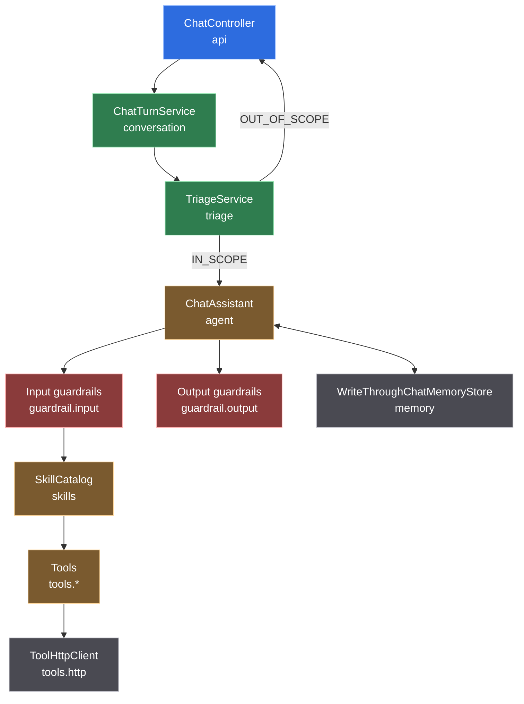

# CONTEXT — domain model and ubiquitous language

The vocabulary this codebase uses, what each term means precisely, and where the
boundaries between them are. If a name here and a name in the code disagree, the
code is wrong.

Design decisions and their evidence live in [`docs/adr/`](docs/adr/README.md).
This file is about *what the words mean*.

---

## The shape of a request

---

## Ubiquitous language

### Conversation and turns

**Conversation** — one continuous exchange with one user, identified by a
`ConversationId`. It owns a chat memory and, implicitly, the set of skills the
assistant has activated so far. It expires with the memory TTL (24 h by default).

**ConversationId** — a validated value object, `[A-Za-z0-9_-]{1,64}`. It is not a
`String` because it is used to build storage keys in two systems, and an
unvalidated id there lets one conversation read or clobber another's memory.

**Turn** — one user message and the assistant's response to it. The unit of
triage, of cost, and of the metrics. Represented by `ChatTurn`, which carries the
reply, the outcome, the triage verdict, the tools that actually ran, and token
usage.

**Outcome** — how a turn ended. Exactly three:
- `ANSWERED` — the agent produced the reply.
- `REFUSED` — triage judged the request outside the assistant's scope. Cheap.
- `BLOCKED` — a guardrail stopped the turn, on the way in or on the way out.

"Refused" and "blocked" are deliberately different words: one is a scope decision
about a legitimate user, the other is a safety decision about a message. Never
use them interchangeably.

### Triage

**Triage** — deciding whether a turn reaches the agent at all. Performed by
`TriageService`, which prefers not to call a model: pre-filters answer the trivial
cases, a cache answers repeats, and only what is left reaches the judge.

**Judge** — the small, fast model that performs triage. It classifies; it never
answers and never acts. Distinct from the **injection classifier**, which is also
a small model but answers a different question ("is this an attack" rather than
"is this in scope").

**Verdict** (`TriageVerdict`) — the judge's structured output, six fields, each
read by something named in its javadoc. Five have exactly one consumer; `riskFlags`
has two, because its `offence` entry gates the mandated de-escalation sentence as
well as feeding a counter. It is *model output* and therefore untrusted: `language`
and `skillHint` are interpolated into the agent's prompt, so both are constrained
before they get there.

**In scope** — conversational input of any kind, any question about the assistant
itself, and anything a skill could serve even partly. **Out of scope** — anything
else. When both readings are arguable the judge chooses in-scope with lower
confidence, because turning away a real user costs more than answering an
off-topic one.

### Skills and tools

**Skill** — a documented capability: a `SKILL.md` with YAML front matter
(`name`, `description`) and a Markdown body, plus the tools bound to it. The unit
of *progressive disclosure*: the system prompt carries only names and
descriptions until the model activates one.

**Activation** — the model calling `activate_skill`. It returns the skill's full
instructions and makes its tools visible for the rest of the memory window. State
that lives in chat memory, not in the application.

**Tool** — one `@Tool` method reaching one upstream endpoint. Named in
`snake_case`, described by *when to reach for it* rather than by what it
technically does, with every parameter's format documented. Those descriptions are
the routing signal, so a test enforces the house style across every tool in the
application.

**Catalogue** (`agentic.tools.apis`) — the map of API keys to base URLs. A tool
names a key and a path; it never sees a URL. This *is* the SSRF control.

**ToolResponse** — a tool's result as a value: body, outcome, and whether it was
truncated. Nothing at the tool boundary throws.

### Guardrails

**Guardrail** — a check LangChain4j runs around a model call. **Input guardrails**
run before, **output guardrails** after.

**Normalization** — the first input guardrail. It rewrites and never blocks, so
every later rule and the model itself see one canonical form.

**Score** — the deterministic injection signal, from `InjectionHeuristics`.
Structural certainties reach the blocking threshold alone; statistical hints only
contribute. Three bands: **clean**, **gray zone** (worth a model's opinion),
**blocking**.

**Canary** — a random marker in the system prompt whose appearance in a response
proves a verbatim leak. Not a secret-protection mechanism: the prompt has no
secrets.

### Memory

**Chat memory** — the message window LangChain4j replays into each prompt.
**Memory store** — where that window is persisted between turns.

**Write-through** — DynamoDB is the source of truth, Valkey is the cache in front
of it. Writes go durable-first; a failed cache write *deletes* the key rather than
leaving a stale one.

**Backend** — which store is in use: `write-through` or `in-memory`. Never chosen
automatically; degrading silently would lose conversations while the health check
stayed green.

### Models

**Role** — how the code addresses a model: `judge`, `agent`. No class names a
model id; roles are resolved by `ChatModelRegistry` from configuration. This is
what makes per-role cost and latency separately measurable, and what makes
swapping a model a deployment decision.

---

## Bounded contexts, and what may depend on what

| Package | Owns | May depend on |
|---|---|---|
| `api` | HTTP surface, DTOs, error shaping | `conversation`, `skills` |
| `conversation` | the turn lifecycle | `triage`, `agent`, `skills`, `memory` |
| `triage` | scope decisions | `llm`, `skills`, `guardrail.input` (normalizer only) |
| `agent` | assistant assembly, the system prompt, sub-agent workflows | `llm`, `skills`, `memory`, `guardrail`, `rag`, `tools.*` |
| `guardrail` | input and output checks | `llm` |
| `skills` | catalogue, `SKILL.md` loading, tool binding | — |
| `tools.*` | tool implementations over external data sources | `tools.http`, `skills` |
| `rag` | corpus ingestion, retrieval, routing | `skills` |
| `memory` | chat memory stores | `infra` |
| `llm` | model construction by role | `infra.config` |
| `infra` | AWS and Valkey clients, configuration, clock | — |

Two rules, enforced by ArchUnit rather than by convention:

1. **No cycles** between these packages. This is not decorative: it already caught
   one. A sub-agent workflow needs tool beans, and exposing that workflow as a tool
   made `agent` and `tools` mutually dependent. The fix was to recognise that the
   trip-briefing tool is the *workflow's adapter*, not a data source, and move it
   beside the workflow — which is why a tool lives under `agent.workflow`.
2. **`infra` and `skills` depend on nothing above them.** They are the bottom of
   the graph.

---

## Invariants

Things that must stay true. Each one is asserted by a test, and breaking one is a
defect rather than a design change.

1. **The system prompt is byte-identical across turns.** Anything varying per turn
   lives in the user message. This is what lets a provider's automatic prompt
   cache hit.
2. **A skill's tools are invisible until it is activated.** The standing prompt
   cost grows with the number of skills, not the number of tools.
3. **No tool can name a host.**
4. **No exception message reaches the model or the user.** Not from a tool, not
   from a guardrail, not from the HTTP layer.
5. **A refusal never says which rule fired.**
6. **Model output is untrusted before it is interpolated anywhere.**
7. **The default build needs no network, no Docker and no API key.** Tests that
   need them are tagged and excluded.
