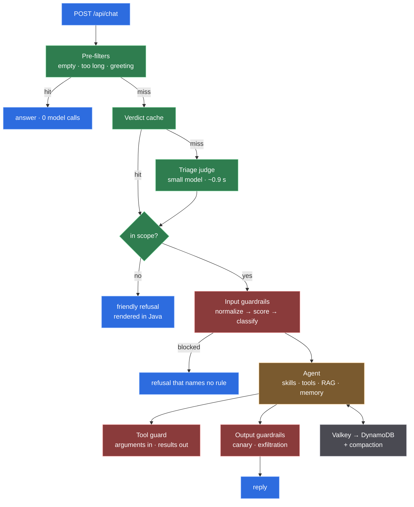

# Agentic chat, built to be read

A working agentic chat backend — **Micronaut 5.1.0, Java 25, LangChain4j 1.18.1**
— written as a study of how one is actually assembled, with the reasoning kept
next to the code.

It runs on the Gemini free tier at zero cost, needs one `docker compose up`, and
its default test suite needs no network, no Docker and no API key.

The interesting parts are the places where a measurement **overturned** the
obvious design. Three of them are in [the reading order](docs/INDEX.md).



The shape is one idea repeated: **decide cheaply before spending.** Three exits
happen before the expensive model is touched at all.

## Run it

```bash
cp .env.example .env      # then put your keys in it
docker compose up --build
curl -s -X POST localhost:8080/api/chat \
  -H 'Content-Type: application/json' \
  -d '{"message":"qual o cep da avenida paulista 1578?"}'
```

Two containers: the app, and floci — a free local AWS emulator serving DynamoDB
in-process and starting a real Valkey container for the cache.

```bash
./mvnw test                       # no network, no Docker, no API key
./mvnw test -Pit                  # + floci via Testcontainers
./mvnw test -Pevals               # + the triage golden set against a live model
./scripts/check-tool-catalogue.py # tool code vs configured endpoints, both ways, https only
./scripts/check-skill-docs.py     # skill directories vs docs/06-skills.md, both ways
```

## What is in it

| | |
|---|---|
| **Triage gate** | a small, fast model decides whether a turn reaches the expensive one — and pre-filters and a cache mean most turns never reach it either |
| **Skills** | 102 tools over free public APIs, disclosed progressively: the prompt carries skill names, not tool schemas |
| **Guardrails** | normalize → deterministic score → gray-zone classifier on the way in; canary and exfiltration checks on the way out; and a tool-result screen, which is the only place indirect injection can be caught |
| **Voice** | a brand's tone-of-voice contract, last in the cacheable prefix rather than behind a skill, with a startup assertion that it reached the model and an output check that repairs what the document defines and never withholds an answer |
| **RAG** | over the assistant's own documentation, routed so it only runs when a tool is not going to answer |
| **Memory** | Valkey in front of DynamoDB, with compaction that never drops a skill activation |
| **Sub-agents** | a composed workflow — resolve, then two lookups in parallel, then summarise — used for context isolation, not for org charts |
| **Cost** | every token and every dollar tagged by role, with cached-token counts read from the provider |

## When this design applies

| Reach for | When |
|---|---|
| a triage gate in front of the agent | requests arrive that the agent should not answer, and the agent turn is much more expensive than a classifier |
| progressive disclosure through skills | more than ~15 tools, or tool selection accuracy dropping as tools are added |
| a sub-agent workflow | a subtask produces output the main conversation will never reference again |
| retrieval | there are questions no tool can answer — usually about the assistant itself |
| a voice document in the prompt, not behind a skill | the rule applies to *every* answer. Routing buys nothing when the answer is always, and it fails silently when the model does not notice the turn qualifies |
| compaction | conversations run long enough that recall, not the context limit, becomes the constraint |
| **none of the above** | fewer than ten tools and short conversations. Most of this is machinery for a scale you may not have |

That last row is the honest one. Every technique here is documented with the size
at which it starts to pay, and
[chapter 2](docs/02-context-engineering.md) lists eight more that were
**deliberately not built**, each with the same reasoning.

## Read the book

**→ [`docs/INDEX.md`](docs/INDEX.md)** — the reading order, every chapter, and the
decisions worth reading first.

Also:

- **[`CONTEXT.md`](CONTEXT.md)** — the ubiquitous language and the seven invariants
  the tests enforce.
- **[`docs/adr/`](docs/adr/README.md)** — one record per decision, with the
  measurement behind it.
- **[`docs/06-skills.md`](docs/06-skills.md)** — the catalogue of
  [`.claude/skills/`](.claude/skills/): what each skill is for, the situation that
  sends you to it, and who fires it. Written to be project-agnostic, so the
  reasoning travels to other agentic backends.

## What this is not

Not a product. There is one anonymous user, no authentication, and no rate
limiting — a real deployment puts both at the edge. The absent controls are listed
with their reasons in [chapter 3](docs/03-security.md), where they are labelled
as absent rather than quietly omitted.
