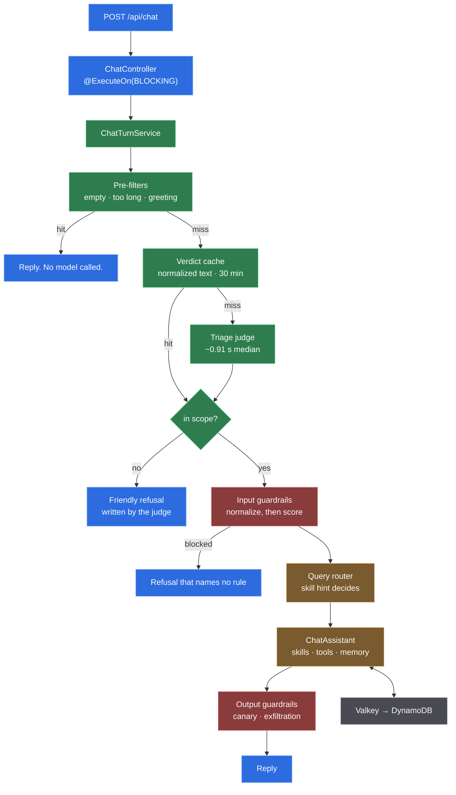

# 1 · Anatomy of a turn

One user message, from the HTTP request to the reply. Every box below is a class
you can open, and every number is measured on the development machine.

The shape is one idea repeated: **decide cheaply before spending**. Three exits
happen before the expensive model is touched at all.

## Step 1 — the controller

`@ExecuteOn(TaskExecutors.BLOCKING)`. A turn blocks on the model and on outbound
tool calls for seconds at a time; running that on a Netty event loop would stall
every other request on the same loop. On Java 25 that executor is backed by
virtual threads, so a blocked turn parks a virtual thread instead of holding a
platform one.

The conversation id is a validated value object, not a `String`. It is used to
build storage keys in two systems, and `[A-Za-z0-9_-]{1,64}` is what stops one
conversation reading another's memory.

## Step 2 — pre-filters

Three deterministic answers, no model:

| Input | Result |
|---|---|
| blank | a friendly "I didn't receive a message" |
| over 12 000 characters | "too long, can you summarise?" |
| a bare greeting (whole message) | in scope, intent `greeting` |

The greeting rule matches the **whole** message. `oi` is a greeting; `oi, qual o
CEP da Paulista?` is a request that starts with one and goes to the judge.

**Each of the three has to say what language it is answering in**, because language
detection lives in the judge and none of them calls it. They used to say `pt-BR`
without looking, which answered `hello` in Portuguese and declined 12 000 characters
of English with the Portuguese template while the English one sat unreachable. The
tag is only a hint in the prompt — the model is told the message wins where the two
disagree — but on the refusal path it is final: `RefusalTemplates` picks by it and no
model is in the loop to correct it.

| Path | How the language is decided |
|---|---|
| a bare greeting | a lookup, not detection — the greeting vocabulary is closed and already partitioned by language |
| over 12 000 characters | a stopword ratio over the head of the message, which is abundant evidence at that size |
| blank | the documented `pt-BR` default: no text, no evidence, and this assistant's audience is Brazilian |
| the judge failed | detected from the text the judge was about to read |

## Step 3 — the verdict cache

Keyed on the normalized text, 30-minute TTL.

This is correct rather than merely convenient: the judge is stateless and runs at
temperature 0, so identical text always yields an identical verdict. The traffic
that hits it hardest is repeated and adversarial — a probe sent fifty times costs
one model call.

The cache lives on its own bean. Micronaut's caching is proxy-based, so a
`@Cacheable` method invoked from another method of the *same* bean compiles, runs,
and never caches anything.

## Step 4 — the judge

A small model, no memory, no tools, no RAG. It classifies; it never answers and
never acts.

**Measured**, same 84-token prompt and JSON schema, time to first byte:

| Model | Thinking | Median | Worst |
|---|---|---|---|
| `gemini-2.5-flash-lite` | budget 0 | **0.91 s** | 1.65 s |
| `gemini-3.1-flash-lite` | level low | 3.32 s | 6.28 s |
| `gemini-3.1-flash-lite` | budget 0 | 5.93 s | 10.11 s |
| `gpt-4o-mini` | n/a | 1.48 s | 2.60 s |

The judge runs the **older** model. On the request path it is the faster one for
this workload, and the newer generation renamed the thinking parameter such that
the old name is silently ignored — see
[ADR 0006](adr/0006-llm-as-judge-triage.md).

Its verdict carries six fields. Five have exactly one consumer; `riskFlags` has
two — the metrics counter, and the `offence` flag that gates the voice document's
mandated de-escalation sentence. Two fields — `language` and `skillHint` — reach
the agent's prompt, so both are constrained before they get there: the guardrail
chain inspected the user's *message*, not this object.

**A refusal ends here.** The judge writes the out-of-scope reply itself, so
declining a request costs one small-model call rather than two.

## Step 5 — input guardrails

Two, in order.

**Normalize** rewrites and never blocks. NFKC folds fullwidth and mathematical
characters onto ASCII; invisible characters, control characters and padding runs
are stripped. It runs first because every later rule and the model itself then
see one canonical form.

**Triage** scores deterministically, and calls a model only in the gray zone.
Structural certainties — a chat-template delimiter, a code fence labelled
`system`, a base64 blob that decodes to readable text — block with no model call.
Statistical hints only contribute to a score.

A blocked turn is told nothing about why. A detector that explains which rule
fired is a detector an attacker iterates against.

## Step 6 — retrieval, if it is worth it

`SkillAwareQueryRouter` decides. If the judge named a skill, a tool will answer
and retrieved prose would only compete with it; if it named none, the turn is
conversational or about the assistant, which is what the corpus covers.

The corpus is the assistant's **own documentation**, not world facts. World facts
come from tools, where they are current.

Why a router at all, when a similarity threshold looks simpler: the score
distributions overlap. Measured, an irrelevant question scored **0.7342** and a
relevant one **0.7299** — see
[ADR 0010](adr/0010-rag-over-the-assistants-own-documentation.md).

## Step 7 — the agent

The system prompt is assembled once at startup and is byte-identical on every
request, so it sits inside the provider's cacheable prefix. Everything that
varies per turn — reply language, skill hint, the message itself — travels in the
*user* message, after that prefix. A test compares two turns and fails if the
system prompt differs.

Tools are disclosed progressively. Before activation the model sees only
`activate_skill` and `read_skill_resource`; after `activate_skill`, that skill's
tools appear. Standing cost measured at **81 tokens per skill**, against roughly
80 per raw tool schema.

Bounds that make agency finite: six tool round trips, a 20-message memory window,
and a per-endpoint byte budget on every tool result.

## Step 8 — output guardrails

**Canary.** A random per-process marker in the system prompt. Its appearance in a
response proves a verbatim leak. Phrase-matching the prompt does not work because
the model paraphrases.

**Exfiltration.** A markdown image pointing at an attacker host fires on render
with no click, so link hosts are allow-listed; credential-shaped strings are
matched narrowly.

Both remove the offending message from chat memory rather than merely blocking
it. Leaving it would replay the leaked text into every later prompt.

## What a turn costs

| Path | Model calls | Notes |
|---|---|---|
| greeting, empty, over-length | **0** | pre-filter answers it |
| repeated text | **0** | verdict cache |
| out of scope | **1** | judge writes the refusal |
| in scope, no tool | **2** | judge + agent |
| in scope, one skill | **3** | judge + activate + answer |
| trip briefing | **6** | judge + agent + four sub-agents |

That table is the architecture. Every design choice above exists to move traffic
up it.
