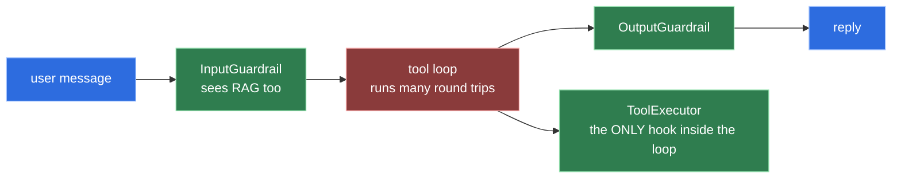

# 3 · Security

The OWASP Top 10 for Agentic Applications 2026, mapped to the class that answers
each item — and, where nothing answers it, said so plainly.

**Provenance.** The landing page at
<https://genai.owasp.org/resource/owasp-top-10-for-agentic-applications-for-2026/>
is promotional; the ten entries live in the PDF at
<https://genai.owasp.org/download/52117>, published 9 December 2025 by the OWASP
GenAI Security Project. The identifiers are **`ASI01:2026` … `ASI10:2026`** — ASI
for the Agentic Security Initiative series. Anything citing `AAI01` has the prefix
wrong.

## The seams everything hangs off

Before the list, the five interception points this framework actually offers,
because the whole map is determined by them.

**Guardrails run once per invocation and never see tool results.** The input chain
runs, then the entire multi-round-trip tool loop, then the output chain. A
`ToolExecutionResultMessage` is produced strictly between the two and is reachable
from neither — there is no accessor for it on either request type.

RAG content *is* reachable from an input guardrail, via
`requestParams().augmentationResult()`. Tool output is not.

**That asymmetry is the spine of this threat model.** Indirect prompt injection —
instructions planted in data the agent fetches — arrives through tool output, so
`ToolGuardProvider` decorating `ToolExecutor` is the only place it can be caught.

Two traps in building that decorator, both of which fail silently:

- **Decorate `executeWithContext`, not `execute`.** The framework only ever calls
  the former, and LangChain4j's own skill executors throw from `execute`
  deliberately. A decorator on the wrong method never runs *and* crashes the
  skills.
- **A hallucinated tool name never reaches any executor.** The framework's
  `executor == null` branch bypasses every decorator, so that path needs its own
  strategy — and the default one throws, turning a model typo into a 500.

## The ten

| ID | Title | Control here | Test |
|---|---|---|---|
| **ASI01** | Agent Goal Hijack | Input guardrail chain: normalize → deterministic score → gray-zone classifier. System prompt is assembled from config at startup and never derived from a request or from memory. | 71 corpus cases, half of them benign traffic that looks like an attack |
| **ASI02** | Tool Misuse and Exploitation | Tools name a catalogue key, never a URL. Arguments screened for credential shapes. Results screened for injection. `maxToolCallingRoundTrips(6)`. Per-endpoint timeouts and byte budgets. | SSRF refusal via an unconfigured catalogue key; credential-shaped argument refused; injected result neutralised |
| **ASI03** | Identity and Privilege Abuse | `ConversationId` is validated before it builds a storage key in either store — the memory-isolation boundary. No tool parameter may be named like a credential. | 13 `ConversationId` cases naming each rejected shape; the parameter-name test over every tool |
| **ASI04** | Agentic Supply Chain | All tools are compiled `@Tool` methods in this repository. There is no runtime tool registry, no MCP mount, no dynamic descriptor. | ArchUnit: tools may not open their own connections |
| **ASI05** | Unexpected Code Execution | There is no code-execution tool, no `eval`, no template engine reachable from a prompt. The applicable slice is deserialization hygiene on anything persisted. | ArchUnit no-cycles and the tool-boundary rules |
| **ASI06** | Memory & Context Poisoning | Output guardrails use `fatalWithMessageRemoval`, so a poisoned assistant message is deleted from memory rather than replayed. Compaction preserves activations and drops failed trajectories. | Leaked-canary message removal; the compaction invariant test |
| **ASI07** | Insecure Inter-Agent Communication | Sub-agents are in-process objects. **There is no wire between them to protect.** | — see below |
| **ASI08** | Cascading Failures | Bounded round trips, bounded retries (never on 4xx or 429), per-endpoint timeouts, and a triage gate that fails *open* so a classifier outage degrades rather than stops. | Per-endpoint timeout test; the retry-once test |
| **ASI09** | Human-Agent Trust Exploitation | Refusals never explain which rule fired. The assistant is instructed to say what it does not know and never to present a tool failure as an answer. | Rejection-message test asserting no rule name leaks |
| **ASI10** | Rogue Agents | Every tool execution is bounded and observable: per-role metrics, per-tool counters, and structured logs on every block. | Metrics assertions in the cost tests |

## The tool layer, specifically

Six attacks, and what stops each.

| Attack | Stopped by |
|---|---|
| **SSRF via a URL-taking tool** | No tool takes a URL. A catalogue key is the only way to name a destination, and one that is not configured is refused. This removes the category rather than filtering it. |
| **Secret exfiltration via tool arguments** | Credential shapes are refused before the request leaves the process, and no tool parameter may be *named* like a credential. |
| **Indirect injection via tool results or RAG** | `ToolGuardProvider` screens every result. RAG documents are the repository's own reviewed Markdown, not third-party text. |
| **Tool-name hallucination** | A non-throwing strategy returns guidance instead of a 500, telling the model to activate the right skill first. |
| **Excessive agency / unbounded loops** | Six round trips per turn, and a bounded tool set that only widens on explicit activation. |
| **Cost-exhaustion DoS** | Per-endpoint timeouts, no retry on 429, a triage gate that answers most refusals with a small model, and per-role cost metrics that make an anomaly visible. |

## What is *not* built, and why

The distinction that matters: everything above is code plus tests in this
repository. Everything below is an **absent control with a written reason** — it
is not mitigated, and nothing here should be read as implying otherwise.

- **ASI07 in full** — mTLS, message signing, nonces, registry attestation.
  Sub-agents are in-process objects reached by a method call. Building crypto
  between them would be theatre. The moment an A2A client or an MCP tool provider
  appears, there *is* a wire, and this decision has to be re-opened.
- **ASI04 runtime supply chain** — SBOM/AIBOM attestation, signed tool
  descriptors, registry pinning. The runtime composition surface OWASP describes
  does not exist here; all tools are compiled into the artefact.
- **ASI09 UI safeguards** — risk badges, manipulation-pattern reminders, adaptive
  trust calibration. This is a headless backend. The server-side half is built;
  the visual layer is out of scope and stays out.
- **ASI05 sandboxing** — containers, syscall limits, safe interpreters. There is
  nothing to sandbox.
- **ASI10 cryptographic identity attestation** — signed behavioural manifests,
  HSM-mediated signing. Requires identity infrastructure this project does not
  have.
- **Per-principal authorization.** There is one anonymous user. The seam exists —
  `ConversationId` scopes memory — but the entitlement matrix is degenerate, so
  no policy is enforced. A real deployment puts authentication at the edge and
  passes a principal through `InvocationParameters`.
- **HTTP rate limiting.** Deliberately at the gateway in a real deployment, and
  absent here. The per-turn bounds cap what one *request* can cost; they do not
  cap how many requests one caller can make.

## The one that generalises

Read the framework's defaults before trusting them. Three in this stack are
actively dangerous and all three are on by default:

1. The tool-execution error handler feeds `Throwable.getMessage()` to the model —
   stack traces, upstream URLs, response bodies and credentials, into the prompt,
   the history and the provider's logs.
2. The hallucinated-tool-name strategy throws, turning a model typo into a 500.
3. Retrieved content is written into persisted chat memory, so a chunk fetched on
   turn three is still being paid for on turn twenty.

None of them announces itself. Each was found by reading the library's source, not
its documentation.
