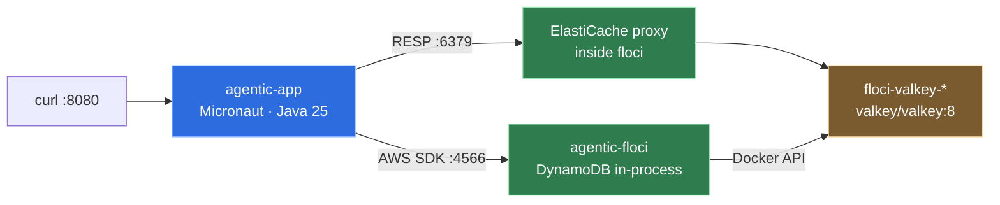

# 4 · Operations

Running it, what it needs, and what to look at when it misbehaves.

## Running it

```bash
docker compose up --build
```

Two containers, plus one more that floci starts for itself.



The only file you must supply is `.env`, and it holds two lines that matter:

```
GOOGLE_API_KEY=...
OPENAI_API_KEY=...
```

It is gitignored. Docker Compose loads it, and a local run picks it up with
`set -a; . ./.env; set +a`.

**Running without Docker at all** is supported and is what the test suite does:

```yaml
agentic:
  persistence:
    memory-backend: in-memory
```

Conversations then live in the process and are lost on restart. That backend is
never selected automatically — degrading to it silently would lose every
conversation while the health check stayed green.

### Measured startup

```
Established active environments: [local]
Created DynamoDB table agentic_chat
Created ElastiCache replication group agentic-chat-cache at Endpoint(Address=localhost, Port=6379)
Knowledge base ready: 11 segments from 3 documents in 155 ms
Startup completed in 7971ms. Server Running: http://localhost:8080
```

Eight seconds, of which about six is the ONNX embedding model loading. It is
loaded eagerly on purpose: lazily, one unlucky user pays that on a request that
looked like everyone else's.

## The endpoints

| Method | Path | What |
|---|---|---|
| `POST` | `/api/chat` | one turn — `{"message": "...", "conversationId": "..."}` |
| `GET` | `/api/chat/capabilities` | the skills, from the same catalogue the model sees |
| `GET` | `/health` | Micronaut health, with details |
| `GET` | `/prometheus` | metrics |
| `GET` | `/swagger-ui` | the generated OpenAPI page |

A real turn:

```
$ curl -s -X POST localhost:8080/api/chat \
    -H 'Content-Type: application/json' -d '{"message":"bom dia"}'

{"conversationId":"c5fe12fa003341c2b64677b97e8626b4",
 "reply":"Bom dia! Como posso ajudar você hoje?",
 "outcome":"ANSWERED","intent":"GREETING",
 "usage":{"inputTokens":1405,"outputTokens":9}}
```

Note `"intent":"GREETING"` with no judge call: a bare greeting is answered by a
pre-filter, and the 1405 input tokens are the agent's standing prompt.

## The metrics that matter

Everything is tagged by **role**, which is the point — see
[chapter 2](02-context-engineering.md).

| Metric | Read it for |
|---|---|
| `agentic_llm_tokens_total{role,model,kind}` | where tokens go. The four kinds — `input`, `cached_input`, `output`, `output_reasoning` — are **mutually exclusive**, so `sum by (kind)` is the true total and `cached_input / (input + cached_input)` is the caching claim. `input` is the FRESH input; it stopped including the cached reads when the counters moved onto `TokenUsageDetails` |
| `agentic_llm_cost_usd_total{role,model}` | spend, decomposed |
| `agentic_llm_unpriced_calls_total` | **a model with no configured price** — silence here is how a total quietly excludes half the spend |
| `agentic_triage_decisions_total{decision,intent,source}` | `source=prefilter` vs `model` is the cheap-path hit rate |
| `agentic_triage_upgraded_to_in_scope_total` | the judge wanted to refuse and was not sure enough. A rise means the scope prompt no longer matches traffic |
| `agentic_triage_failovers_total` | the primary provider is rate-limiting |
| `agentic_turn_latency_seconds{path}` | `refused` / `answered` / `blocked`, separately |
| `agentic_memory_compactions_total` | how often conversations hit the budget |
| `agentic_memory_tokens` | the size distribution compaction was asked to judge. A summary, not a gauge: Micrometer holds a gauge's source weakly, so a boxed count reports the first conversation the process ever saw and then `NaN` |
| `agentic_tools_indirect_injection_blocked_total{tool}` | a data source returned something shaped like instructions |
| `agentic_llm_errors_total{role,exception}` | provider trouble, per role |

## Failure modes, and what each looks like

| Symptom | Cause | What happens |
|---|---|---|
| every turn slow, `agentic_triage_failovers_total` climbing | Google free tier at its 10–20 req/min limit | judge fails over to OpenAI; if none is configured, the turn escalates to the agent |
| `RESOURCE_EXHAUSTED` on the agent role | same limit, no failover for the agent | the turn fails; the error handler returns a shaped 500 |
| answers ignore tools, model "just knows" | skill activation lost — memory window too small, or a store that dropped message attributes | `SkillActivationTest` covers both; check the window first |
| tool results full of `[link removed: outside the tool catalogue]`, then responses containing a link blocked | the link allow-list is empty | it is derived from the tool catalogue, so this means the catalogue is empty — check `agentic.tools.apis` loaded. The removal marker is the **first** observable: the same list runs at the tool door before it runs on the answer |
| `this data source is not configured` | a tool names a catalogue key that is not in config | `./scripts/check-tool-catalogue.py` |
| a tool's arguments visible to anything on the path | a catalogue entry with an `http://` base URL | same script — it fails on any non-https base URL |
| tools all fail after a deploy | a `@Factory` method was reordered and stale bean definitions linger | `./mvnw clean` |

## The checks

```bash
./mvnw test                      # no network, no Docker, no API key
./mvnw test -Pit                 # + floci via Testcontainers (~35 s of container startup)
./mvnw test -Pevals              # + the triage golden set against a live model, paced for the free tier
./mvnw test -Pall                # everything
./scripts/check-tool-catalogue.py
```

The default build deliberately needs nothing. A suite that requires a live
provider is a suite nobody runs, so the deterministic half gates every commit and
the expensive half gates a release.

## Costs, honestly

On the Gemini free tier this runs at zero. The prices in `agentic.llm.pricing`
are the paid-tier rates, recorded so the accounting is truthful the moment
billing is enabled — a cost report that silently reports zero is worse than none.

The shape of the bill, per turn:

| Path | Model calls | Relative cost |
|---|---|---|
| greeting, empty, repeated text | 0 | free |
| out of scope | 1 small | ~1 |
| in scope, no tool | 1 small + 1 large | ~15 |
| in scope, one skill | 1 small + 2 large | ~30 |
| trip briefing | 1 small + 5 large | ~80 |

That ratio is why the triage gate exists, and why the trip-briefing workflow is a
tool the agent chooses rather than something on the default path.
