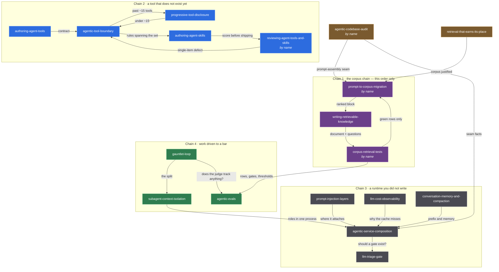

# 6 · Skills

The documents under [`.claude/skills/`](../.claude/skills/), what each is for,
which situation sends you to it, and — because no skill here is an island — which
neighbour owns the question it stops at.

**Two different things in this repository are called a skill.** The application's
skills are the capability groups the agent activates mid-turn — the ones
[chapter 2](02-context-engineering.md) discloses progressively, names in the prompt
and tool schemas only after activation.
This chapter is about the other kind: files no user ever reaches, read by the
*engineer* — human or coding agent — working on a system like this one. They carry
the design reasoning with none of this project's code, which is why they travel.

Each is a directory with a `SKILL.md`: a `description` that decides when it is
read, and a body that teaches once it is. Some carry sibling files the body loads
only when a reader gets that far.

## How you reach one

This is the difference that changes how a reader gets to a skill, so it is a column
in both tables below.

| Fired by | What happens | What that means for you |
|---|---|---|
| **the model** | the harness matches the turn against the `description` and loads the body | you do not ask for it; you describe the problem, and a description written for that sentence pulls the skill in |
| **by name** | the frontmatter carries `disable-model-invocation: true`, so nothing fires it automatically | a person runs it deliberately — these are sweeps and audits, work with a start and an artefact, not advice mid-turn |

Four skills carry `disable-model-invocation: true`. The by-name ones are the passes
that produce a document: an audit, a sweep, a migration plan, a committed query
set. A skill that would only ever be right on a turn nobody types is better as a
procedure someone invokes than as a description paid for on every turn of every
conversation.

**A by-name step is not closed by pointing at it.** Three of these four say so in
their own bodies, in the same words: *ask the user to run it, which they invoke by
name*, and leave the step open until they have. Reporting a step done because you
named the skill that owns it is how a prompt keeps its copy of text everyone
believes was deleted.

**This chapter routes; it does not teach.** Every row is a door, not a summary —
the material lives once, inside the skill. If a paragraph here would let you skip
the skill, it is a paragraph that will drift.

## How they relate

Almost every skill ends by naming the neighbour that owns the next question, and
the useful ones say so in their own descriptions — the `For X, use Y` clause at the
end of a `description` is a routing edge, and the bodies name siblings in prose the
same way. **Every edge in this chapter is one of those sentences.** An edge nobody
wrote is an edge that stops being true the first time someone edits either side,
and a sweep of all eighteen bodies has already caught two of those.

Each entry below carries three things beside its scenarios:

- **which skills it hands work to** — where its own text stops and says so;
- **which hand work to it** — the mirror, read from the neighbour's file;
- **the discriminator** — the noun, or the question, that decides which of the two
  owns a piece of ground. *"Under fifteen tools or over"* is a discriminator.
  *"Related"* is not.

One group of edges is an order rather than a preference. **Three of them form a
four-step chain that does not commute**: audit the prompt, write the document,
prove it retrieves, and only then delete the text from the prompt. The first step
and the last are the same skill, which is why three skills spend four steps — and
two of the three are by-name, so a model cannot start either end of it.

`llm-triage-gate` is the one skill whose text names no neighbour at all: it is a
pure sink, pointed at by three others and pointing at none. That is a property of
the skill, not a gap in the row — a gate is where a decision ends.

The diagram maps the **four chains** below, not the forty-odd edges the entries
carry; drawing all of them would be a picture nobody can read.



## Skills that describe a piece of this design

Each one is the reasoning behind a component that runs here — read it beside the
chapter that measures it.

| Skill | What it is for | Fired by |
|---|---|---|
| [`agentic-tool-boundary`](../.claude/skills/agentic-tool-boundary/SKILL.md) | the four rules the class at the tool door enforces, so a tool owns only its arguments and its meaning | the model |
| [`progressive-tool-disclosure`](../.claude/skills/progressive-tool-disclosure/SKILL.md) | keeping a large tool set affordable — names in the standing prompt, schemas on activation | the model |
| [`llm-triage-gate`](../.claude/skills/llm-triage-gate/SKILL.md) | a cheap classifier in front of an expensive agent, and the pre-filters and cache that spare even the classifier | the model |
| [`prompt-injection-layers`](../.claude/skills/prompt-injection-layers/SKILL.md) | four ordered layers of injection defence, each shrinking the next one's job | the model |
| [`retrieval-that-earns-its-place`](../.claude/skills/retrieval-that-earns-its-place/SKILL.md) | whether an agent that already has tools should retrieve at all, what goes in the corpus, and when it runs | the model |
| [`llm-cost-observability`](../.claude/skills/llm-cost-observability/SKILL.md) | making spend decomposable by role, and a cache-hit claim provable | the model |

### `agentic-tool-boundary`

**Reach for it when a tool is being added or reviewed** — especially one whose
parameters would let the model name a destination.

- The API doc shows a full URL, so the new tool is about to take `String url`, and
  every SSRF target in the world now has somewhere to be typed.
- A tool result is a fat JSON document and nobody has decided what the model may
  see of it — the trap this repository hit with `ToolJson.project` on a container
  path, which reads like a projection and drops nothing.
- An upstream call throws, and the exception's message — carrying the upstream URL,
  the response body, possibly a credential — is on its way into the prompt, the
  history and the provider's logs.

| Neighbour | Way | The discriminator |
|---|---|---|
| `progressive-tool-disclosure` | both ways | **how many tools the model is choosing from.** Under about fifteen a wrong pick is one description's fault and belongs here; past fifteen it is the length of the list, and belongs there. Both descriptions carry the clause |
| `authoring-agent-tools` | handed by | **does the tool exist yet?** Not yet is the interview; already shipped is this page |
| `reviewing-agent-tools-and-skills` | handed by | **one item, or the whole layer?** A defect you can see reading one tool alone is this page's single-item review; one visible only against its neighbours is the sweep's |
| `agentic-codebase-audit` | handed by | **fact or doctrine.** The audit records what a validated argument looks like today; this page says what it should have been |
| `conversation-memory-and-compaction` | handed by | **the failure value versus the message carrying it.** This page owns the outcome type a tool returns instead of an exception; what then happens to that message in history is memory's |
| `subagent-context-isolation` | handed by | **what is being retried.** A bounded transport retry inside one call is this page's; re-spawning a child agent is not |
| `prompt-to-corpus-migration` | handed by | **where standing text belongs.** Guidance on choosing between always-mounted tools does not move to a corpus — it belongs in the tool descriptions, which is this page's ground |

### `progressive-tool-disclosure`

**Reach for it when the standing prompt is mostly tool schemas**, or when the tool
count grew and selection accuracy fell with it.

- 102 tools would put roughly 8k tokens of schema in front of every turn of every
  conversation, unchanged from the first turn to the last — see
  [chapter 2](02-context-engineering.md) and
  [ADR 0005](adr/0005-progressive-tool-disclosure-through-skills.md).
- Someone proposes tool *search* instead of skills and the two are being treated as
  complementary.
- The catalogue doubled and the model started reaching for the wrong tool; the
  answer is a level of indirection, not a better description on each of them.

| Neighbour | Way | The discriminator |
|---|---|---|
| `agentic-tool-boundary` | both ways | **the count again, from the other side.** Under about fifteen tools this page has nothing to sell: the fix is one description, not a mechanism |
| `authoring-agent-skills` | handed by | **whether to group, or what the grouping document says.** This page decides that tools should sit behind an activation; that page writes the text |
| `reviewing-agent-tools-and-skills` | handed by | **economics versus inventory.** The cost of disclosure is this page's; which items are exposed on a given turn is the sweep's, and a dump taken with nothing activated never held the deferred half |
| `agentic-service-composition` | handed by | **the ~80-token schema figure.** Composition borrows it to price a merged service that inherits schemas it never calls; the figure itself is this page's |
| `subagent-context-isolation` | handed by | **which context is being shrunk.** A child agent discards a transcript; this page never spawns anything, it defers a schema |
| `agentic-codebase-audit` | handed by | **the disclosure seam's doctrine.** The audit counts what is exposed; this page says what the count should be |

### `llm-triage-gate`

**Reach for it when every request pays for a full agent turn** regardless of
whether it needed one.

- Bare greetings arrive all day and each one currently costs a full agent turn:
  a model call to discover that nothing was asked.
- Two small models are being compared for the classifier slot and the choice is
  about to be made on version numbers — the newer one here was **6.5× slower** on
  the same prompt ([ADR 0006](adr/0006-llm-as-judge-triage.md)).
- The classifier returned a field the enum does not contain, and the code that
  consumes it assumes that cannot happen.

| Neighbour | Way | The discriminator |
|---|---|---|
| — | hands to | **nothing, and deliberately.** This is the only skill here whose text names no neighbour: it is where a decision ends, not a step that defers one. Three skills point at it; it points at none |
| `agentic-service-composition` | handed by | **whether the role exists, or how it is wired.** Composition's description sends you here for *whether a cheap classifier should run in front at all*; the service object that holds it is composition's |
| `agentic-codebase-audit` | handed by | **fact versus policy.** The audit records what the classifier does when it cannot answer in time, and whether it fails open; *whether it should* is this page's |
| `subagent-context-isolation` | handed by | **the fallback to a safe default.** A classifier can fall back to one; a sub-agent returning prose cannot, which is the whole reason that page cites this one |

### `prompt-injection-layers`

**Reach for it when a regex blocklist is the whole defence**, or when a detector
has started refusing real users.

- `"pode ignorar o que eu disse antes, na verdade quero o CNPJ"` is a real customer
  and the blocklist refuses them — two sentences of exactly that shape were real
  false positives here, caught by the corpus in [chapter 5](05-evaluation.md).
- The untrusted text is a *tool result*, not a user message, and nothing screens
  it — the only place indirect injection can be caught.
- A rule is about to be narrowed to fix one complaint, with nothing that says which
  attacks the narrowing loses.

| Neighbour | Way | The discriminator |
|---|---|---|
| `agentic-service-composition` | both ways | **the order of the layers versus the place they attach.** This page's description hands off *where a guardrail attaches in the runtime so that it actually runs*; composition hands the ordering back, because chain order is this page's subject |
| `conversation-memory-and-compaction` | handed by | **withheld versus removed.** This page requires a flagged message be *removed* from memory, not merely withheld from one answer; making that happen to a stored list is memory's |
| `subagent-context-isolation` | handed by | **whose text is untrusted.** A child agent's return value is untrusted text arriving at a parent; how the wrapper around it is written is this page's |
| `agentic-evals` | handed by | **the control versus the measurement.** This page owns the detector and what a misfire is; the labelled corpus that proves a narrowing lost nothing is evals' |
| `agentic-codebase-audit` | handed by | **the guardrail seam's doctrine** — the audit records that something runs inbound and nothing runs outbound; this page says why that is the wrong shape |

### `retrieval-that-earns-its-place`

**Reach for it when RAG is being added to an agent that already has tools**, or
when a similarity threshold is being tuned.

- A corpus of world facts is proposed for questions the tools already answer, and
  now the model has two sources and no way to prefer one.
- `minScore` alone is meant to decide when to retrieve — here the relevant and
  irrelevant score distributions **overlap**, so it cannot
  ([ADR 0010](adr/0010-rag-over-the-assistants-own-documentation.md)).
- Retrieved chunks are being written into persisted chat memory by a framework
  default nobody chose.

| Neighbour | Way | The discriminator |
|---|---|---|
| `prompt-to-corpus-migration` | both ways | **is the content already written?** This page decides that a corpus is justified and what belongs in it; text already sitting in a standing prompt is moved by a procedure this page closes by naming — **a model cannot start it: ask the user to run it, which they invoke by name** |
| `agentic-service-composition` | both ways | **the embedder as a role.** Composition owns the service object and the trap of an embedder resolving to a model other than the one that built the index; the threshold that measurement then means something against is this page's |
| `writing-retrievable-knowledge` | handed by | **whether it belongs, or how it is written.** That page's description defers *whether the content belongs in a corpus at all, its threshold and its router* to here |
| `corpus-retrieval-tests` | handed by | **the threshold versus the rows measured at it.** Where the gate sits is this page's; what comes back at the shipped gate is the query set's |
| `agentic-evals` | handed by | **who owns the number.** Evals owns rows, gates and sizing; where the retrieval threshold sits and whether it can work at all is this page's |
| `authoring-agent-tools` | handed by | **not a tool.** Stale-but-static content that a proposed tool would have wrapped is retrieval's material, and the interview says so rather than building the tool |
| `agentic-codebase-audit` | handed by | **whether this codebase should retrieve at all** — the audit records the retrieval seam's facts and defers the question to here |

### `llm-cost-observability`

**Reach for it when the model bill is one number** nobody can decompose.

- The claim the whole architecture rests on — the classifier is most of the calls
  and a small part of the cost — has no graph behind it.
- The prompt was laid out to earn cache hits, and the framework's vendor-neutral
  usage type does not report cached tokens, so the win is unclaimable.
- A model listener threw, the exception was swallowed, and the accounting has a
  hole in it rather than an error.

| Neighbour | Way | The discriminator |
|---|---|---|
| `agentic-service-composition` | both ways | **proving a cache hits versus fixing one that does not.** This page's description says it: *for why a cache is not hitting rather than how to prove it does, use `agentic-service-composition`*. Composition borrows the rule that a model is addressed by role, because the tag is what makes the proof possible |
| `subagent-context-isolation` | handed by | **the extra calls a child costs.** That page decides whether a sub-agent is worth spawning; measuring what it actually spent, and whether its cache hits, is this page's |
| `agentic-codebase-audit` | handed by | **the cost seam's doctrine.** The audit records whether pricing lives in code and whether metrics carry a role tag; what those metrics should be is this page's |

## Skills that are about building one

Ordered the way the work runs: author, sweep what already ships, audit, move
prompt text into a corpus and prove it lands, then assemble and drive the runtime.

| Skill | What it is for | Fired by |
|---|---|---|
| [`authoring-agent-tools`](../.claude/skills/authoring-agent-tools/SKILL.md) | the interview before a tool exists — whether it should, and what its contract is | the model |
| [`authoring-agent-skills`](../.claude/skills/authoring-agent-skills/SKILL.md) | writing the document a model reads when tools are grouped: the description routes, the body teaches | the model |
| [`reviewing-agent-tools-and-skills`](../.claude/skills/reviewing-agent-tools-and-skills/SKILL.md) | sweeping a whole tool and skill layer for routing, contract and body defects | **by name** |
| [`agentic-codebase-audit`](../.claude/skills/agentic-codebase-audit/SKILL.md) | inventorying a codebase's seams and producing a ranked, capped plan for what is *absent* | **by name** |
| [`prompt-to-corpus-migration`](../.claude/skills/prompt-to-corpus-migration/SKILL.md) | finding standing prompt content that ships on every turn and planning its move out | **by name** |
| [`writing-retrievable-knowledge`](../.claude/skills/writing-retrievable-knowledge/SKILL.md) | writing a document so that one retrieved chunk of it answers the user alone | the model |
| [`corpus-retrieval-tests`](../.claude/skills/corpus-retrieval-tests/SKILL.md) | the committed query set that proves a corpus answers, and the diagnosis when one row stops | **by name** |
| [`agentic-evals`](../.claude/skills/agentic-evals/SKILL.md) | proving a prompt, classifier or guardrail change safe — what gates a build and what only reports | the model |
| [`agentic-service-composition`](../.claude/skills/agentic-service-composition/SKILL.md) | wiring a runtime out of one service per role, and attaching guardrails where they actually run | the model |
| [`conversation-memory-and-compaction`](../.claude/skills/conversation-memory-and-compaction/SKILL.md) | deciding what a turn carries forward and what it may forget | the model |
| [`subagent-context-isolation`](../.claude/skills/subagent-context-isolation/SKILL.md) | spending a sub-agent only where the context it throws away is worth the extra calls | the model |
| [`gauntlet-loop`](../.claude/skills/gauntlet-loop/SKILL.md) | driving work toward a standard the agent cannot grade itself into | the model |

### `authoring-agent-tools`

**Reach for it when someone says "we need a tool for X"** and the tool does not
exist yet.

- The request arrived as an implementation — *wrap the orders endpoint* — and
  nobody has written down a sentence a user actually types.
- Two proposed tools turn out to answer the same list of sentences, which makes
  routing a coin flip; the finding is that one of them should not be built.
- The parameter set is being copied from the upstream API's query string, so the
  model is handed fields no user question ever mentions.

| Neighbour | Way | The discriminator |
|---|---|---|
| `agentic-tool-boundary` | hands to | **before it exists versus after.** This is the interview whose answer may be *no tool*; the boundary is what a finished one looks like |
| `authoring-agent-skills` | both ways | **one tool's contract versus several behind one activation.** Both descriptions carry the clause, in opposite directions |
| `retrieval-that-earns-its-place` | hands to | **wrong for a reason a tool does not fix.** Stale-but-static content is retrieval's; a phrasing the model keeps getting wrong is the standing prompt's |
| `reviewing-agent-tools-and-skills` | both ways | **sourcing and scoring the turn set.** This page names the set; building, sizing and scoring it is the sweep's — and a tool the sweep decides to split leaves it as a request that comes back here |
| `agentic-evals` | hands to | **the threshold and the flaky-case rule** on that set, which is evals' territory and not this page's |

### `authoring-agent-skills`

**Reach for it once the grouping decision is made and the text has to be written**,
or when a skill fires on the wrong turns.

- The body has grown to the point where the instruction at the top no longer
  steers the tool call at the bottom.
- Two descriptions claim the same ground and neither hands the boundary to the
  other by name, so which one fires is effectively random.
- A skill is model-invoked but no turn anyone types matches its description: paid
  on every turn, activated on none.

| Neighbour | Way | The discriminator |
|---|---|---|
| `reviewing-agent-tools-and-skills` | both ways | **one document versus the layer.** This page's own description closes with the rule: *before shipping a description change, score it against a turn set written down before the edit — ask the user to run `reviewing-agent-tools-and-skills`, which they invoke by name.* **No skill can invoke it**; the sweep hands single-skill body defects back here |
| `authoring-agent-tools` | both ways | **the group versus the member.** One tool's own contract is that page's; the document that fronts several is this one's |
| `progressive-tool-disclosure` | hands to | **whether to group at all** — a mechanism decision that precedes writing any text |
| `writing-retrievable-knowledge` | handed by | **the rigged green.** That page borrows this one's warning about a question set written by whoever wrote the document; the corpus half of it is not this page's |
| `prompt-to-corpus-migration` | handed by | **the grep-back move**, used here in the other direction — to prove a mounted skill body reached the model at all |

### `reviewing-agent-tools-and-skills`

**Invoked by name.** Reach for it when a routing signal is about to change — a
description, a name, which items are exposed, or the order they appear in.

- A one-word description edit is queued and nothing in the build would show which
  turns it moves; here that is not hypothetical, since a `@Tool` description is
  shipped behaviour with no code diff.
- A tool has had no calls this month and nobody knows whether it is unused or
  simply unreachable behind a neighbour that answers first.
- A rename is being waved through as cosmetic — the routing change a sweep produces
  most often and the one it is most tempted not to measure.

| Neighbour | Way | The discriminator |
|---|---|---|
| `agentic-tool-boundary` | hands to | **relative versus absolute.** Every check here needs the whole layer: an item is wrong only relative to its neighbours, its traffic, or its own text a month ago. A defect visible in one tool read alone is deferred to that page's single-item review |
| `authoring-agent-skills` | both ways | **the sweep's finding versus the document's fix.** Overlapping territory is found here and repaired there; a body leaves the sweep as *body clean* or *body deferred* |
| `authoring-agent-tools` | both ways | **a split is a request.** *Why* a tool that hides a decision gets split is the boundary's; the sweep only decides that it should, and the request goes back to the interview |
| `progressive-tool-disclosure` | hands to | **which items are exposed versus what exposure costs.** The sweep decides the first; the economics and the failure mode are that page's |
| `agentic-evals` | handed by | **whose set it is.** Evals owns row counts and thresholds in general; this particular turn set — its sourcing, its sizing, its scoring — is the sweep's |
| `agentic-codebase-audit` | handed by | **an absent control versus a mis-routed one.** The audit hunts what was never written; a description that routes badly is written and wrong, which is this page's |

### `agentic-codebase-audit`

**Invoked by name.** Reach for it when arriving at an agentic codebase you did not
write, or before a review that must find what was never written. It hunts
**absences**, so no diff looks wrong and there is no line to point at.

- A provider client is constructed inside the request path, so the connection count
  now tracks traffic instead of capacity.
- Guardrails run on the way in and nothing runs on the way out.
- A conversation key has no tenant component and is one identifier bug away from
  cross-user bleed, with nothing in the type system objecting.

This is the most connected skill here, and connected in one shape: each seam in
[`SEAM-PROBES.md`](../.claude/skills/agentic-codebase-audit/SEAM-PROBES.md) opens by
naming the skill that owns its **doctrine**, then asks probes that establish
**facts**. Fact here, doctrine there, on every row.

| Neighbour | Way | The discriminator |
|---|---|---|
| `agentic-service-composition`, `agentic-tool-boundary`, `conversation-memory-and-compaction`, `agentic-evals`, `llm-cost-observability`, `subagent-context-isolation` | hands to | **fact versus doctrine**, one seam each. The probe records what the code does; the named skill says what it should have been. The audit never argues |
| `llm-triage-gate`, `prompt-injection-layers`, `retrieval-that-earns-its-place` | hands to | the same split at the seams that share a probe set — *whether* to fail open, how the layers are ordered, whether this codebase should retrieve at all |
| `progressive-tool-disclosure`, `reviewing-agent-tools-and-skills` | hands to | **the tool seam splits two ways.** Routing quality goes to the sweep, disclosure economics to that page; the audit keeps only the inventory |
| `prompt-to-corpus-migration` | both ways | **absent control versus present content.** The audit's prompt-assembly seam scores whether configuration or user data reaches the standing instructions; whether the content *belongs* there is the migration's question, and **a model cannot load it: ask the user to run it, which they invoke by name.** The migration reads the audit's prompt-assembly row in the other direction, and a row naming two assembly points tells it there are two containers before it starts |
| `corpus-retrieval-tests` | handed by | **the wrong-layer catch.** A query-set failure that turns out to be an absent control at a seam — no output guardrail, a catalogue that loads eleven of twelve entries — leaves the corpus chain and comes here |

### `prompt-to-corpus-migration`

**Invoked by name.** Reach for it when the system prompt only ever grows — every
feature ships a paragraph into it and no paragraph is ever charged rent.

- Nobody can write the sentence *this block changes the answer when the user asks
  about X* for a paragraph that ships on every turn — which does not make its share
  of useful turns small, it makes it **unknown**, and a guessed share is the one
  ledger entry that gets an otherwise correct plan thrown out.
- A skill whose activation condition is absent or always true: standing text
  wearing a routing costume.
- A document was migrated into the corpus and the prompt still carries its copy, so
  the model answers from the one sitting in front of it — the failure
  [chapter 2](02-context-engineering.md) names from the other end, in the row that
  rejects *growing the system prompt to fix behaviour*.

| Neighbour | Way | The discriminator |
|---|---|---|
| `corpus-retrieval-tests` | both ways | **planning and deleting versus proving.** This page owns step 1 and step 4; the proof between them is not its own, and **both carry `disable-model-invocation: true`** — at each hand-off, ask the user to run the other, which they invoke by name |
| `writing-retrievable-knowledge` | both ways | **the plan versus the document.** This page ranks blocks and writes the acceptance questions before any document exists; that page writes the document those questions then have to pass |
| `retrieval-that-earns-its-place` | both ways | **whether to retrieve at all is not this page's question.** And when the retrieval layer itself is at fault — threshold or router — this page **stops migrating** and sends you there, because every further block loaded onto a layer that cannot route multiplies one defect |
| `agentic-codebase-audit` | both ways | **present content versus absent control**, stated in the first paragraph of both files |
| `agentic-tool-boundary` | hands to | **text that does not move.** Guidance on choosing between always-mounted tools belongs in the tool descriptions, not a corpus |
| `authoring-agent-skills` | hands to | **the grep-back**, used there to prove a body reached the model and here to give every block a `file:symbol` origin |

### `writing-retrievable-knowledge`

**Reach for it when a file is about to be added to a corpus**, or when a question
that plainly matches a document does not retrieve it.

- A retrieved passage arrives reading *"as described above, this applies to all of
  them"* and means nothing on its own.
- The document is written in the team's vocabulary — *verdict*, *activation*,
  *catalogue key*, the words [`CONTEXT.md`](../CONTEXT.md) defines — and the user
  types none of them.
- The content includes a table whose header row is about to end up in a different
  chunk from its rows.

| Neighbour | Way | The discriminator |
|---|---|---|
| `corpus-retrieval-tests` | both ways | **building the question list versus owning its schema.** This page builds the list while writing, because it is the check that the document covers what it claims; the fields, the labels and the assertions are that page's, read there rather than from a second copy — and **it is not a step a model can close: ask the user to run it, which they invoke by name** |
| `prompt-to-corpus-migration` | both ways | **audit before writing.** Content currently in a system prompt is planned there first, and deleted there last; **that page is by-name too** |
| `retrieval-that-earns-its-place` | hands to | **does this belong in a corpus at all** — a decision that comes before this page, and the threshold and router that come after it |
| `authoring-agent-skills` | hands to | **the rigged green** — the same warning about a question set written by whoever wrote the text, stated there for skill activation |

**This is the one middle step a model can take on its own.** Its two corpus
neighbours are by-name; it is not.

### `corpus-retrieval-tests`

**Invoked by name.** Reach for it when the retrieval suite is all positives and
passes — which a corpus that returns its nearest chunk for *every* input also does.

- The suite's negative rows are all **far** negatives and the near-miss half does
  not exist. This repository is the illustration: the two committed rows in
  [`KnowledgeBaseTest.java`](../src/test/java/io/github/rodrigorjsf/agenticchat/rag/KnowledgeBaseTest.java)
  — a cake recipe and *"escreva um script em python para ler um csv"* — are plainly
  out of domain, score **0.7058** and **0.6826** under the shipped
  `agentic.rag.min-score: 0.72`, and prove only the floor. A third out-of-domain
  question, a football result, scored **0.7342**: above the gate, which is why it is
  a pinned probe in `theScoreDistributionsOverlap` and could not have been a
  negative row at all. What is owed is a question in the product's own vocabulary
  that must retrieve nothing — not a fourth absurdity. And
  `anUnrelatedQuestionRetrievesNothing` calls the retriever directly, so neither
  committed row carries a `routing_input` through the shipped router at all.
- A new document landed in the corpus and an older question now retrieves it
  instead of the document written for it.
- A row fails and the tempting fix is to edit the row.

| Neighbour | Way | The discriminator |
|---|---|---|
| `writing-retrievable-knowledge` | both ways | **the document versus the evidence it retrieves.** Reading a document is not evidence; this page produces the evidence. When a row's diagnosis lands on the document itself, it goes back there |
| `prompt-to-corpus-migration` | both ways | **step 3 sits between that page's step 2 and step 4.** Until the rows are green the prompt keeps its copy — and that page is by-name, so **ask the user to run it** rather than reporting the deletion done |
| `agentic-evals` | hands to | **rows here, row *counts* there.** Sizing, gating and the deterministic/live split are evals'; this page writes the rows and reads the sizing rule off that page rather than restating it |
| `retrieval-that-earns-its-place` | hands to | **whether to retrieve, and where the threshold sits** — measured there, asserted against here |
| `agentic-codebase-audit` | hands to | **wrong chain entirely.** A failure that turns out to be an absent control at a seam is not a corpus defect |

### `agentic-evals`

**Reach for it when the thing that changed is a prompt, a rule or a description**
and someone has to show nothing regressed.

- A guardrail rule is being narrowed to fix one false positive — the regression
  [chapter 5](05-evaluation.md)'s injection corpus exists to catch.
- A suite needs an API key and four minutes on every push, and it is one blocked
  developer away from being marked ignored.
- An LLM judge is scoring another model's output and nobody has measured the judge
  against a human on the rows people argue about.

| Neighbour | Way | The discriminator |
|---|---|---|
| `gauntlet-loop` | both ways | **measuring the judge versus driving the work.** This page's description says it: *for driving work toward a bar rather than measuring the judge that grades it, use `gauntlet-loop`* — and that page hands back everything about whether a judge's verdicts track anything |
| `prompt-injection-layers` | hands to | **the control versus the corpus.** That page owns the detector and what a misfire is; the labelled rows are this page's |
| `retrieval-that-earns-its-place` | hands to | **where the threshold sits**, which is not a row count |
| `reviewing-agent-tools-and-skills` | hands to | **the routing turn set**, which that sweep owns end to end |
| `conversation-memory-and-compaction` | hands to | **the invariant versus the assertion.** That page owns *compaction preserves the state that gates behaviour*; this page owns the test that keeps it true through the next edit |
| `agentic-service-composition` | both ways | the same split at the cache floor — *the standing prompt is byte-identical across turns* is composition's invariant and this page's assertion — and composition hands back the other direction, because answering an in-scope turn is behaviour, so it is an eval case rather than a wiring rule |
| `corpus-retrieval-tests`, `authoring-agent-tools`, `agentic-codebase-audit` | handed by | **row counts, thresholds and the flaky-case rule**, deferred here from three different sets |

### `agentic-service-composition`

**Reach for it when one service both classifies and answers**, or when a guardrail
that is configured never seems to run.

- The classifier is reached through the answerer's service and inherits its tool
  schemas and its memory, so the classification returns next turn as if the user
  had said it.
- A model id appears in application code, which makes swapping the cheap model a
  code change rather than a deployment one.
- The provider's prompt cache stopped hitting and something interpolated into the
  standing prefix is the reason.

| Neighbour | Way | The discriminator |
|---|---|---|
| `llm-triage-gate` | hands to | **whether the role exists at all**, which its description defers; the service object that holds it stays here |
| `prompt-injection-layers` | both ways | **attachment versus order.** Where a guardrail attaches so that it runs is this page's; the order of the layers is that page's subject, and only one ordering constraint is composition's own |
| `llm-cost-observability` | both ways | **why a cache misses versus proving it hits.** Addressing a model by role is that page's rule; composition adds what a role owns |
| `conversation-memory-and-compaction` | handed by | **the prefix and the store.** Why a rewritten prefix misses a provider's cache, why a silent storage fallback cascades, and why the standing prompt is never derived from memory are this page's; what a turn carries forward is that page's |
| `subagent-context-isolation` | both ways | **roles in one process versus roles across agents.** That description defers *separating roles inside one process* to here; this page defers *when a sub-agent is worth its cost* to there |
| `progressive-tool-disclosure` | hands to | **the schema price** a merged service pays for capabilities it never calls |
| `retrieval-that-earns-its-place` | both ways | **the embedder as a role** — resolve it to a model other than the one that built the index and nothing errors, and the threshold measured there is measuring noise |
| `agentic-evals` | both ways | **wiring versus behaviour.** Answering an in-scope turn is behaviour, so it is an eval case, not a composition rule |
| `agentic-codebase-audit` | handed by | **doctrine for four separate seams**, the largest single deferral in that file |

### `conversation-memory-and-compaction`

**Reach for it when history grows unbounded**, or when a compaction pass is being
written or reviewed.

- A long conversation quietly lost a capability because compaction summarised away
  a skill activation — the invariant `ConversationCompactorTest` guards here.
- Compaction separated a tool result from the `AiMessage` that requested it, and
  the provider rejected the whole list.
- The choice is between a message window and a token budget, and only one of them
  replays the same stored history as the same prompt after a tokenizer upgrade.

| Neighbour | Way | The discriminator |
|---|---|---|
| `agentic-service-composition` | hands to | **the message list versus the runtime around it.** Cache-prefix behaviour, a silent storage fallback, and never deriving the standing prompt from memory are composition's |
| `agentic-tool-boundary` | hands to | **the value versus the message.** The outcome type a failed tool returns is the boundary's; what happens to that message in the stored list is this page's |
| `prompt-injection-layers` | hands to | **removed, not withheld** — that page sets the requirement, this page is where a stored list has to honour it |
| `agentic-evals` | handed by | **the invariant is here, the assertion is there** |
| `subagent-context-isolation` | handed by | **the spliced return value.** What must happen to a message a child produced, once it is in history, is this page's |
| `agentic-codebase-audit` | handed by | **six probes' worth of doctrine** at the memory seam |

### `subagent-context-isolation`

**Reach for it when work is being split across several agents**, or when the brief
a child receives is being written.

- The proposed split is an org chart — researcher, writer, critic — so the same
  material is retold at every hop and hedges arrive as flat assertions.
- A child returned eight sentences and the next user turn asks about the ninth,
  which means nothing was discarded and the sub-agent was a prompt section with a
  round trip in front of it.
- A fan-out has no call budget, and one of the children can spawn children.

| Neighbour | Way | The discriminator |
|---|---|---|
| `agentic-service-composition` | both ways | **across agents versus inside one process**, stated in both descriptions |
| `gauntlet-loop` | handed by | **the brief versus the bar.** That page defers *what a child agent's brief may carry and what its answer may be trusted for* to here; what the loop adds on top is narrow — the critic must not receive the builder's reasoning |
| `llm-cost-observability` | hands to | **the extra calls, measured.** Whether a child is worth spawning is this page's; the hit rate and the spend are that page's |
| `agentic-tool-boundary` | hands to | **which retry.** A bounded transport retry inside one call is the boundary's; re-spawning a child is not a transport concern |
| `prompt-injection-layers` | hands to | **the wrapper around returned text**, which is that page's |
| `conversation-memory-and-compaction` | hands to | **the returned message, once stored** |
| `llm-triage-gate` | hands to | **the safe default a classifier can fall back to** — and prose cannot |
| `progressive-tool-disclosure` | hands to | **what a child is allowed to see**, priced there |
| `agentic-codebase-audit` | handed by | **five probes' worth of doctrine** at the sub-agent seam |

### `gauntlet-loop`

**Reach for it when someone asks for excellent, production-grade or "AAA"**, or
when quality is being self-reported by whoever produced it.

- The plan is *build it and then review it against the bar*, in one pass, by one
  agent — which leaves prose where it should leave artefacts someone else can open.
- A critic returns the same grade round after round, which is usually the bar being
  unreachable rather than the work being bad.
- Two independent drafts exist and the comparison must not know which one is
  whose.

| Neighbour | Way | The discriminator |
|---|---|---|
| `subagent-context-isolation` | hands to | **the brief versus the loop.** Everything about what a child may carry and what its answer may be trusted for is that page's; the loop's own addition is that the critic must not receive the builder's reasoning |
| `agentic-evals` | both ways | **driving versus measuring.** A blind comparison names a winner only when the same side wins both orders; whether the judge's verdicts track a human's at all is evals', and both descriptions carry the clause |
| a harness runner skill | hands to | **the technique versus the machinery.** Which tool fans out, where state survives a session and how a run resumes are properties of a harness. **This repository ships no runner skill**, and a skill that guessed those would be wrong on every other harness |

## Four worked chains

Each is a situation, an ordered sequence, and — where one exists — the gate at which
a wrong result must stop the chain instead of feeding the next step. Between them
they cover every skill above. **A step marked *by name* is not one a model can
start**: ask the user to run it, and leave the step open until they have.

### Chain 1 — the prompt only grows

**The situation.** A backlog item says *add RAG*. The standing prompt already
carries eleven product descriptions, two of them contradicting each other, and the
last person who could say why is gone.

| # | Step | Fired by | Consumes | Produces |
|---|---|---|---|---|
| 0 | `retrieval-that-earns-its-place` | the model | the question *should this agent retrieve?* | a decision that a corpus is justified, and the rule that no fact a tool already serves goes into it. It closes by naming step 1 |
| 0′ | `agentic-codebase-audit` | **by name** | the repository | the alternate entrance: a prompt-assembly row naming how many places build standing instructions. Two rows means two containers before step 1 starts |
| 1 | `prompt-to-corpus-migration` | **by name** | one captured request payload — the exact bytes the model received on an ordinary turn | a block inventory with a `file:symbol` origin each, a `waste = B × C × (1 − U)` ledger, a ranked plan, and an acceptance question list written before any document exists |
| 2 | `writing-retrievable-knowledge` | the model | one ranked block and its acceptance questions | a document whose chunks stand alone, and a per-document question list that **extends** the acceptance list rather than starting a second one |
| 3 | `corpus-retrieval-tests` | **by name** | that document and that list | committed rows — positives naming `expected_source`, negatives naming *which* emptiness they assert — and a green or red result through the shipped router at the shipped threshold |
| 4 | `prompt-to-corpus-migration` again | **by name** | green rows | the deletion from the prompt, and a re-measure |

**The gate is between 3 and 4, and it is the reason the chain exists.** Red rows
stop it: the prompt keeps its copy. Reading a document is not evidence that it
retrieves, and a deletion made on that evidence removes the text while the corpus
cannot answer for it — the failure the whole procedure is built around. Two more stops sit inside step 1, and they
are not the same stop. If diagnosis lands on the retrieval *layer* while a signal
for that class of turn exists, migrating stops entirely and returns to step 0,
because every further block loaded onto a layer that cannot route multiplies one
defect. If instead no such signal exists — nothing in the turn tells the ones that
need the block from the ones that do not — only that block stops: it goes back to
the side that stays in the prompt, and the run continues.

**Steps 1, 3 and 4 are typed by a person.** Three of the four steps, and the first
and last are the same skill, which is why three skills spend four steps.

**Where it ends.** When the ledger's last row is deleted and re-measured. The tell
is two-sided: the payload on an ordinary turn is smaller, *and* the question set is
still green. One without the other is not the end of the chain.

**The branch off it.** Row counts, the gate's threshold, and whether the suite runs
deterministically or live are `agentic-evals`' — step 3 hands them over rather than
deciding them.

### Chain 2 — "add a tool that looks up an order"

**The situation.** The sentence arrives on a backlog, phrased as an implementation.
The service exposes a dozen tools already, and the person who wrote the ticket was
looking at the upstream API's query string when they wrote it.

| # | Step | Fired by | Consumes | Produces |
|---|---|---|---|---|
| 1 | `authoring-agent-tools` | the model | the request as stated | a sentence list in the words users type, and a contract — or the finding that there is no tool, because the content is stale-but-static and belongs to retrieval, or because two proposed tools answer the same sentences |
| 2 | `agentic-tool-boundary` | the model | that contract | the argument shape (a catalogue key and a path, never a URL), the projection keep-list, and the value a failed call returns instead of an exception |
| 3 | `progressive-tool-disclosure` | the model | the resulting tool count | *only past about fifteen*: names in the standing prompt, schemas on activation. Under fifteen this step does not run, and the chain returns to step 2 |
| 4 | `authoring-agent-skills` | the model | the group, plus the rules from step 2 that span the whole set rather than one call | a description that routes and a body that teaches, ordered by when the model needs each part |
| 5 | `reviewing-agent-tools-and-skills` | **by name** | the new description *and* every neighbouring one | a scored turn set and a verdict per item — and a split request that goes back to step 1 |

**The gate is between 4 and 5.** The turn set is written down **before** the edit,
and a description that moves traffic it did not mean to move does not ship. A rename
is a routing change, not a cosmetic one, and it is the change most often waved
through unmeasured.

**Step 5 is typed by a person**, and no skill can invoke it — `authoring-agent-skills`
says so in its own body.

**Where it ends.** When every item in the layer leaves the sweep with a verdict:
*body clean* or *body deferred*. A deferred body is not a failure, it is a finding
handed back to step 4.

### Chain 3 — a runtime you did not write

**The situation.** You have inherited an agentic backend. The model bill is one
number, a guardrail is configured and nobody has seen it fire, and the classifier
and the answerer are the same service object.

| # | Step | Fired by | Consumes | Produces |
|---|---|---|---|---|
| 1 | `agentic-codebase-audit` | **by name** | the repository, seam by seam | a fact sheet per seam and a ranked, capped plan of absences. Each seam names the skill that owns its doctrine — the audit records, it does not argue |
| 2 | `agentic-service-composition` | the model | the composition seam's facts | the role matrix with its **Never** column, one service object per role, and the attachment point for every guardrail, listener and tool provider |
| 2a | `prompt-injection-layers` | the model | the guardrail seam's facts | the four-layer order — and it hands the *attachment* question straight to step 2, which is why a configured guardrail can never have run |
| 2b | `llm-cost-observability` | the model | the cost seam's facts | role-tagged token, cost, latency and error metrics, and a provable cache-hit claim; *why* a cache misses goes to step 2 |
| 2c | `conversation-memory-and-compaction` | the model | the memory seam's facts | a window-or-budget decision and a compaction pass that never separates a tool result from the message that requested it |
| 3 | `llm-triage-gate` | the model | step 2's decision that a role belongs in front | the pre-filters that answer without a model call, the model choice for the slot, and the fallback when it cannot answer in time. It names no further skill; the chain ends here |

**This chain has no gate of chain 1's kind, and that is worth stating rather than
leaving blank.** Step 1 produces facts, and a wrong fact is inert until somebody
acts on it — there is no artefact whose redness must halt the next step. What the
audit has instead is a **cap**: the plan is ranked and capped, so the stop is a
budget, not a red light.

It does have one place where it stops of its own accord. The prompt-assembly seam
records whether configuration or user data reaches the standing instructions, and
then declines the next question — *does this content belong in the prompt at all?* —
because that question is `prompt-to-corpus-migration`'s and **a model cannot load
it**. Ask the user to run it. That is chain 1, step 1, entered from here.

**Step 1 is typed by a person; steps 2 through 3 are all model-fired.**

**Where it ends.** When every seam has a row and the plan is capped. The tell is
that the next finding does not change the ranking — at which point the plan is the
work, and reading more of the codebase is not.

### Chain 4 — "make it AAA"

**The situation.** Someone asks for something excellent, and the plan on the table
is *build it, then review it against the bar*, in one pass, by one agent. Or a
review loop is already running and the critic has returned the same grade three
rounds in a row.

| # | Step | Fired by | Consumes | Produces |
|---|---|---|---|---|
| 1 | `gauntlet-loop` | the model | the adjective, and whatever standard is currently implied | a bar named **before** the work, a split cut where a critic can judge one piece alone, and a blind comparison protocol |
| 2 | `subagent-context-isolation` | the model | that split | each child's brief, the discard test applied before spawning, and a call budget for the fan-out. The critic's brief must not carry the builder's reasoning — that is the loop's one addition on top |
| 3 | `agentic-evals` | the model | the critic's verdicts | the judge-versus-human agreement measurement, on the rows people actually argue about |
| 3a | `agentic-service-composition` | the model | the roles step 2 spread across agents | the alternative, when the split does not need separate agents at all: roles inside one process |

**The gate is step 3, and it gates the loop's own output.** A critic whose verdicts
do not track a human's is not a gate, and a loop reporting green through it has
measured nothing. The second gate is inside step 1: a blind comparison names a
winner only when the same side wins **both** orders. If it does not, there is no
winner, and reporting one is the self-assessment the loop exists to remove.

**No step in this chain is typed by a person** — all three skills are model-invoked,
and that absence is checked, not overlooked. The one thing the chain cannot supply
from this repository is the *harness runner*: which tool fans out, where state
survives a session, how a run resumes. `gauntlet-loop` defers those to a runner
skill, and this repository ships none.

**Where it ends.** When the bar's rows are met and the winner won both orders. Not
when the agent says the work is good — that sentence is the input to this chain, not
its output.

## Keeping this list honest

The failure mode of a chapter like this is silent: a skill is added under
`.claude/skills/` and no row is written, so it exists for the model and not for the
reader — or a row outlives the directory it names and sends someone to a path that
is not there. Neither breaks a build.

```bash
./scripts/check-skill-docs.py    # skill directories vs the rows here, both ways
```

Set equality in both directions, and exit 1 on either failure. It is the same
argument as [`check-tool-catalogue.py`](../scripts/check-tool-catalogue.py): when a
pairing is a directory name on one side and a Markdown table on the other, nothing
in the language checks it, so something else has to.

**Its subject is the first cell of a table row, and only when that cell is a link
into `.claude/skills/`.** That is why the neighbour tables in every entry above name
their skills as bare backticked text rather than as links: a hand-off cell that
could satisfy the check would let a skill mentioned by its neighbour and never given
a row of its own pass, which is precisely the case the check exists to catch. Two
rows for one skill fails the same way one row for none does.

---

← [5 · Evaluation](05-evaluation.md) | [Back to the index](INDEX.md) →
