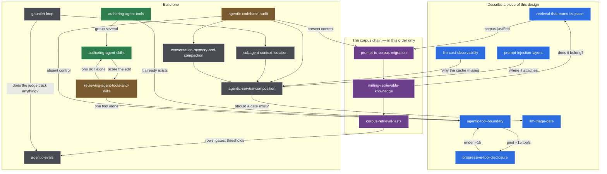

# 6 · Skills

The documents under [`.claude/skills/`](../.claude/skills/), what each is for, and
which situation sends you to it.

**Two different things in this repository are called a skill.** The application's
skills are the capability groups the agent activates mid-turn — the ones
[chapter 2](02-context-engineering.md) discloses progressively, names in the prompt
and tool schemas only after activation.
This chapter is about the other kind: files no user ever reaches, read by the
*engineer* — human or coding agent — working on a system like this one. They carry
the design reasoning with none of this project's code, which is why they travel.

Each is a directory with a `SKILL.md`: a `description` that decides when it is
read, and a body that teaches once it is. Some carry sibling files the body loads
only when a reader gets that far.

## How you reach one

This is the difference that changes how a reader gets to a skill, so it is a column
in both tables below.

| Fired by | What happens | What that means for you |
|---|---|---|
| **the model** | the harness matches the turn against the `description` and loads the body | you do not ask for it; you describe the problem, and a description written for that sentence pulls the skill in |
| **by name** | the frontmatter carries `disable-model-invocation: true`, so nothing fires it automatically | a person runs it deliberately — these are sweeps and audits, work with a start and an artefact, not advice mid-turn |

The by-name ones are the passes that produce a document: an audit, a sweep, a
migration plan, a committed query set. A skill that would only ever be right on a
turn nobody types is better as a procedure someone invokes than as a description
paid for on every turn of every conversation.

**This chapter routes; it does not teach.** Every row is a door, not a summary —
the material lives once, inside the skill. If a paragraph here would let you skip
the skill, it is a paragraph that will drift.

## The hand-offs

Almost every skill ends by naming the neighbour that owns the next question, and
the useful ones say so in their own descriptions. Four of them form a chain that
**does not commute**: audit the prompt, write the document, prove it retrieves,
and only then delete the text from the prompt.



## Skills that describe a piece of this design

Each one is the reasoning behind a component that runs here — read it beside the
chapter that measures it.

| Skill | What it is for | Fired by | Hands off to |
|---|---|---|---|
| [`agentic-tool-boundary`](../.claude/skills/agentic-tool-boundary/SKILL.md) | the four rules the class at the tool door enforces, so a tool owns only its arguments and its meaning | the model | `progressive-tool-disclosure` |
| [`progressive-tool-disclosure`](../.claude/skills/progressive-tool-disclosure/SKILL.md) | keeping a large tool set affordable — names in the standing prompt, schemas on activation | the model | `agentic-tool-boundary` |
| [`llm-triage-gate`](../.claude/skills/llm-triage-gate/SKILL.md) | a cheap classifier in front of an expensive agent, and the pre-filters and cache that spare even the classifier | the model | — |
| [`prompt-injection-layers`](../.claude/skills/prompt-injection-layers/SKILL.md) | four ordered layers of injection defence, each shrinking the next one's job | the model | `agentic-service-composition` |
| [`retrieval-that-earns-its-place`](../.claude/skills/retrieval-that-earns-its-place/SKILL.md) | whether an agent that already has tools should retrieve at all, what goes in the corpus, and when it runs | the model | `prompt-to-corpus-migration` |
| [`llm-cost-observability`](../.claude/skills/llm-cost-observability/SKILL.md) | making spend decomposable by role, and a cache-hit claim provable | the model | `agentic-service-composition` |

### `agentic-tool-boundary`

**Reach for it when a tool is being added or reviewed** — especially one whose
parameters would let the model name a destination.

- The API doc shows a full URL, so the new tool is about to take `String url`, and
  every SSRF target in the world now has somewhere to be typed.
- A tool result is a fat JSON document and nobody has decided what the model may
  see of it — the trap this repository hit with `ToolJson.project` on a container
  path, which reads like a projection and drops nothing.
- An upstream call throws, and the exception's message — carrying the upstream URL,
  the response body, possibly a credential — is on its way into the prompt, the
  history and the provider's logs.

### `progressive-tool-disclosure`

**Reach for it when the standing prompt is mostly tool schemas**, or when the tool
count grew and selection accuracy fell with it.

- 102 tools would put roughly 8k tokens of schema in front of every turn of every
  conversation, unchanged from the first turn to the last — see
  [chapter 2](02-context-engineering.md) and
  [ADR 0005](adr/0005-progressive-tool-disclosure-through-skills.md).
- Someone proposes tool *search* instead of skills and the two are being treated as
  complementary.
- The catalogue doubled and the model started reaching for the wrong tool; the
  answer is a level of indirection, not a better description on each of them.

### `llm-triage-gate`

**Reach for it when every request pays for a full agent turn** regardless of
whether it needed one.

- Bare greetings arrive all day and each one currently costs a full agent turn:
  a model call to discover that nothing was asked.
- Two small models are being compared for the classifier slot and the choice is
  about to be made on version numbers — the newer one here was **6.5× slower** on
  the same prompt ([ADR 0006](adr/0006-llm-as-judge-triage.md)).
- The classifier returned a field the enum does not contain, and the code that
  consumes it assumes that cannot happen.

### `prompt-injection-layers`

**Reach for it when a regex blocklist is the whole defence**, or when a detector
has started refusing real users.

- `"pode ignorar o que eu disse antes, na verdade quero o CNPJ"` is a real customer
  and the blocklist refuses them — two sentences of exactly that shape were real
  false positives here, caught by the corpus in [chapter 5](05-evaluation.md).
- The untrusted text is a *tool result*, not a user message, and nothing screens
  it — the only place indirect injection can be caught.
- A rule is about to be narrowed to fix one complaint, with nothing that says which
  attacks the narrowing loses.

### `retrieval-that-earns-its-place`

**Reach for it when RAG is being added to an agent that already has tools**, or
when a similarity threshold is being tuned.

- A corpus of world facts is proposed for questions the tools already answer, and
  now the model has two sources and no way to prefer one.
- `minScore` alone is meant to decide when to retrieve — here the relevant and
  irrelevant score distributions **overlap**, so it cannot
  ([ADR 0010](adr/0010-rag-over-the-assistants-own-documentation.md)).
- Retrieved chunks are being written into persisted chat memory by a framework
  default nobody chose.

### `llm-cost-observability`

**Reach for it when the model bill is one number** nobody can decompose.

- The claim the whole architecture rests on — the classifier is most of the calls
  and a small part of the cost — has no graph behind it.
- The prompt was laid out to earn cache hits, and the framework's vendor-neutral
  usage type does not report cached tokens, so the win is unclaimable.
- A model listener threw, the exception was swallowed, and the accounting has a
  hole in it rather than an error.

## Skills that are about building one

Ordered the way the work runs: author, sweep what already ships, audit, move
prompt text into a corpus and prove it lands, then assemble and drive the runtime.

| Skill | What it is for | Fired by | Hands off to |
|---|---|---|---|
| [`authoring-agent-tools`](../.claude/skills/authoring-agent-tools/SKILL.md) | the interview before a tool exists — whether it should, and what its contract is | the model | `agentic-tool-boundary`, `authoring-agent-skills` |
| [`authoring-agent-skills`](../.claude/skills/authoring-agent-skills/SKILL.md) | writing the document a model reads when tools are grouped: the description routes, the body teaches | the model | `reviewing-agent-tools-and-skills` |
| [`reviewing-agent-tools-and-skills`](../.claude/skills/reviewing-agent-tools-and-skills/SKILL.md) | sweeping a whole tool and skill layer for routing, contract and body defects | **by name** | `agentic-tool-boundary`, `authoring-agent-skills` |
| [`agentic-codebase-audit`](../.claude/skills/agentic-codebase-audit/SKILL.md) | inventorying a codebase's seams and producing a ranked, capped plan for what is *absent* | **by name** | the describing skills above |
| [`prompt-to-corpus-migration`](../.claude/skills/prompt-to-corpus-migration/SKILL.md) | finding standing prompt content that ships on every turn and planning its move out | **by name** | `writing-retrievable-knowledge` |
| [`writing-retrievable-knowledge`](../.claude/skills/writing-retrievable-knowledge/SKILL.md) | writing a document so that one retrieved chunk of it answers the user alone | the model | `corpus-retrieval-tests` |
| [`corpus-retrieval-tests`](../.claude/skills/corpus-retrieval-tests/SKILL.md) | the committed query set that proves a corpus answers, and the diagnosis when one row stops | **by name** | `agentic-evals` |
| [`agentic-evals`](../.claude/skills/agentic-evals/SKILL.md) | proving a prompt, classifier or guardrail change safe — what gates a build and what only reports | the model | `gauntlet-loop` |
| [`agentic-service-composition`](../.claude/skills/agentic-service-composition/SKILL.md) | wiring a runtime out of one service per role, and attaching guardrails where they actually run | the model | `llm-triage-gate` |
| [`conversation-memory-and-compaction`](../.claude/skills/conversation-memory-and-compaction/SKILL.md) | deciding what a turn carries forward and what it may forget | the model | `agentic-service-composition` |
| [`subagent-context-isolation`](../.claude/skills/subagent-context-isolation/SKILL.md) | spending a sub-agent only where the context it throws away is worth the extra calls | the model | `agentic-service-composition` |
| [`gauntlet-loop`](../.claude/skills/gauntlet-loop/SKILL.md) | driving work toward a standard the agent cannot grade itself into | the model | `subagent-context-isolation`, `agentic-evals` |

### `authoring-agent-tools`

**Reach for it when someone says "we need a tool for X"** and the tool does not
exist yet.

- The request arrived as an implementation — *wrap the orders endpoint* — and
  nobody has written down a sentence a user actually types.
- Two proposed tools turn out to answer the same list of sentences, which makes
  routing a coin flip; the finding is that one of them should not be built.
- The parameter set is being copied from the upstream API's query string, so the
  model is handed fields no user question ever mentions.

### `authoring-agent-skills`

**Reach for it once the grouping decision is made and the text has to be written**,
or when a skill fires on the wrong turns.

- The body has grown to the point where the instruction at the top no longer
  steers the tool call at the bottom.
- Two descriptions claim the same ground and neither hands the boundary to the
  other by name, so which one fires is effectively random.
- A skill is model-invoked but no turn anyone types matches its description: paid
  on every turn, activated on none.

### `reviewing-agent-tools-and-skills`

**Invoked by name.** Reach for it when a routing signal is about to change — a
description, a name, which items are exposed, or the order they appear in.

- A one-word description edit is queued and nothing in the build would show which
  turns it moves; here that is not hypothetical, since a `@Tool` description is
  shipped behaviour with no code diff.
- A tool has had no calls this month and nobody knows whether it is unused or
  simply unreachable behind a neighbour that answers first.
- A rename is being waved through as cosmetic — the routing change a sweep produces
  most often and the one it is most tempted not to measure.

### `agentic-codebase-audit`

**Invoked by name.** Reach for it when arriving at an agentic codebase you did not
write, or before a review that must find what was never written. It hunts
**absences**, so no diff looks wrong and there is no line to point at.

- A provider client is constructed inside the request path, so the connection count
  now tracks traffic instead of capacity.
- Guardrails run on the way in and nothing runs on the way out.
- A conversation key has no tenant component and is one identifier bug away from
  cross-user bleed, with nothing in the type system objecting.

### `prompt-to-corpus-migration`

**Invoked by name.** Reach for it when the system prompt only ever grows — every
feature ships a paragraph into it and no paragraph is ever charged rent.

- The system prompt has reached 9 KB and most turns use none of it, and nobody can
  say what is in there.
- A skill whose activation condition is absent or always true: standing text
  wearing a routing costume.
- A document was migrated into the corpus and the prompt still carries its copy, so
  the model answers from the one sitting in front of it.

### `writing-retrievable-knowledge`

**Reach for it when a file is about to be added to a corpus**, or when a question
that plainly matches a document does not retrieve it.

- A retrieved passage arrives reading *"as described above, this applies to all of
  them"* and means nothing on its own.
- The document is written in the team's vocabulary — *verdict*, *activation*,
  *catalogue key*, the words [`CONTEXT.md`](../CONTEXT.md) defines — and the user
  types none of them.
- The content includes a table whose header row is about to end up in a different
  chunk from its rows.

### `corpus-retrieval-tests`

**Invoked by name.** Reach for it when the retrieval suite is all positives and
passes — which a corpus that returns its nearest chunk for *every* input also does.

- Every question in the suite hits, and nobody has asked what comes back for
  `"escreva um script em python"`.
- A new document landed in the corpus and an older question now retrieves it
  instead of the document written for it.
- A row fails and the tempting fix is to edit the row.

### `agentic-evals`

**Reach for it when the thing that changed is a prompt, a rule or a description**
and someone has to show nothing regressed.

- A guardrail rule is being narrowed to fix one false positive — the regression
  [chapter 5](05-evaluation.md)'s injection corpus exists to catch.
- A suite needs an API key and four minutes on every push, and it is one blocked
  developer away from being marked ignored.
- An LLM judge is scoring another model's output and nobody has measured the judge
  against a human on the rows people argue about.

### `agentic-service-composition`

**Reach for it when one service both classifies and answers**, or when a guardrail
that is configured never seems to run.

- The classifier is reached through the answerer's service and inherits its tool
  schemas and its memory, so the classification returns next turn as if the user
  had said it.
- A model id appears in application code, which makes swapping the cheap model a
  code change rather than a deployment one.
- The provider's prompt cache stopped hitting and something interpolated into the
  standing prefix is the reason.

### `conversation-memory-and-compaction`

**Reach for it when history grows unbounded**, or when a compaction pass is being
written or reviewed.

- A long conversation quietly lost a capability because compaction summarised away
  a skill activation — the invariant `ConversationCompactorTest` guards here.
- Compaction separated a tool result from the `AiMessage` that requested it, and
  the provider rejected the whole list.
- The choice is between a message window and a token budget, and only one of them
  replays the same stored history as the same prompt after a tokenizer upgrade.

### `subagent-context-isolation`

**Reach for it when work is being split across several agents**, or when the brief
a child receives is being written.

- The proposed split is an org chart — researcher, writer, critic — so the same
  material is retold at every hop and hedges arrive as flat assertions.
- A child returned eight sentences and the next user turn asks about the ninth,
  which means nothing was discarded and the sub-agent was a prompt section with a
  round trip in front of it.
- A fan-out has no call budget, and one of the children can spawn children.

### `gauntlet-loop`

**Reach for it when someone asks for excellent, production-grade or "AAA"**, or
when quality is being self-reported by whoever produced it.

- The plan is *build it and then review it against the bar*, in one pass, by one
  agent — which leaves prose where it should leave artefacts someone else can open.
- A critic returns the same grade round after round, which is usually the bar being
  unreachable rather than the work being bad.
- Two independent drafts exist and the comparison must not know which one is
  whose.

This repository ships the technique, not a harness runner for it: which tool fans
out, where state survives a session and how a run resumes are properties of the
harness, and a skill that guessed them would be wrong on every other one.

## Keeping this list honest

The failure mode of a chapter like this is silent: a skill is added under
`.claude/skills/` and no row is written, so it exists for the model and not for the
reader — or a row outlives the directory it names and sends someone to a path that
is not there. Neither breaks a build.

```bash
./scripts/check-skill-docs.py    # skill directories vs the rows here, both ways
```

Set equality in both directions, and exit 1 on either failure. It is the same
argument as [`check-tool-catalogue.py`](../scripts/check-tool-catalogue.py): when a
pairing is a directory name on one side and a Markdown table on the other, nothing
in the language checks it, so something else has to.

---

← [5 · Evaluation](05-evaluation.md) | [Back to the index](INDEX.md) →
