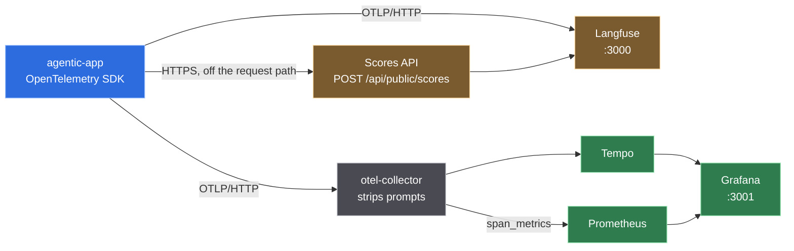
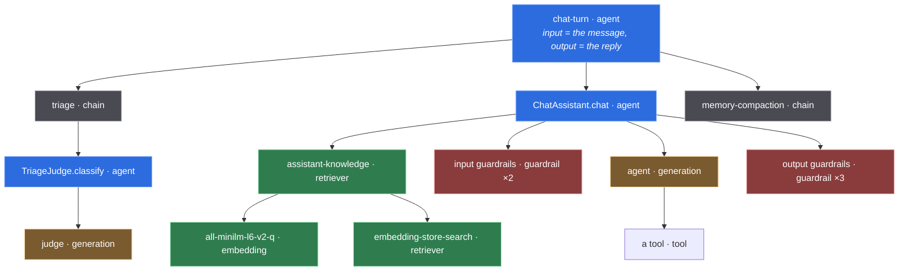

# 7 · Observability

What one turn looks like from the outside, and how it got there without a single
`span.start()` in the pipeline it describes.

[Chapter 4](04-operations.md) covers the Micrometer counters: how many tokens, how much
money, at what rate. This chapter is the other half — *which* turn, *which* tool call,
*which* prompt. A counter is an alarm with no address; a trace is the address.

The decision and its evidence are in
[ADR 0011](adr/0011-opentelemetry-as-the-observability-substrate.md). This chapter is how
to use it.

---

## Two readers, one substrate

OpenTelemetry is the only instrumentation this application has. Two very different tools
read the same spans, and neither replaces the other.



| Question | Read it in |
|---|---|
| what was the model asked, and what did it answer | **Langfuse** |
| why did this turn cost what it cost | **Langfuse** — usage and cost are per observation |
| how sure was the judge, across every turn this week | **Langfuse** — that is a score, and scores aggregate |
| is the p95 rising, and since when | **Grafana** — span metrics, derived from the same spans |
| which seam is the slow one | either; Grafana groups by `langfuse_observation_type` |
| is the collector dropping spans | **Grafana** — `otelcol_exporter_send_failed_spans_total` |

**The two stacks do not run at the same time on a 7 GB machine.** Langfuse self-hosted is
six containers wanting ~4 GB; the Grafana side wants ~2.5 GB; the application and floci want
3 GB more. `compose.observability.yaml` ships them as two profiles for that reason.

---

## What a turn looks like

This is a real tree, taken from `TurnTraceShapeTest` — not a sketch of one.



Two things about this shape are load-bearing.

**The turn is the root, not `POST /api/chat`.** Langfuse v4 has no separate trace entity —
a trace is a group of observations correlated by trace id — and it expects the overall
request and response on the root observation. Left alone, Micronaut's server filter would
put the HTTP request above the turn and the root would carry neither the message nor the
reply. `otel.exclusions` removes the server span for that one route, and the turn also says
outright that it is the root (`langfuse.internal.is_app_root`), so the trace stays headed if
that exclusion is ever removed.

**The types are what draw the graph.** Langfuse renders an agent graph only when a trace
holds an observation typed something other than `span`, `event` or `generation`. A trace of
identical `span`s is a list; the same trace with `agent`, `chain`, `tool`, `retriever` and
`guardrail` on it is a picture of what the agent does.

---

## The seams

Nothing in the pipeline knows it is observed. LangChain4j 1.18.1 publishes a listener for
every layer, and each fires on the caller's thread — so an observation nests under the turn
by virtue of the OpenTelemetry context alone, with no plumbing.

| Layer | Seam | Type | Class |
|---|---|---|---|
| the turn | opened by hand — the only one | `agent` | `ChatTurnService` |
| triage | `@Observed` | `chain` | `TriageService` |
| memory read / write / delete | `@Observed` | `span` | `WriteThroughChatMemoryStore` |
| compaction | `@Observed` | `chain` | `ConversationCompactor` |
| model call | `ChatModelListener` | `generation` | `LangfuseChatModelListener` |
| AI-service invocation | `AiServiceStarted/Completed/Error` | `agent` | `LangfuseAiServiceListener` |
| tool execution | `ToolExecutedEventListener` | `tool` | `LangfuseToolListener` |
| guardrails | `Input/OutputGuardrailExecuted` | `guardrail` | `LangfuseGuardrailListener` |
| embeddings | `EmbeddingModelListener` | `embedding` | `LangfuseEmbeddingModelListener` |
| RAG retrieval | `ContentRetrieverListener` | `retriever` | `LangfuseRetrieverListener` |
| vector search | `EmbeddingStoreListener` | `retriever` | `LangfuseEmbeddingStoreListener` |
| outbound HTTP | Micronaut OTel client filter | `span` | — |
| a guardrail reprompt | `OutputGuardrailExecuted`, when the result is a reprompt | `event` | `LangfuseGuardrailListener` |
| a compaction firing | inside the compactor, at the moment it decides | `event` | `ConversationCompactor` |
| grading one eval row | opened by the experiment runner | `evaluator` | `ExperimentRun` |
| judge verdicts | the Scores API | *a score* | `LangfuseScoreWriter` |

That table covers **all ten** of Langfuse's observation types, each produced by something
real: `agent`, `chain`, `span`, `generation`, `tool`, `guardrail`, `embedding`, `retriever`,
`event` and `evaluator`. Until this round two of them — `event` and `evaluator` — were in the
enum with no producer at all, which is a different thing from a type this application has no
use for.

**Nine of them, on a request path.** That sentence is about the repository and it has been
read as being about production traffic. `evaluator`'s only producer is `ExperimentRun`,
whose only callers are under `src/test` and run under `-Pevals`; no served turn reaches it.
Measured: six real turns against a self-hosted 4.16.0 produced 100 observations spanning
nine types and no `EVALUATOR` row. Copy this design and never run an eval, and your traces
hold nine — which is enough for everything the agent graph needs, because it needs one.
[Chapter 8](08-langfuse-features.md) has the census.

**Why two of them are `event` and not `span`.** An event is a decision taken at an instant,
not work with a duration. N guardrail observations in a turn say a guardrail ran N times;
none of them says the second run exists *because* the first asked for it, and the causal link
between a refusal and the extra model call it bought is the expensive fact. The duration that
followed belongs to the generation, which already has its own observation.

**Why `evaluator` matters beyond tidiness.** Langfuse draws an agent graph for a trace only
when it holds an observation whose type is something other than `span`, `event` or
`generation`. Typing the grading step correctly is what turns an eval run from a flat list
into a graph.

`AgentTracer` is the only interface any of them uses. No other package imports
OpenTelemetry.

### The AOP one

```java
@Observed(value = "triage", type = ObservationType.CHAIN, captureResult = true)
public TriageVerdict triage(String rawText) { … }
```

Micronaut's `@Around` advice is compile-time and subclass-based, so — unlike `@Cacheable`
in this same codebase — **a self-invoked annotated method IS observed**. The two look
identical at the call site and behave oppositely; `ObservedInterceptorTest` pins it.
Applying the annotation to a `private`, `static` or `final` method is a compilation error
rather than a silent no-op.

---

## Tokens, cost and the two conventions

Usage and cost live on `generation` and `embedding` observations and on no other type.

Langfuse stores usage as **mutually exclusive buckets** — every token in exactly one key —
and both providers hand their numbers over in the wrong shape, in opposite directions:

| Provider | Cached input | Reasoning output |
|---|---|---|
| OpenAI | reported **inside** `prompt_tokens` → subtracted | reported **inside** `completion_tokens` → subtracted |
| Gemini | reported **inside** `promptTokenCount` → subtracted | reported **beside** `candidatesTokenCount` → added |

Getting the second column backwards is invisible in both directions, and it was already
wrong here: langchain4j maps Gemini's `outputTokenCount` from `candidatesTokenCount` alone,
so with `thinking-level: low` on the agent role **every turn's cost was understated by
however much the model thought**. `TokenUsageDetails` is where both conventions are
reconciled.

**Cost is ingested, not inferred.** Langfuse can price a generation from its own model
definitions; this application sends `cost_details` from the same `CostCalculator` that feeds
`agentic_llm_cost_usd_total`, so the trace and the counter cannot report different numbers
for one call.

That sentence used to be here and used to be **false**, which is worth keeping rather than
quietly correcting. Both numbers did come from `CostCalculator` — through two different
overloads. The four-argument one takes raw counts and has no notion of a reasoning token, so
on a Gemini answer that spent 880 tokens thinking the span said `5.32e-4` and the counter
said `1.8e-4`: the counter reported **34% of the real cost**, on every turn, while a
paragraph in this chapter promised they could not disagree. `TokenCostListener` now builds
`TokenUsageDetails` once and hands the same object to Micrometer, to `GenAiMetrics` and to
the generation span. `GenAiMetricsTest.theTwoCostsAgree` asserts the equality rather than a
literal, so a price change in `application.yml` has to move both or fail.

**The Micrometer buckets are mutually exclusive too, as of that fix.**
`agentic_llm_tokens_total{kind="input"}` no longer includes the cached reads — it is the
fresh input, `kind="cached_input"` is the rest, and `kind="output_reasoning"` is new. The
dashboard's cache-hit panel already assumed this: its denominator is
`kind=~"input|cached_input"`, which is only a total if the two are disjoint. Before the fix
that panel understated every cache-hit rate it drew.

### The third vocabulary: OpenTelemetry's own GenAI metrics

Chapter 7 used to argue that a second metrics pipeline could only be a way for two numbers to
disagree. That was right about the risk and wrong about the remedy — and the disagreement it
warned about turned out to be already there, inside the one pipeline it trusted.

`GenAiMetrics` emits the two histograms the GenAI semantic conventions define, from the same
`TokenUsageDetails` object everything else reads:

| Instrument | Unit | What it is for |
|---|---|---|
| `gen_ai.client.token.usage` | `{token}` | tokens per call, split by `gen_ai.token.type` |
| `gen_ai.client.operation.duration` | `s` | latency per call, `error.type` on the failures |

Three things about them are decisions rather than transcription.

**`gen_ai.token.type` is a closed set of `input` and `output`.** Langfuse's buckets are four.
A cache read is still an input token and a reasoning token is still an output token, so the
fold is `input = INPUT + INPUT_CACHED` and `output = OUTPUT + OUTPUT_REASONING` — and
`GenAiMetricsTest` asserts the folded totals against `TokenUsageDetails` rather than against
literals, because a fold that quietly dropped a bucket would still look plausible on a panel.

**The unit is seconds, and the span metrics are milliseconds.** Deliberately, and they must
not be reconciled: the collector's `span_metrics` connector is pinned to `ms` because the
unit is part of the Prometheus metric *name*, while the convention specifies `s` here. Two
names, two units, no ambiguity. One unit written into the wrong metric would be off by a
thousand and still plot.

**`gen_ai.provider.name` carries the LangChain4j spelling** (`google_ai_gemini`), not the
value from the conventions' registry. The registry value would be more portable in the
abstract and would join to nothing: the spans carry `gen_ai.system = google_ai_gemini` and
the span metrics derive `gen_ai_request_model` from those same spans. One vocabulary that
joins beats two that are each half right.

They are exported **only when a collector is configured**. `otel.metrics.exporter` follows
`agentic.observability.otlp.endpoint`, because a `MeterProvider` dials on an *interval*
rather than once — OpenTelemetry's own default of `otlp` would have every `./mvnw test` run
open a connection to `localhost:4318` and keep retrying it, and the default build is required
to need no network. The collector's metrics pipeline already has an `otlp` receiver beside
the `span_metrics` connector, so nothing else had to change for them to reach Prometheus.

---

## Scores

The judge's verdict is not a span attribute. Langfuse's migration guide is explicit: a score
goes to the Scores API, **"not an OTLP trace span"**.

| Score | Type | Why that type |
|---|---|---|
| `triage_confidence` | `NUMERIC` | it averages, and "every turn under 0.7" is a range query |
| `triage_decision` | `CATEGORICAL` | averaging `IN_SCOPE` and `OUT_OF_SCOPE` produces nothing |

A score aggregates across traces and an attribute does not, which is the whole reason for
the second transport. It is also the column a human annotation and an offline evaluator
write into, so the judge's opinion sits beside its later corrections.

The write never touches the request path: a bounded queue with a background consumer that
**drops rather than blocks**. The judge exists because it costs 0.91 s; a synchronous POST
would spend that.

Only the model path is scored. A greeting is answered by the pre-filter with no judge call
at all, and a confidence recorded there would be a number attributed to a component that
never ran.

### Corrections: what the model should have said

A **correction** is a score with `dataType: "CORRECTION"` and `name: "output"` — the same
endpoint, and no span attribute exists for one. Langfuse renders it as a diff against the
actual output and exports it as fine-tuning data.

Pushed at a running self-hosted 4.16.0 and read back **[verified]**:

```
  ok    correction accepted (200)
  ok    the correction is named 'output'
  ok    the corrected output survived the round trip
  ok    the correction is attached to the ROOT observation
        subject={"kind":"observation","id":"1850ce43356792ad","traceId":"550500a45653…"}
```

Reading them back needs `dataType=CORRECTION&fields=subject,details`. Without the `fields`
group the projection is lean and `value` comes back `null`, which is indistinguishable from a
write that never landed — the same trap the observations endpoint sets.

Both halves are fixed by the feature rather than chosen by the caller, which is why
`Score.correction(text)` takes only the text: a correction filed under any other name is an
ordinary score that never reaches the diff view, and nothing anywhere reports that. It is
also the one score that is **not** truncated at the 500-character `TEXT` ceiling. A cut
critique is still a critique; a cut correction is a wrong answer that reads as a right one.

The producer is the eval harness. When a row fails, the expected output *is* the correction —
that is precisely the documented use — and it is filed against the item **root**, because
Langfuse reads an experiment-item score off the root observation. A passing row writes none:
a correction on a row that was already right is a training example asserting the opposite.

### Experiments

An experiment has no entity on the wire either. Langfuse synthesises one out of ordinary
traces that carry the same `langfuse.experiment.id` — one trace per item — so the whole
feature is a set of attributes that must reach **every** span of **every** item trace.

`ExperimentRun` exists for the two traps and nothing else:

- **The item root must be the OTel trace root.** Any ambient span would adopt it, and
  `langfuse.experiment.item.root_observation_id` would then name a span in another trace.
  Each item is started from `Context.root()`. That also drops the experiment's own context
  key, so the experiment is re-opened on top of the detached context — miss that and the run
  exports with no `langfuse.experiment.*` attribute at all.
- **`root_observation_id` is not a value a caller can supply correctly.** It is the id of a
  span that does not exist until it has been started, so `Observation.experimentItem` derives
  it from the observation's own span id rather than accepting it.

The attributes ride the same private context key as the turn attributes, read by the same
span processor. Langfuse's own guide recommends Baggage here; Baggage is injected into
outbound request headers, and an eval run is exactly when that bites — the rows are
adversarial by construction and the tools they reach still call third parties.

Eval traffic sets `langfuse.environment=experiment` so it cannot pollute the dashboards and
alert rules that watch production.

**What a running 4.16.0 actually does with them, measured [verified].** An experiment-shaped
trace was pushed through the real OTLP door and read back:

```
  ok    experiment trace accepted (200)
  ok    the grading child is typed EVALUATOR (lower-case 'evaluator' on the wire)
  ok    langfuse.environment separates the run from production traffic
  ok    experiment attributes arrive (unmapped, under metadata.attributes)
```

The third line is the one to read twice. On this self-hosted version the
`langfuse.experiment.*` family is **not** mapped to first-class experiment fields — every
value arrives, and every one of them lands in the unmapped catch-all as
`metadata["attributes.langfuse.experiment.id"]` and siblings, exactly the way Langfuse files
any attribute it does not recognise. The trace is intact and the data is queryable; what does
not happen is the experiment view assembling it.

The attribute names come from Langfuse's own OpenTelemetry experiments guide, so this is a
gap between that page and the self-hosted build rather than a spelling mistake — but the
distinction matters to anyone expecting an experiments UI to light up, and the honest label
for "the experiments view works" is `[sourced — unverified]`. `check-langfuse-ingestion.sh`
asserts the behaviour observed here, so the day a version does map them the check fails and
someone re-reads the mapping instead of finding out years later.

### Alerts

**Langfuse's alerts have no producer in the application at all.** They are configured in its
UI over observations and over numeric, categorical and boolean scores, routed through
Automations to Slack, a webhook or a GitHub Action. There is no file to commit; the
application's only lever is emitting data worth filtering on. `[sourced]`

**Grafana's are provisioned as code**, under `observability/grafana/provisioning/alerting/`,
and that asymmetry is the reason the rules live on the Grafana side. A provisioned rule with
a wrong field, an unknown datasource uid or a malformed `data` block is logged once at
startup and then skipped — Grafana comes up perfectly healthy watching nothing, which looks
exactly like a quiet system. `check-observability-stack.sh` therefore reads the rules back
out of `/api/v1/provisioning/alert-rules` rather than trusting that the container started.

Four rules, each chosen because it detects something that is otherwise silent. The rules
themselves were read back off a running Grafana 13.2.0 and every expression was evaluated
against a live Prometheus **[verified]** — the *thresholds* are judgement, and the note under
the table says which of them rests on a measurement and which does not:

| Rule | Expression | Fires at |
|---|---|---|
| Spans are being dropped before they reach Tempo | `sum by (exporter) (rate(otelcol_exporter_send_failed_spans[5m]))` | `> 0`, after 2m |
| More than a fifth of chat turns are failing | error calls ÷ all calls on `chat-turn` | `> 0.2`, after 10m |
| Chat turns are taking more than fifteen seconds | `histogram_quantile(0.95, …duration_milliseconds_bucket…)` | `> 15000`, after 10m |
| LLM spend is above one dollar an hour | `sum(rate(agentic_llm_cost_usd_total[15m])) * 3600` | `> 1`, after 15m |

Two details in that table are the whole craft of it.

**The latency threshold is 15000, not 15.** The span-metrics histogram is pinned to
milliseconds because its unit is part of the Prometheus metric name; a threshold written in
seconds is off by a factor of a thousand and never fires.

The expression returned `4850` against the traffic on this machine, and what that number
measures has to be said rather than implied: **every one of those turns ended in the Gemini
400 of [issue #18](https://github.com/rodrigorjsf/java-micronaut-langchain4j-poc/issues/18)**,
so it is a p95 time-to-failure, not a p95 answer time. It still settles the question it was
read for — the expression evaluates, returns a number, and that number is in the thousands
rather than the single digits, which is the unit check. It settles nothing about whether
15 s is the right threshold for a healthy turn; that number is `[sourced — unverified]` until
a turn succeeds against this stack.

**Rule 1 cannot see the first failure, and says so.** `rate()` and `increase()` compute
last-minus-first over the samples in the window, so a counter that appears at 1 and stays
there produces no increase at all — the collector does not emit
`otelcol_exporter_send_failed_spans` until it is non-zero, and its first appearance is
therefore invisible to the very rule watching for it. A *later* increment is seen normally.
That is a property of PromQL, not a fixable expression, and it is the kind of claim a YAML
linter cannot check — so `scripts/check-alert-rule-claims.sh` asserts the comment still
carries the blind spot and reproduces the behaviour with a `promtool` unit test on the real
engine.

**No-data handling differs per rule, deliberately.** `otelcol_exporter_send_failed_spans` is
*absent* until something fails — the collector does not emit a zero — so that rule treats no
data as OK and would otherwise be a permanent false alarm. The spend rule treats no data as
OK for a different reason: its series comes from the application's own `/prometheus`, and
that scrape target is legitimately down whenever someone starts only the observability
profile. A rule that screamed then would be trained away within a week.

---

## Running it

```bash
# The LLM-native view.
docker compose -f compose.observability.yaml --profile langfuse up -d   # :3000

# The service view.
docker compose -f compose.observability.yaml --profile grafana up -d    # :3001
```

Then point the application at whichever is up, in `.env`:

```
AGENTIC_OBSERVABILITY_OTLP_ENDPOINT=http://localhost:4318
AGENTIC_OBSERVABILITY_LANGFUSE_HOST=http://localhost:3000
AGENTIC_OBSERVABILITY_LANGFUSE_PUBLIC_KEY=pk-lf-…
AGENTIC_OBSERVABILITY_LANGFUSE_SECRET_KEY=sk-lf-…
```

With none of them set, nothing is exported and no connection is opened — which is what keeps
`./mvnw test` free of a network.

The Langfuse profile initialises **headlessly**, so those two keys exist before anyone opens
the UI rather than being copied out of it afterwards.

### The checks

```bash
./scripts/check-observability-stack.sh --down    # the Grafana leg
./scripts/check-langfuse-ingestion.sh            # the Langfuse leg, against a running instance
./scripts/check-app-tracing-e2e.sh --down        # the APPLICATION, for real
```

The first two push real data through the real doors and read back what arrived, rather than
asserting what should have. On the Grafana side the Prometheus metric name is composed by three
separate pieces of code, so a dashboard query can be wrong while every container is healthy.
On the Langfuse side every part of the contract fails silently — an upper-case observation
type is filed as a `SPAN` with no error at all. Measured on this machine:

```
  ok    no deprecated component types in the collector config
  ok    traces_span_metrics_calls_total
  ok    traces_span_metrics_duration_milliseconds_bucket
  ok    label langfuse_observation_type
  ok    tempo returned the probe trace by id
  ok    dashboard agentic-llm provisioned
```

```
  ok    root observation typed AGENT (not SPAN)
  ok    usage_details parsed, exclusive buckets kept: {"input":86,"input_cached_tokens":17817,…}
  ok    cost_details ingested rather than inferred: {"input":0.0000215,"output":0.000282,…}
  ok    totalCost is the ingested number, not an inferred one
  ok    the session id is on every observation
  ok    prefixed metadata is a top-level, filterable key
  ok    the score is attached to the OBSERVATION, not the trace
```

The third does something neither of the others can: it proves the **application** produces a
trace, rather than that the stack would accept one if it did. That distinction was not
academic. Before this script existed, `compose.yaml` set no OTLP endpoint at all — the
containerised application carried the entire tracing layer wired to nothing, every container
healthy, every dashboard empty, and nothing anywhere saying why. Measured **[verified]**:

```
==> sending one real turn
  FAIL  POST /api/chat returned nothing
==> waiting for the collector batch and the span_metrics flush
==> tempo
  ok    Tempo has the turn's trace (8676577d5b145b278c07c135496c067f)
        observation types in the trace: agent chain generation guardrail span tool
  ok    the trace contains a 'agent' observation
  ok    the trace contains a 'generation' observation
  ok    the trace contains a 'chain' observation
  ok    the trace contains a 'guardrail' observation
  ok    the trace contains a 'tool' observation
  ok    the session id reached the spans
  ok    langfuse.environment=docker, from the compose wiring
  ok    no observation input/output in Tempo (the collector stripped the payloads)
  ok    traces_span_metrics_calls_total has a chat-turn series
  ok    gen_ai_client_token_usage_count is being scraped
  ok    gen_ai_client_operation_duration_seconds_count is being scraped
  ok    gen_ai.token.type carries both input and output (input output)
  ok    agentic_llm_cost_usd_total is being scraped from the app

application tracing end to end: 1 FAILURE(S)
```

**That first line is not elided and the script exits 1 because of it.** Sixteen of seventeen
checks pass; the seventeenth is the turn itself, and until
[issue #18](https://github.com/rodrigorjsf/java-micronaut-langchain4j-poc/issues/18) is closed
this script cannot go green. It is listed beside two passing checks in the README and in
`CLAUDE.md`, and that is worth saying out loud rather than discovering: a red check that is
red for a known, filed, unrelated reason is still red, and the moment it stops being red for
*that* reason someone has to notice.

Two traps it walked into first, both now encoded in the script rather than in anyone's memory:

**Tempo's search index lags its ingestion.** At 25 s the search returned `{"traces":[]}` for
a trace `/api/traces/{id}` was already serving. A fixed sleep turns that lag into "the
application exported nothing", which is the one conclusion the script must never reach by
accident — so it polls for up to 150 s instead.

**A search on the span name matches the synthetic probe.** `check-observability-stack.sh`
pushes a probe also named `chat-turn` and also typed `agent`, so `.traces[0]` picked whichever
Tempo returned first and the assertions then described the probe — reporting "no generation
observation" about a turn that had produced six types. The predicate is this run's session id,
which nothing else can carry.

The one check that does **not** pass is the turn itself: every agent turn against Gemini 3.x
currently returns 500 for a missing `thought_signature`, which is
[issue #18](https://github.com/rodrigorjsf/java-micronaut-langchain4j-poc/issues/18) and has
nothing to do with observability. A failed turn still exports a complete trace, with the
failing generation marked `langfuse.observation.level=ERROR` — which is itself the layer
doing its job.

---

## Content, and what leaves the process

Span inputs and outputs are the user's message, the system prompt and whatever a public API
returned. Capturing them is the point of tracing an agent — a trace with no content shows
the shape of a turn and nothing about it — and it is also where observability becomes a
data-protection decision.

```yaml
agentic:
  observability:
    capture-content: true      # AGENTIC_CAPTURE_CONTENT
```

Three things bound it.

**A redactor list.** Contribute a `ContentRedactor` bean per rule; returning `null` drops the
payload entirely, which is the right answer when a redactor cannot establish that a value is
safe rather than merely failing to find a pattern in it.

**The collector strips payloads before Tempo.** The same spans go to both destinations, and
Tempo has no view that renders a prompt. Delete `attributes/strip-payloads` from the
collector pipeline if you want it there — and know that you are doing it.

Measured on this machine rather than assumed **[verified]**. One span was pushed through the
real OTLP door carrying seven attributes, one of them
`langfuse.observation.input = "SEGREDO-DO-USUARIO"`, and Tempo was then asked for it by id:

```
$ curl -s http://localhost:3200/api/traces/$TID \
    | jq -r '[ .. | objects | select(has("key")) | .key ] | unique | .[]'
langfuse.environment
langfuse.observation.type
langfuse.session.id
langfuse.trace.metadata.outcome
langfuse.trace.name
service.name
```

Six of seven arrived. The one that did not is the one that mattered, and this is the only
form of evidence a data-protection claim can have — a processor that silently stopped
matching would leave every other assertion in this chapter passing.

**Baggage is not propagated.** Langfuse recommends OpenTelemetry Baggage for copying
trace-level attributes to every span, and its own documentation carries the reason not to:
baggage is injected into outbound request headers. Every tool here calls a public API with
arguments the model chose, so the conversation id would travel to fifty third parties for
the sake of an in-process copy. A private context key does the same job and cannot be
injected into a header by any propagator. `otel.propagators` is `tracecontext`, not the
default `tracecontext,baggage`.

Turning capture off does **not** remove a retriever's scores, an embedding's count and
dimension, or a store search's threshold. None of that is content, and a deployment with
capture off still has to be able to argue about its own retrieval threshold.

---

## Failure modes, and what each looks like

| Symptom | Cause | What to do |
|---|---|---|
| every observation is a `SPAN` in Langfuse, no agent graph | the type attribute was sent upper case | it is matched **case-sensitively** against a lower-case table, and a miss is not an error — it falls through to the default |
| the trace has no root and no name | no span satisfies `parent_span_id = '' OR is_app_root = true` | every observation is still ingested; nothing errors. Check the server-span exclusion and `asTraceRoot()` |
| a sub-agent appears as its own trace | an executor that does not carry the context | `Context.taskWrapping(...)`, as `WorkflowExecutorFactory` does |
| cost is double what the invoice says | overlapping usage buckets | a cached count left inside the input count. `TokenUsageDetails` |
| cost is lower than the invoice | reasoning tokens in no bucket | Gemini reports them beside the output count, not inside it |
| data appears in Langfuse ~10 minutes late | the `x-langfuse-ingestion-version: 4` header is missing | it does not error; it selects the slower path |
| a dashboard panel is empty while everything is healthy | the metric name | the unit and the `_total` suffix are appended by the exporter, not the connector. `check-observability-stack.sh` |
| an unset variable takes out unrelated beans at startup | `${VAR:``}` | that resolves to the two-character string `` , not to empty. Write `${VAR:}` |
| a test fails with `Unresolved compilation problem` | stale IDE-compiled classes in `target/` | `./mvnw clean` |
| `langfuse-web` restart-loops on `Dirty database version 39` | ClickHouse older than 25.12 | migration 39 creates a skip index with a non-literal argument; 25.3 answers `Code: 80 … Only literals can be skip index arguments` and leaves the migration dirty. The message names the database, not the version |
| `GET /api/public/traces/{id}` answers 404 | a v4 deployment in events_only mode | there is no trace entity — read the trace's name and session off its observations |
| an observation reads back with `input`, `model` and `usageDetails` all `null` | the read, not the write | `/api/public/v2/observations` returns `core,basic` unless `fields=` asks for more; `traceName` needs the `trace_context` group |

---

## What is deliberately not here

**Log correlation.** Traces and logs are not joined. It is a small change —
`micronaut-tracing` ships a Logback appender installer — and it has not been made.

**`gen_ai.usage.*` — this paragraph used to say the opposite, and measurement is why.**
The usage family was left unset on the reasoning that Langfuse normalises it by subtracting
cache reads from input, so sending both would count a cache hit twice. Pushed at a real
4.16.0, that is not what happens: a generation carrying both families reads back with the
Langfuse buckets intact, byte for byte the same as one carrying only
`langfuse.observation.usage_details`. The `langfuse.*` namespace takes precedence, as it
does for every other attribute. Both are now written, from one `TokenUsageDetails`, and the
reason is not symmetry — Langfuse **3.80.0 ignores `usage_details` entirely** and reads usage
only from `gen_ai.usage.*`, so without them every token count and every cost on that version
reads zero on a trace that otherwise looks perfect. See
[chapter 8](08-langfuse-features.md).

---

← [6 · Skills](06-skills.md) | [8 · Wiring Langfuse features](08-langfuse-features.md) →
