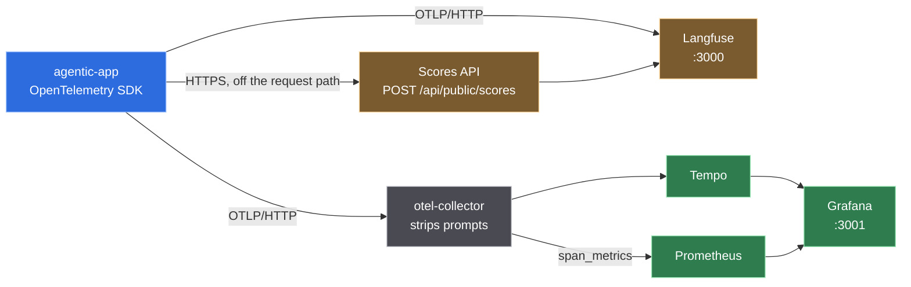
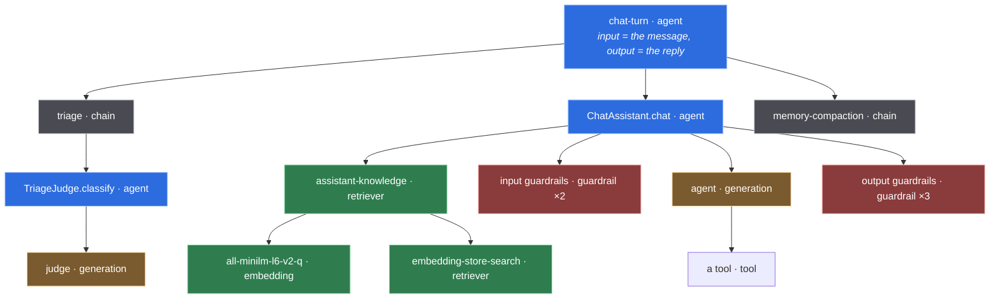

# 7 · Observability

What one turn looks like from the outside, and how it got there without a single
`span.start()` in the pipeline it describes.

[Chapter 4](04-operations.md) covers the Micrometer counters: how many tokens, how much
money, at what rate. This chapter is the other half — *which* turn, *which* tool call,
*which* prompt. A counter is an alarm with no address; a trace is the address.

The decision and its evidence are in
[ADR 0011](adr/0011-opentelemetry-as-the-observability-substrate.md). This chapter is how
to use it.

---

## Two readers, one substrate

OpenTelemetry is the only instrumentation this application has. Two very different tools
read the same spans, and neither replaces the other.



| Question | Read it in |
|---|---|
| what was the model asked, and what did it answer | **Langfuse** |
| why did this turn cost what it cost | **Langfuse** — usage and cost are per observation |
| how sure was the judge, across every turn this week | **Langfuse** — that is a score, and scores aggregate |
| is the p95 rising, and since when | **Grafana** — span metrics, derived from the same spans |
| which seam is the slow one | either; Grafana groups by `langfuse_observation_type` |
| is the collector dropping spans | **Grafana** — `otelcol_exporter_send_failed_spans_total` |

**The two stacks do not run at the same time on a 7 GB machine.** Langfuse self-hosted is
six containers wanting ~4 GB; the Grafana side wants ~2.5 GB; the application and floci want
3 GB more. `compose.observability.yaml` ships them as two profiles for that reason.

---

## What a turn looks like

This is a real tree, taken from `TurnTraceShapeTest` — not a sketch of one.



Two things about this shape are load-bearing.

**The turn is the root, not `POST /api/chat`.** Langfuse v4 has no separate trace entity —
a trace is a group of observations correlated by trace id — and it expects the overall
request and response on the root observation. Left alone, Micronaut's server filter would
put the HTTP request above the turn and the root would carry neither the message nor the
reply. `otel.exclusions` removes the server span for that one route, and the turn also says
outright that it is the root (`langfuse.internal.is_app_root`), so the trace stays headed if
that exclusion is ever removed.

**The types are what draw the graph.** Langfuse renders an agent graph only when a trace
holds an observation typed something other than `span`, `event` or `generation`. A trace of
identical `span`s is a list; the same trace with `agent`, `chain`, `tool`, `retriever` and
`guardrail` on it is a picture of what the agent does.

---

## The seams

Nothing in the pipeline knows it is observed. LangChain4j 1.18.1 publishes a listener for
every layer, and each fires on the caller's thread — so an observation nests under the turn
by virtue of the OpenTelemetry context alone, with no plumbing.

| Layer | Seam | Type | Class |
|---|---|---|---|
| the turn | opened by hand — the only one | `agent` | `ChatTurnService` |
| triage | `@Observed` | `chain` | `TriageService` |
| memory read / write / delete | `@Observed` | `span` | `WriteThroughChatMemoryStore` |
| compaction | `@Observed` | `chain` | `ConversationCompactor` |
| model call | `ChatModelListener` | `generation` | `LangfuseChatModelListener` |
| AI-service invocation | `AiServiceStarted/Completed/Error` | `agent` | `LangfuseAiServiceListener` |
| tool execution | `ToolExecutedEventListener` | `tool` | `LangfuseToolListener` |
| guardrails | `Input/OutputGuardrailExecuted` | `guardrail` | `LangfuseGuardrailListener` |
| embeddings | `EmbeddingModelListener` | `embedding` | `LangfuseEmbeddingModelListener` |
| RAG retrieval | `ContentRetrieverListener` | `retriever` | `LangfuseRetrieverListener` |
| vector search | `EmbeddingStoreListener` | `retriever` | `LangfuseEmbeddingStoreListener` |
| outbound HTTP | Micronaut OTel client filter | `span` | — |
| judge verdicts | the Scores API | *a score* | `LangfuseScoreWriter` |

`AgentTracer` is the only interface any of them uses. No other package imports
OpenTelemetry.

### The AOP one

```java
@Observed(value = "triage", type = ObservationType.CHAIN, captureResult = true)
public TriageVerdict triage(String rawText) { … }
```

Micronaut's `@Around` advice is compile-time and subclass-based, so — unlike `@Cacheable`
in this same codebase — **a self-invoked annotated method IS observed**. The two look
identical at the call site and behave oppositely; `ObservedInterceptorTest` pins it.
Applying the annotation to a `private`, `static` or `final` method is a compilation error
rather than a silent no-op.

---

## Tokens, cost and the two conventions

Usage and cost live on `generation` and `embedding` observations and on no other type.

Langfuse stores usage as **mutually exclusive buckets** — every token in exactly one key —
and both providers hand their numbers over in the wrong shape, in opposite directions:

| Provider | Cached input | Reasoning output |
|---|---|---|
| OpenAI | reported **inside** `prompt_tokens` → subtracted | reported **inside** `completion_tokens` → subtracted |
| Gemini | reported **inside** `promptTokenCount` → subtracted | reported **beside** `candidatesTokenCount` → added |

Getting the second column backwards is invisible in both directions, and it was already
wrong here: langchain4j maps Gemini's `outputTokenCount` from `candidatesTokenCount` alone,
so with `thinking-level: low` on the agent role **every turn's cost was understated by
however much the model thought**. `TokenUsageDetails` is where both conventions are
reconciled.

**Cost is ingested, not inferred.** Langfuse can price a generation from its own model
definitions; this application sends `cost_details` from the same `CostCalculator` that feeds
`agentic_llm_cost_usd_total`, so the trace and the counter cannot report different numbers
for one call.

---

## Scores

The judge's verdict is not a span attribute. Langfuse's migration guide is explicit: a score
goes to the Scores API, **"not an OTLP trace span"**.

| Score | Type | Why that type |
|---|---|---|
| `triage_confidence` | `NUMERIC` | it averages, and "every turn under 0.7" is a range query |
| `triage_decision` | `CATEGORICAL` | averaging `IN_SCOPE` and `OUT_OF_SCOPE` produces nothing |

A score aggregates across traces and an attribute does not, which is the whole reason for
the second transport. It is also the column a human annotation and an offline evaluator
write into, so the judge's opinion sits beside its later corrections.

The write never touches the request path: a bounded queue with a background consumer that
**drops rather than blocks**. The judge exists because it costs 0.91 s; a synchronous POST
would spend that.

Only the model path is scored. A greeting is answered by the pre-filter with no judge call
at all, and a confidence recorded there would be a number attributed to a component that
never ran.

### What the Scores API also unlocks

- **Corrections** are scores with `dataType: "CORRECTION"` and `name: "output"` — the same
  endpoint, no span attribute exists for them. `[sourced]`
- **Alerts** have no producer in the application at all: they are configured in the Langfuse
  UI over observations and over numeric, categorical and boolean scores. The application's
  only lever is emitting data worth filtering on. `[sourced]`

---

## Running it

```bash
# The LLM-native view.
docker compose -f compose.observability.yaml --profile langfuse up -d   # :3000

# The service view.
docker compose -f compose.observability.yaml --profile grafana up -d    # :3001
```

Then point the application at whichever is up, in `.env`:

```
AGENTIC_OBSERVABILITY_OTLP_ENDPOINT=http://localhost:4318
AGENTIC_OBSERVABILITY_LANGFUSE_HOST=http://localhost:3000
AGENTIC_OBSERVABILITY_LANGFUSE_PUBLIC_KEY=pk-lf-…
AGENTIC_OBSERVABILITY_LANGFUSE_SECRET_KEY=sk-lf-…
```

With none of them set, nothing is exported and no connection is opened — which is what keeps
`./mvnw test` free of a network.

The Langfuse profile initialises **headlessly**, so those two keys exist before anyone opens
the UI rather than being copied out of it afterwards.

### The check

```bash
./scripts/check-observability-stack.sh --down
```

It pushes a real trace through the real OTLP door and reads back what the collector
produced, rather than asserting what it should be — because the Prometheus metric name is
composed by three separate pieces of code and a dashboard query can be wrong while every
container is healthy. Measured on this machine:

```
  ok    no deprecated component types in the collector config
  ok    traces_span_metrics_calls_total
  ok    traces_span_metrics_duration_milliseconds_bucket
  ok    label langfuse_observation_type
  ok    tempo returned the probe trace by id
  ok    dashboard agentic-llm provisioned
```

---

## Content, and what leaves the process

Span inputs and outputs are the user's message, the system prompt and whatever a public API
returned. Capturing them is the point of tracing an agent — a trace with no content shows
the shape of a turn and nothing about it — and it is also where observability becomes a
data-protection decision.

```yaml
agentic:
  observability:
    capture-content: true      # AGENTIC_CAPTURE_CONTENT
```

Three things bound it.

**A redactor list.** Contribute a `ContentRedactor` bean per rule; returning `null` drops the
payload entirely, which is the right answer when a redactor cannot establish that a value is
safe rather than merely failing to find a pattern in it.

**The collector strips payloads before Tempo.** The same spans go to both destinations, and
Tempo has no view that renders a prompt. Delete `attributes/strip-payloads` from the
collector pipeline if you want it there — and know that you are doing it.

**Baggage is not propagated.** Langfuse recommends OpenTelemetry Baggage for copying
trace-level attributes to every span, and its own documentation carries the reason not to:
baggage is injected into outbound request headers. Every tool here calls a public API with
arguments the model chose, so the conversation id would travel to fifty third parties for
the sake of an in-process copy. A private context key does the same job and cannot be
injected into a header by any propagator. `otel.propagators` is `tracecontext`, not the
default `tracecontext,baggage`.

Turning capture off does **not** remove a retriever's scores, an embedding's count and
dimension, or a store search's threshold. None of that is content, and a deployment with
capture off still has to be able to argue about its own retrieval threshold.

---

## Failure modes, and what each looks like

| Symptom | Cause | What to do |
|---|---|---|
| every observation is a `SPAN` in Langfuse, no agent graph | the type attribute was sent upper case | it is matched **case-sensitively** against a lower-case table, and a miss is not an error — it falls through to the default |
| the trace has no root and no name | no span satisfies `parent_span_id = '' OR is_app_root = true` | every observation is still ingested; nothing errors. Check the server-span exclusion and `asTraceRoot()` |
| a sub-agent appears as its own trace | an executor that does not carry the context | `Context.taskWrapping(...)`, as `WorkflowExecutorFactory` does |
| cost is double what the invoice says | overlapping usage buckets | a cached count left inside the input count. `TokenUsageDetails` |
| cost is lower than the invoice | reasoning tokens in no bucket | Gemini reports them beside the output count, not inside it |
| data appears in Langfuse ~10 minutes late | the `x-langfuse-ingestion-version: 4` header is missing | it does not error; it selects the slower path |
| a dashboard panel is empty while everything is healthy | the metric name | the unit and the `_total` suffix are appended by the exporter, not the connector. `check-observability-stack.sh` |
| an unset variable takes out unrelated beans at startup | `${VAR:``}` | that resolves to the two-character string `` , not to empty. Write `${VAR:}` |
| a test fails with `Unresolved compilation problem` | stale IDE-compiled classes in `target/` | `./mvnw clean` |

---

## What is deliberately not here

**OpenTelemetry metrics.** `otel.metrics.exporter` is `none`. Micrometer already reports the
per-role token, cost and latency counters this project cares about, and the span metrics the
collector derives cover rate and duration. A third metrics pipeline would be a second
opinion on the same numbers.

**Log correlation.** Traces and logs are not joined. It is a small change —
`micronaut-tracing` ships a Logback appender installer — and it has not been made.

**`gen_ai.usage.*`.** The descriptive GenAI attributes are set beside the Langfuse ones for
Tempo and the span metrics; the usage family is not, because Langfuse normalises it by
subtracting cache reads from input and this application has already done that subtraction.
Sending both is how a cache hit gets counted twice.

---

← [6 · Skills](06-skills.md) | [Back to the index](INDEX.md) →
