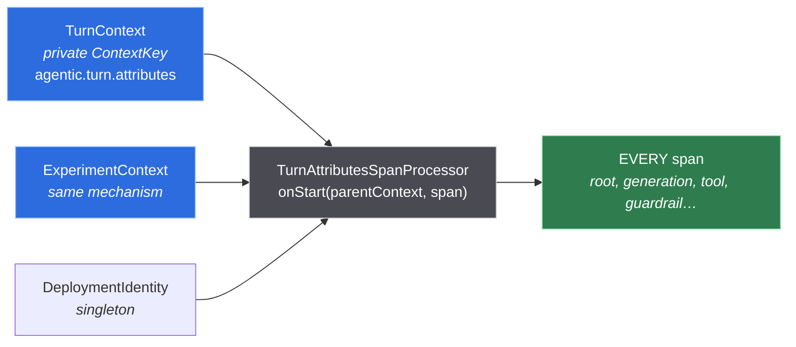
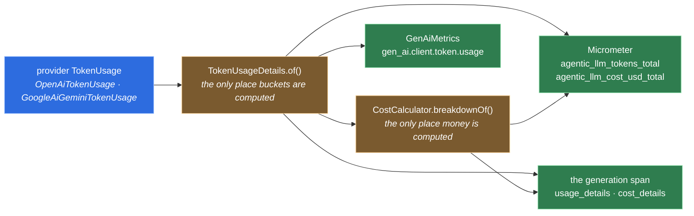

# 8 · Wiring Langfuse features

[Chapter 7](07-observability.md) reads one direction: here is a turn, and here is what it
looks like from the outside. This chapter reads the other. You have picked a Langfuse
feature — the agent graph, scores, corrections, cost decomposition — and you want to know
what your own application has to emit for it to work, and where an application that already
does it keeps that code.

Every section below answers the same four questions in the same order: **what you see** in
the UI, **what the wire needs** — the literal attribute keys, the endpoint, the body —
**where this POC does it**, by file and symbol, and **how to know it worked**, by test or by
check script. Where chapter 7 already explains a mechanism, this chapter links to it rather
than restating it.

Two things are worth knowing before the first section, because everything else assumes them.

**Almost nothing here is a setting.** Langfuse has very few switches. What it has is a
vocabulary of span attributes, and a feature appears when the attributes it needs are
present and correct. The agent graph is the clearest case: there is no flag, no API call and
no `langfuse.graph.*` key anywhere — the graph is drawn because at least one observation in
the trace carries a type that is not `span`, `event` or `generation`. You do not enable it.
You earn it, by typing your seams.

**Getting an attribute wrong is silent.** Almost every mistake in this chapter is answered
with HTTP 200 and then discarded: a mis-cased observation type, a cost sent as a string, a
usage object sent as an object rather than as a JSON string, a metadata key without the
prefix that makes it filterable. Nothing is red, nothing is logged, and the symptom is a
feature that never appears. That is why every section ends with a way to check rather than a
statement that it works, and why this repository's `scripts/check-langfuse-*.sh` push real
payloads at a real instance and read every field back.

The version this chapter describes is **Langfuse 4.16.0**, self-hosted. The last section
measures the same integrations against **3.80.0**, because that question was asked and the
answer is not in either version's documentation.

**How claims here are labelled**, following the convention chapter 7 uses. **[verified]**
means it was run on this machine against a real instance and the output was captured —
every such claim traces to one of `scripts/check-langfuse-ingestion.sh`,
`scripts/check-langfuse-3x-compat.sh`, `scripts/check-app-tracing-e2e.sh` or a test in
`src/test`. `[sourced]` means it is quoted from Langfuse's own documentation, with the URL
and the date it was read. `[sourced — unverified]` means the documentation says it and this
project has not checked. Anything unlabelled is a design argument about this repository's
own code, which the code itself settles.

---
## The wire

Before any feature in this chapter can work, bytes have to arrive. Every one of the four
decisions below is silent when it is wrong: the exporter is built, the process runs, the
dashboards stay empty, and nothing anywhere is red. They are collected here because the
rest of the chapter assumes them.

### The OTLP door

**What you see.** Traces in the Langfuse UI, or an empty project with a healthy
application beside it. There is no third state — Langfuse does not report a rejected
export back to the thing that sent it, and the OpenTelemetry SDK exports from a background
thread whose log nobody reads.

**What the wire needs.** Four things, and each one fails differently.

| Thing | Value | What happens when it is wrong |
|---|---|---|
| path | `/api/public/otel/v1/traces` | the base path `/api/public/otel` answers 4xx from a background thread |
| auth | `Authorization: Basic base64(publicKey:secretKey)` | 401, in that same unread thread |
| version selector | `x-langfuse-ingestion-version: 4` | no error. It selects the slower path, and data appears up to ten minutes later |
| transport | OTLP over **HTTP**, `http/protobuf` or `http/json` | gRPC is not an option: Langfuse supports OTLP over HTTP only |

The path is the one people get wrong first, and the reason is that Langfuse documents both
forms. `/api/public/otel` is for exporters that append the signal segment themselves;
`/api/public/otel/v1/traces` is for exporters that take a complete endpoint. The
OpenTelemetry Java OTLP HTTP exporter is the second kind, so this project sends the
signal-specific path.

The credentials are HTTP **Basic**, not a bearer token. The public key and the secret key
are the two halves of one `user:password` pair; a `Bearer` header built from the secret key
alone looks like the obvious modern choice and authenticates nothing.

The ingestion header is the cheapest of the four to omit and the most confusing to debug.
It does not error. It selects Langfuse's older ingestion path, and a trace that will appear
in ten minutes is indistinguishable, in the first nine of them, from a trace that will never
appear. [Chapter 7](07-observability.md) lists it in the failure-modes table for exactly
that reason.

**Where this POC does it.** `LangfuseProperties` binds the three values under the prefix
`agentic.observability.langfuse` — `host`, `public-key`, `secret-key` — and all three are
absent by default, because configuring an exporter nobody asked for would have `./mvnw test`
open a connection on every run.

`LangfuseOtlpSettings` turns them into the wire form. It holds the path as the constant
`TRACES_PATH`, trims a trailing slash off the host so `http://host/` does not produce a
doubled separator, and builds the header map in its constructor. Its three
`@Requires(property = …, pattern = "\\S+")` guards are a pattern rather than a bare presence
check on purpose: a property set to the empty string *is* present, and an OTLP exporter
built on an empty endpoint fails the SDK at startup rather than degrading — which is how a
blank `.env` line takes out every bean that needs an HTTP client.

`AgenticTracingCustomizer` is where the exporter is actually constructed. It implements
Micronaut's `OpenTelemetryBuilderCustomizer` rather than contributing a `SpanProcessor` bean,
because Micronaut's `DefaultOpenTelemetryFactory` injects exactly one `SpanProcessor`: a
second bean of that type is a startup failure, and replacing the first is a fight with the
framework over something it owns. The customizer adds `TurnAttributesSpanProcessor` first
and then, only if `LangfuseOtlpSettings` exists, an `OtlpHttpSpanExporter` wrapped in a
`BatchSpanProcessor`. Batched, not simple: a turn produces a dozen observations and a
synchronous export would put an HTTP round trip inside the request the user is waiting on.

**`OtlpHttpSpanExporter` is protobuf, and that is not incidental.** The Langfuse leg does
not get its encoding from a property — `TracingDefaults` sets
`otel.exporter.otlp.protocol = http/protobuf` only inside the branch that configures a
*collector*. The Langfuse leg is protobuf because of the exporter class this line picks. It
matters because the two encodings are not equivalent on every Langfuse version: over
OTLP/**JSON**, Langfuse 3.80.0 stores a trace under an id that is not the one that was sent.
Over protobuf both versions store the id unchanged, so the application is unaffected — and it
is unaffected because of the exporter class this line picks rather than by luck. The
mechanism, and why it bites a hand-written probe and nothing else, is in
[the compatibility section](#langfuse-3800-what-still-works).

**How to know it worked.** Three separate claims, proved by three different things, and
they must not be allowed to stand in for each other.

That the *settings* are right: `LangfuseOtlpSettingsTest` asserts the signal-specific path,
the trailing-slash tolerance, the Basic header, the `x-langfuse-ingestion-version: 4` entry,
and that with no credentials the bean does not exist at all.
`LangfuseConfiguredContextTest.theSettingsBeanIsPresentAndCorrect` re-asserts the endpoint
and the header from a context booted WITH credentials and stub models — which is what makes
it the one test that also proves a configured exporter opens no connection, and that
`ScoreWriter` still resolves to exactly one bean. (Both tests boot a real Micronaut context;
that part is not what distinguishes them.)

That the *server* honours the contract: `scripts/check-langfuse-ingestion.sh` pushes a real
trace at a running instance and reads it back — 47 assertions on the run recorded for this
chapter. It is the evidence behind most of the sections that follow, not only this one: the
path and the auth, all ten observation types and their nesting, levels and status messages,
usage and cost and which family wins, scores, corrections and experiments. The number is not
a property of the script: most of its assertions come out of a loop over the observation
types, so it moves whenever a type is added.

That the *application's own encoding* reaches Langfuse: neither of the above. The harness
posts with `Content-Type: application/json` — it exercises OTLP/JSON, which is not the
encoding the application uses. What proves the protobuf leg is a real run of the real
application against a real Langfuse **[verified]**. Six turns produced 100 stored
observations, every type the chat path emits mapped correctly:

```
STORED       NAME                           N
AGENT        chat-turn                       4      <- the turn, the trace root
AGENT        ChatAssistant.chat              3
AGENT        TriageJudge.classify            3
CHAIN        triage                          4
CHAIN        memory-compaction               3
SPAN         triage-judge                    4
SPAN         memory-read                    27
SPAN         memory-write                   11
GENERATION   agent                           7
GENERATION   judge                           3
GUARDRAIL    NormalizingInputGuardrail       3
GUARDRAIL    InjectionTriageGuardrail        4
GUARDRAIL    ExfiltrationGuardrail           5
GUARDRAIL    SystemPromptLeakageGuardrail    5
GUARDRAIL    VoiceComplianceGuardrail        5
RETRIEVER    assistant-knowledge             2
RETRIEVER    embedding-store-search          2
EMBEDDING    all-minilm-l6-v2-q              2
TOOL         activate_skill                  1
EVENT        guardrail-reprompt              2
                                          ---
                                          100 observations, 9 of the 10 types
```

Nine, not ten: no chat turn emits an `EVALUATOR`. Its round trip is proved separately, by
`scripts/check-langfuse-ingestion.sh` — *"ok type EVALUATOR survived the round trip"* — and
the reason it has no producer on a request path is in the types table above.


### One egress each: direct to Langfuse, not through the collector

**What you see.** In the collector's config, no Langfuse exporter — and in the Langfuse
project, traces that keep arriving when the whole Grafana profile is down.

**What the wire needs.** Nothing extra. This is a routing decision, and the cost of it is
one additional egress from the application: the same spans are serialised twice, once to the
collector and once to Langfuse.

**Where this POC does it.** `compose.observability.yaml` ships the two halves as two
independent profiles, `grafana` and `langfuse` (a third, `langfuse3`, exists only for the
compatibility check later in this chapter), and its header comment states the arithmetic
— Langfuse self-hosted is six containers wanting roughly 4 GB, the Grafana side wants roughly
2.5 GB, and the application stack wants 3 GB more, on a 7 GB machine.

`observability/otel-collector/config.yaml` says the same thing from the other side, under
"WHAT it deliberately does NOT do". The collector's traces pipeline exports to Tempo and to
the `span_metrics` connector, and to nothing else.

What the extra egress buys is that **neither profile carries a dead host in its config**. A
collector with a Langfuse exporter pointed at a stopped Langfuse retries, queues and
eventually drops — while the Grafana leg it was meant to serve looks fine. Two independent
pipelines cannot fail that way.

It also buys a correctness property that is easy to miss and is the subject of the exclusions
section below: **a span dropped at the collector still reaches Langfuse.** Any filtering
that has to apply to both readers must therefore happen in the application, not in the
collector. That is why `otel.exclusions` exists in `application.yml` rather than as a
`filter` processor in the collector config.

**How to know it worked.** `scripts/check-observability-stack.sh` reads the collector's
derived metrics and Grafana's provisioned rules back; `scripts/check-langfuse-ingestion.sh`
reads Langfuse back. Each runs against one profile, with the other stopped, which is itself
the demonstration that neither depends on the other.

### Sampling: the decision has to be taken at the root

**What you see.** Nothing, when it is right. When a trace loses its root — which sampling
is not the way to lose it, see below — Langfuse still shows every observation and still
groups them, because `TurnAttributesSpanProcessor` puts the session, the trace name and the
environment on all of them. What goes missing is narrower and is the same loss the root
subsection above describes: the trace has no name of its own and no top-level input or
output.

**What the wire needs.** `otel.traces.sampler = parentbased_traceidratio`, with
`otel.traces.sampler.arg` carrying the ratio.

**And here is a mechanism this chapter used to claim and that does not exist**, kept because
it is the kind of thing that reads as obvious and is wrong. The claim was that a bare
`traceidratio` sampler "re-rolls the dice per span", so it could keep a child and drop its
root. It cannot. `TraceIdRatioBasedSampler.shouldSample` is a pure function of the trace id
and the ratio, and the SDK's own comment says the decision holds *"even for child spans
(that may have had a different sampling samplingResult made)"*. Inside one process, every
span of a trace already gets the same answer with no sampler doing anything to enforce it.

What parent-based actually adds is the **remote** case: it honours an incoming W3C
`sampled` flag instead of re-deciding with this service's own ratio. Two services at 0.5
that each decide for themselves keep a quarter of their shared traces whole and cut three
quarters somewhere in the middle. Nothing calls this application today, so it is insurance —
correct insurance, for a reason the old sentence got wrong.

**Where this POC does it.** `TracingDefaults.properties()` sets both keys **unconditionally**
— outside the `collectorConfigured` branch — so a deployment that configures only Langfuse
still gets them. The ratio comes from `agentic.observability.sample-rate`, which
`application.yml` defaults to `1.0` and documents as head sampling applied at the root and
inherited by every child.

The whole map is supplied through `builder.addPropertiesSupplier(defaults::properties)` in
`AgenticTracingCustomizer`, which registers them as autoconfiguration **defaults**. The
standard `OTEL_*` environment variables still win, so an operator who knows OpenTelemetry
does not have to learn this application's property names to point it somewhere else.

**How to know it worked.** `TracingDefaultsTest.samplingIsParentBased` asserts both keys on
the map the bean produces.

### Propagators: `tracecontext`, and not the OpenTelemetry default

**What you see.** Not in Langfuse at all. You see this one in a third party's request log,
as a `baggage:` header carrying your user id and your conversation id.

**What the wire needs.** `otel.propagators = tracecontext`. The OpenTelemetry default is
`tracecontext,baggage`, and the second entry is the problem: baggage is *designed* to be
injected into outbound request headers, which is what makes it work across service
boundaries and what makes it unsafe here.

This matters because Langfuse's own integration guide recommends OpenTelemetry Baggage plus
a `BaggageSpanProcessor` as the way to copy trace-level attributes onto every span — the
exact job the next section describes. That advice is wrong for an agent, and
[chapter 7](07-observability.md) argues the trade in full. What belongs here is what you
have to write instead.

**Where this POC does it.** Two places, and they are the same decision taken at both ends.
`TracingDefaults.properties()` writes the literal string `tracecontext` — unconditionally,
like the sampler. `TurnContext` is the other end: a private
`ContextKey.named("agentic.turn.attributes")`, which propagates the same way inside the
process, is read by the span processor exactly as baggage would have been, and cannot be
injected into a header by any propagator that exists.

**How to know it worked.** `TracingDefaultsTest.baggageIsNotAPropagator` asserts the
property. `TurnAttributesTest.turnAttributesAreNotCarriedInBaggage` asserts the other half
— inside an open `TurnContext`, `Baggage.current()` is empty while `TurnContext.current()`
is present. Asserting only the property would leave a future refactor free to start
populating baggage for some other purpose.

---

## Trace identity

A Langfuse v4 deployment has no trace entity on the wire. A trace is a set of observations
that share a trace id, and everything a human recognises about it — its name, its session,
its user, its environment, its tags — is an attribute on the observations themselves. That
single fact drives every decision in this section.

### What makes an observation the root

**What you see.** The top row of the trace view: the name of the turn, the user's message
as the input, the assistant's reply as the output, and the total duration and cost. When
nothing is the root, the trace still opens and still lists every observation — it has no
name and no top-level input or output.

**What the wire needs.** Langfuse decides what a root is with a query-time predicate rather
than a stored flag, and there are two write paths with two different spellings:

| Attribute | Type | Read by |
|---|---|---|
| `langfuse.internal.is_app_root` | **boolean** `true` | the v4 events write path, as `parent_span_id = '' OR is_app_root = true` |
| `langfuse.internal.as_root` | **string** `"true"` | the dual/legacy write path, which compares `String(attribute) === "true"` |
| `langfuse.trace.name` | string | what the trace is called once it has a head |

Send the boolean where the string is expected, or the reverse, and the attribute is accepted
and ignored. Which path runs is a property of the Langfuse deployment, not of the
application, so this project sets both.

The first half of the predicate — `parent_span_id = ''` — is usually what makes this work:
the HTTP server span for the chat route is excluded, so the turn observation has no OTLP
parent and satisfies the predicate without saying anything. Setting the attributes as well
is what keeps the trace headed if that exclusion is ever removed, or if another traced
service calls this one.

**Where this POC does it.** `Observation.asTraceRoot()` is the interface method;
`OtelAgentTracer` implements it by setting `LangfuseAttributes.INTERNAL_IS_APP_ROOT` (a
`booleanKey`) and `LangfuseAttributes.INTERNAL_AS_ROOT` (a `stringKey`) on the same span.
`ChatTurnService.handle` calls it on the turn observation, immediately after opening it and
before any input is written.

The name is not set there. `langfuse.trace.name` is a trace-level attribute like the session
id, so it travels through `TurnAttributes.traceName` and is written by the span processor —
see below.

`ExperimentRun` deliberately does **not** call `asTraceRoot()` on an eval item's root; its
class comment gives the reason.

**How to know it worked.** `TurnObservationTest.theTurnMarksItselfAsTheTraceRoot` asserts
both attributes with their respective types. `scripts/check-langfuse-ingestion.sh` proves
the other end: it pushes both spellings and asserts that Langfuse reads back
`isRootObservation: true` and a trace named `chat-turn`.

### Session, user, tags, environment, release, version

**What you see.** The Sessions view, which stitches N turns of one conversation into one
readable exchange; the environment and release filters at the top of the traces list; tags
as chips on a trace.

**What the wire needs.** Seven attribute keys. All of them are documented as *trace-level*
and every one of them belongs on **every span** — that is the next section.

| Attribute | Java field | Set from | Empty here? |
|---|---|---|---|
| `langfuse.trace.name` | `TurnAttributes.traceName` | `ChatTurnService.TRACE_NAME` | no |
| `langfuse.session.id` | `TurnAttributes.sessionId` | the `ConversationId` | no |
| `langfuse.user.id` | `TurnAttributes.userId` | — | **yes, by design** |
| `langfuse.trace.tags` | `TurnAttributes.tags` | — | **yes, by design** |
| `langfuse.environment` | `DeploymentIdentity.environment()` | `agentic.observability.environment` | no |
| `langfuse.version` | `DeploymentIdentity.version()` | `agentic.observability.version` | no |
| `langfuse.release` | `DeploymentIdentity.release()` | `agentic.observability.release` | **empty by default** |

`langfuse.trace.tags` is the one type outlier: a **string array**, written with
`span.setAttribute(AttributeKey<List<String>>, …)` rather than a plain string. A
comma-joined string in that key is accepted and does not become tags.

Anything else worth filtering on has to carry the prefix `langfuse.trace.metadata.` —
Langfuse filters on top-level metadata keys only, and an ordinary OpenTelemetry attribute
lands under `metadata.attributes`, where it is queryable but not filterable.
`LangfuseAttributes.traceMetadata(key)` builds those.

**Where this POC does it.** `TurnAttributes` is the record; `ChatTurnService.handle` builds
one per turn with the trace name and the conversation id and opens a `TurnContext` around
the whole turn. `DeploymentIdentity` is a singleton holding the three deployment constants.
Every key string lives in `LangfuseAttributes` and nowhere else, because a misspelt key is
not an error — the attribute is filed under `metadata.attributes` as an unmapped extra, the
field it was meant to populate stays empty, and the trace looks plausible.

**Three empty fields, two different reasons — the distinction is the point.**

`userId` and `tags` are empty because of *this application's design*, and the comment in
`ChatTurnService.handle` says so. There is no authentication, so there is no user to name.
Tags are the more interesting refusal: a tag is only worth setting before the first span
starts, which is before triage has produced the intent that would be worth tagging. Setting
it afterwards would put it on the second half of the turn and not the first, and an
aggregation over tags would then silently count some observations of a turn and not others —
which is worse than having no tag at all.

`release` is empty for a different reason: it is an **operator's** value, supplied at deploy
time from `AGENTIC_RELEASE`. The shipped default is the empty string, and the span processor
skips null and blank values, so an unset release writes no attribute rather than an empty
one.

**A measured trap [verified], and the one place `DeploymentIdentity` had to change.** Of the 37
observations the containerised application had ever exported to a real Langfuse, every one
carried `version` as `"0.1}"` — with a stray closing brace. The cause was a *nested*
placeholder default,
`${agentic.observability.version:${micronaut.application.version:0.1}}`. Micronaut leaves
the inner placeholder's closing brace as a literal, and it does so **whether or not the
outer property is set** — so it is not a broken fallback, it is a corrupted value. Proved
with an explicit override: expected `2.4.1`, got `2.4.1}`. The declaration is now the flat
`${agentic.observability.version:0.1}`.

**How to know it worked.** `TurnAttributesTest.turnAttributesReachEveryObservation` and
`.deploymentIdentityIsAlwaysPresent` assert the keys on exported spans;
`.tagsAndMetadataAreFilterable` asserts the array form and the metadata prefix;
`.noTurnMeansNoTurnAttributes` asserts that a span started outside a turn carries the
deployment identity and no user id. `DeploymentIdentityTest.theShippedDefaultsAreClean`
asserts `version()` is exactly `0.1` — no brace — and that `release()` is empty, and
`.theEnvironmentVariableWins` asserts an operator's override survives intact. Against a
running instance, `scripts/check-langfuse-ingestion.sh` asserts that the session id is on
every observation of the trace and that a prefixed metadata key reads back as a top-level,
filterable field.

### `TurnAttributesSpanProcessor`: why every span carries the trace's attributes

This is the most transferable idea in the chapter, and it follows from one sentence:
**Langfuse v4 queries observations, not traces.**

**What you see.** A filter that looks like it worked and did not. Filter the observations
of a session and get one row back instead of twelve; group cost by environment and watch
most of the spend fall outside every group. Nothing is missing from the trace view, so
nothing looks broken.

**What the wire needs.** Every trace-level attribute — the seven above, plus the whole
`langfuse.experiment.*` family — repeated on **every span of the trace**, not only on the
root. Langfuse documents them as trace-level because that is what they *describe*; the
storage they are queried out of is per observation.

**Where this POC does it.** `TurnAttributesSpanProcessor`, a `SpanProcessor` whose
`onStart` copies three sources onto the span being started:



Three properties of that class are decisions, not boilerplate.

**It runs at `onStart`, and `isEndRequired()` returns `false`.** Everything it knows is
known when the span begins, and an attribute written on end would arrive after a
`SimpleSpanProcessor` had already exported the span.

**It is registered before any exporting processor.** `AgenticTracingCustomizer.configure`
adds it first, with a comment saying why: a processor that exports on end must see the
attributes a start-time processor wrote.

**Null and blank values are skipped.** The private `set` helper writes nothing for them,
which is what turns an unset `release` into an absent attribute rather than an empty one
that a filter would match.

The alternative — setting these at each call site — is not a style preference. The seams
that open observations are listed in [chapter 7](07-observability.md), and most of them are
LangChain4j listeners this codebase does not call directly. A processor is one class; the
call-site version is every seam remembering, forever, including the seams a future
LangChain4j version adds.

**How to know it worked.** `TurnAttributesTest` asserts that a nested observation carries the
turn's user and session, which is the property call-site setting would break first. Against a
running Langfuse, `scripts/check-langfuse-ingestion.sh` asserts the session id is identical
across *every* observation of the pushed trace rather than merely present on the root — which
is the assertion that distinguishes a working copy from an attribute sitting on the root
alone.

### `otel.exclusions`: two different reasons to never make a span

**What you see.** Without it, a Langfuse project full of traces the application did not
mean to produce, sitting beside the conversations and outnumbering them.

**What the wire needs.** Nothing — this is the absence of a span. The mechanism is
Micronaut's `otel.exclusions` list, which the framework compiles into a predicate over the
request path.

```yaml
otel:
  exclusions:
    - /api/chat
    - /health.*
    - /prometheus
    - /api/public/.*
```

**Four entries, two entirely different reasons.**

`/api/chat` is excluded so that **the turn can be its own root**. Left alone, Micronaut's
server filter would put `POST /api/chat` above the turn observation, and the root of the
trace would then carry neither the user's message nor the reply — one level above the only
observation that has them. [Chapter 7](07-observability.md) covers what that costs in the
trace view.

The other three are excluded because **a server span with no parent is a trace.** A liveness
probe polled every few seconds does not sit beside the real traffic; it becomes the traffic.
Measured on this project's own instance **[verified]**: of the **37** observations the containerised
application had ever exported to Langfuse, **all 37 were `GET /health`**, and none was a
conversation.

`/api/public/.*` is the same reason pointed at a stranger case. That is *Langfuse's own* API,
called by this application's `LangfuseScoreWriter` over an instrumented Micronaut HTTP
client — and the exclusion list feeds the **client** filter as well as the server one.
Without the entry, every `POST /api/public/scores` becomes a root span, becomes a trace, and
is exported to Langfuse: telemetry about telemetry, filed beside the conversations. Measured **[verified]**
on a six-turn run against a real instance: **10 traces named `POST`**, each one a score
write, none of them work the application did. This project serves nothing under
`/api/public`, so the pattern is safe to write broadly.

**The full-match trap.** These are regexes matched with `Matcher.matches()` — a **full**
match, not a search. `/health` as a pattern therefore does not exclude `/health/liveness`,
which is the path a Kubernetes probe actually calls, so a list that reads as complete keeps
exporting the probes. Hence `/health.*` rather than `/health`. The same trap is why
`/api/public/.*` carries the `.*`.

**Where the exclusion belongs, and why it is not in the collector.** A `filter` processor in
`observability/otel-collector/config.yaml` would clean up the Grafana leg only. The
application exports to Langfuse **directly**, so a probe span dropped at the collector still
arrives at Langfuse. Excluding it at the source is the only place that covers both readers —
which is the routing decision from the first half of this chapter turning into a constraint.

**What is deliberately still traced.** `/api/chat/capabilities` — the one other route
`ChatController` serves — keeps its server span. It is ordinary traffic and it has no turn
observation to be the root of, so the framework's span is the right root for it. `/api/chat`
being a full match is what guarantees that: it excludes the chat route and nothing under it.

**How to know it worked.** `TracingExclusionsTest` builds the predicate the way the framework
does — `OpenTelemetryExclusionsConfiguration.exclusionTest()` from a booted context reading
this application's own YAML — and asserts it in both directions: `/health`,
`/health/liveness`, `/health/readiness`, `/prometheus`, `/api/chat`, `/api/public/scores` and
`/api/public/otel/v1/traces` are excluded, while `/api/chat/capabilities` and a hypothetical
`/api/chat/history` are not. The `/health/liveness` assertion is what encodes the full-match
trap: it fails the moment someone shortens the pattern to `/health`.

The end-to-end evidence is the census **[verified]**. After the exclusion list grew from one entry to four,
a six-turn run of the real application produced 100 observations across the 20 names in the
census above, and **no `POST` and no `GET /health` among them**. Reproduce it with
`./scripts/check-app-tracing-e2e.sh`, which asserts the second half of that directly:
*"no GET /health trace reached Tempo"*.
## Observation types, and the agent graph

Langfuse's timeline, its filters and its agent graph are all downstream of one span
attribute. Get it right and a trace is a picture of what the agent did; get it wrong and
the same trace is a list of anonymous boxes. Nothing in between, and nothing reports the
difference.

[Chapter 7](07-observability.md) shows what a finished turn looks like and which seam
produces each part of it. This section is the other question: what a follower has to write
so that those types exist at all.

### What you see

In the Langfuse UI an observation's type is the coloured pill beside its name in the trace
timeline, the value behind the **Type** filter on the observations table, and — the reason
this section is long — the precondition for the **Graph** tab appearing on a trace at all.
A `generation` also unlocks the token and cost columns; a `span` unlocks nothing.

### What the wire needs

One attribute, on the span, per observation:

```
langfuse.observation.type = "agent"
```

Three properties of that attribute decide whether any of this works.

**The value is matched case-sensitively against a lower-case table.** `"agent"` maps;
`"AGENT"` does not. An unmatched value is not an error — the ingestion returns `200`, the
observation is stored as a `SPAN`, and the attribute is filed away in the unmapped
`metadata.attributes` catch-all where nothing filters on it. There is no warning in the
Langfuse logs, no counter, no red anywhere. A whole application typed in upper case ingests
perfectly and renders as a flat list of identical spans, and the only symptom is a Graph tab
that never appears.

**There are exactly ten values, and they are Langfuse's, not yours.** An invented type
(`"planner"`, `"router"`) behaves identically to an upper-case one: accepted, discarded,
stored as `SPAN`.

**The attribute is per observation, not per trace.** Langfuse v4 has no separate trace
entity — a trace is a set of observations correlated by trace id — so every span carries its
own type or gets the default.

The ten names and their glosses are quoted from
`https://langfuse.com/docs/observability/features/observation-types`, read 2026-08-23.
`[sourced]`

| Wire value | `ObservationType` | What Langfuse says it is | Where this application produces it | On a request path? |
|---|---|---|---|---|
| `span` | `SPAN` | "durations of units of work in a trace" | `WriteThroughChatMemoryStore` — `@Observed` on the read, write and delete methods; `TriageService.judged`, which opens `triage-judge` by hand; the Micronaut OpenTelemetry client filter, for outbound HTTP | yes |
| `generation` | `GENERATION` | "generations of AI models incl. prompts, token usage and costs" | `LangfuseChatModelListener.onRequest`, one instance per configured LLM role, so the observation is named `agent` or `judge` | yes |
| `event` | `EVENT` | "the basic building block … used to track discrete events in a trace" | `LangfuseGuardrailListener.recordReprompt` → `guardrail-reprompt`; `ConversationCompactor.recordCompacted` → `memory-compacted` | yes |
| `agent` | `AGENT` | "decides on the application flow and can for example use tools with the guidance of a LLM" | `ChatTurnService.handle` → `chat-turn`, the trace root; `LangfuseAiServiceListener.onStarted` → `ChatAssistant.chat` and `TriageJudge.classify` | yes |
| `tool` | `TOOL` | "a single action that does something, such as a function or API call" | `LangfuseToolListener.observe`, named for the tool the model asked for | yes |
| `chain` | `CHAIN` | "a link between different application steps, like passing context from a retriever to a LLM call" | `TriageService.triage` and `ConversationCompactor.compactIfNeeded`, both by `@Observed` | yes |
| `retriever` | `RETRIEVER` | "a data-retrieval step that only looks something up rather than changing state" | `LangfuseRetrieverListener` → `assistant-knowledge`; `LangfuseEmbeddingStoreListener` → `embedding-store-search` | yes |
| `embedding` | `EMBEDDING` | "a call to a LLM to generate embeddings … can include model, token usage and costs" | `LangfuseEmbeddingModelListener`, named for the model | yes |
| `guardrail` | `GUARDRAIL` | "a component that protects against malicious content or jailbreaks" | `LangfuseGuardrailListener.observe`, named for the guardrail class | yes |
| `evaluator` | `EVALUATOR` | "functions that assess relevance/correctness/helpfulness of a LLM's outputs" | `ExperimentRun.grade` → `grade` | **no — see below** |

**`evaluator` has a producer in the repository and none on any request path, and the
measurement is what says so.** `ExperimentRun` lives in `src/main`, but its only callers are
`InjectionEval`, `TriageGoldenSetEval` and `ExperimentRunTest`, all under `src/test`, and all
of them run under `-Pevals` rather than in a served turn. A six-turn run of the real
application produced 100 observations spanning nine types and **no `EVALUATOR` row at all** **[verified]**
(`app-on-4.16.0.txt`). The same is true of the `agent`-typed `experiment-item` root that
`ExperimentRun.item` opens: it exists, and no user request reaches it.

[Chapter 7](07-observability.md) draws the same distinction beside its seam table — that
table is a claim about the repository and was read as one about production traffic — and
delegates the census to here. What matters for this section is the consequence: copy this
design and never run an eval, and your traces hold nine types rather than ten, which is
enough for everything below, because the agent graph needs one.

### How this project makes the case impossible to get wrong

Two files, and neither of them is a comment reminding somebody.

`ObservationType` is an enum whose constants are upper case, Java's convention, and whose
`wireValue()` is `name().toLowerCase(Locale.ROOT)` — computed once per constant, in a field.
`OtelAgentTracer.start` is the only writer of the attribute anywhere in the codebase, and it
writes `type.wireValue()`. Because `AgentTracer.start` takes an `ObservationType` and not a
`String`, an upper-case type is not a mistake somebody has to avoid — it is unrepresentable
at the API. The same holds for a misspelt one.

`LangfuseAttributes` does the equivalent job for the key. Every `langfuse.*` name this
application writes is a constant there, with the class comment stating the reason: a misspelt
key does not fail either, the attribute is filed under `metadata.attributes` as an unmapped
extra, and the field it was meant to populate stays empty. Collecting them in one file makes
the wire contract greppable and a rename one edit.

### How to know it worked

Three layers of evidence, and they prove different things.

**In the build.** `AgentTracerTest` starts an observation typed `ObservationType.CHAIN` and
asserts the exported span carries `langfuse.observation.type = "chain"` — the literal
lower-case string, not the enum. `TurnTraceShapeTest` runs a whole turn against an
in-memory span recorder and asserts the exported types include `agent`, `chain`,
`generation` and `guardrail`, with at least two generations; a sibling case drives a tool
call and asserts a `tool` type and the `gen_ai.tool.name` attribute for `activate_skill`.
Neither test needs a network.

**Against a running Langfuse.** `scripts/check-langfuse-ingestion.sh` pushes a
hand-built trace carrying all ten types through the real OTLP door and reads every one of
them back through `/api/public/v2/observations`, asserting the stored `type` per
observation. It is worth being precise about what that proves: the trace is a synthetic
probe assembled inside the script, so a green run says *Langfuse accepts and stores these ten
types*, not *this application emits ten types*. The measured claim about the application is
the census in `app-on-4.16.0.txt`.

**Against an older Langfuse, which is where the silence gets expensive.**
`scripts/check-langfuse-3x-compat.sh` pushes the same ten-type trace at a real Langfuse
3.80.0 and reads it back. Every type outside `span`, `generation` and `event` is accepted
with a `200` and stored as something it was not, with no warning anywhere, and the script's
closing line on the matter is `no observation is outside span/event/generation: the agent
graph cannot draw on this version`. The real application against the same version stored 129
observations, of which every declared type outside that set was silently collapsed —
`chat-turn` as `SPAN`, `ChatAssistant.chat` as `GENERATION`, `activate_skill` as `SPAN`
(`app-on-3.80.0.txt`).

That is a version gap rather than a defect, and the version-by-version survey belongs to
the compatibility table elsewhere in this chapter rather than here. What it is doing *here*
is standing in for something no current version will show you on demand: it is exactly what
a mis-cased `langfuse.observation.type` buys you on 4.16.0 — the identical outcome, at the
identical volume, with nothing red.

---

### The two mechanisms, and when each one is the only option

A follower copying this design needs both. They are not alternatives; each covers what the
other cannot reach.

#### `@Observed` — an annotation, for code you own

```java
@Observed(value = "triage", type = ObservationType.CHAIN, captureResult = true)
public TriageVerdict triage(String rawText) { … }
```

`Observed` is a Micronaut `@Around` annotation; `ObservedInterceptor` is its
`@InterceptorBean`. It opens an observation of the declared type, optionally writes the
arguments as input and the return value as output — both default to `false`, because a turn's
arguments are the user's message and that decision belongs to `ObservationContentPolicy` and
to the person annotating the method, not to a default — and closes the observation on every
path including the failing one. The interceptor catches `Throwable` rather than
`RuntimeException`: catching only the latter would end the span **unmarked** on an `Error`,
exporting an observation that looks successful inside a turn that failed.

That the advice is compile-time and subclass-based — so that, unlike a proxy-based
`@Cacheable`, a **self-invoked** annotated method is still observed — is
[chapter 7's](07-observability.md) point and is pinned by
`ObservedInterceptorTest.selfInvocationIsStillObserved`. What that chapter does not say is the
consequence that decides *where you are allowed to put the annotation at all*.

**Advice order can make an annotation fire on the wrong half of the calls, and nothing
reports it.** Micronaut orders `@Around` advice by interceptor phase, and
`InterceptPhase.CACHE` is **-100** where `TRACE` is **-80**. Caching therefore wraps tracing.
An `@Observed` on `CachedTriageJudge.classify` — which is where the judge observation
conceptually belongs — would compile, would work on the miss path, and would produce
**nothing at all** on a cache hit, because the hit returns from the outer interceptor and the
inner one never runs. The cached path is the common one and the whole reason that method
exists, so the annotation would go missing on exactly the calls it was added for.
`TriageService.judged` therefore opens `triage-judge` at the call site instead, which is
order-independent. The real run confirms both halves: four `triage-judge` spans and three
`judge` generations across six turns — one cached turn, still visible, still carrying its
verdict.

The general rule a follower should take from this: an annotation is the right mechanism only
where no other `@Around` advice sits in an earlier phase. Where one does, or where there is
no method of yours to annotate, use the SPI below. Applying `@Observed` to a `private`,
`static` or `final` method is a compilation error rather than a silent no-op — the one
failure of this kind the compiler will catch for you.

That span is typed `SPAN` and not `GENERATION`, deliberately. A remembered verdict involves no
model call, and a generation carrying no tokens and no model name renders in Langfuse as a
zero-cost call that never happened. When the judge does reach the model,
`LangfuseChatModelListener` nests a real `generation` inside this span; when the cache answers,
the span stands alone, and the absence of a child is what says so. `TriageObservationTest`
asserts all three shapes — the judged turn, the cached turn that "stands alone", and the
pre-filtered turn that has no judge observation because no judge ran.

#### `AgentTracer` and `Observation` — an SPI, for code you do not own

Every LangChain4j seam is a callback. There is no method of this application's to annotate,
because the caller is LangChain4j and what it publishes is an event. So each listener talks to
the same two-type SPI:

```java
try (Observation observation = tracer.start(request.name(), ObservationType.TOOL)) {
    observation.input(content.capture(request.arguments()));
    observation.output(content.capture(resultOf(event)));
}
```

`AgentTracer` exists so that no other package imports OpenTelemetry — the listeners, the
`@Observed` interceptor and the score writer all speak this vocabulary, which makes the
tracing library one implementation behind an interface rather than a dependency spread across
twelve classes. `Observation` returns `this` from every method so a seam can describe what it
did in one statement, tolerates a null value by writing nothing, and is idempotent on
`close()` — Langfuse v4 does not deduplicate a span id it has already accepted, so exporting
the same observation twice creates two observations and doubles every metric derived from
them.

The listeners that cannot be closed in a `try`-with-resources are the ones whose start and end
arrive as separate callbacks. `LangfuseChatModelListener` stashes the open observation in
`ChatModelRequestContext.attributes()` under a namespaced key and takes it out in `onResponse`
or `onError`. `LangfuseAiServiceListener` keeps a bounded `ConcurrentHashMap` keyed by
`invocationId`, because the started and completed events are different objects.

One rule runs through all of them: **nothing a listener does may throw into the call it
observes.** LangChain4j wraps listener callbacks in a `catch (Exception e)` that logs one
generic line naming neither the class nor the role, and
`shouldThrowExceptionOnEventError(true)` makes the opposite choice fatal to the turn. Every
callback in this package catches and logs with its own identity in the message, so a tracing
bug can never cost a user their answer and can never be an invisible hole either.

---

### The agent graph

This is the feature people ask for by name, and it is the clearest case of something you do
not turn on.

**What you see.** A **Graph** tab on the trace, drawing the run as a directed graph of named
steps rather than as a timeline. Langfuse offers two view modes behind an
**Aggregated / Expanded** toggle: aggregated merges steps that share a name into one node with
a counter, drawing loops as cycles; expanded gives every individual call its own node and
unrolls loops into a DAG.

**What the wire needs.** Nothing that is not already in the table above. Quoting
`https://langfuse.com/docs/observability/features/agent-graphs`, read 2026-08-23 `[sourced]`, on the two
ways a graph appears for a trace:

> 1. **Inferred from observations.** Have an observation with any observation type except
>    `span`, `event`, or `generation` in your trace. Langfuse then interprets the trace as
>    agentic and shows a graph, inferred automatically from the observations' timings and
>    nesting.
> 2. **From the LangGraph integration.** When you use the LangGraph integration, the graph
>    shows automatically.

Read that precondition twice, because everything follows from it. There is no
`langfuse.graph.*` attribute, no enable flag, no API call. The graph is a **consequence** of
typing, and the bar is **one** observation outside `span`/`event`/`generation`. A trace
consisting entirely of correctly-typed `span`s and `generation`s — which is what a
conventional OpenTelemetry instrumentation produces, and what a mis-cased `langfuse.observation.type`
degrades to — is not agentic as far as Langfuse is concerned, and no graph is drawn.

The second clause matters as much as the first: the graph is inferred from *timings and
nesting*. The types decide whether a graph is drawn; the parent/child links decide what it
draws. Both halves have to be right, and they fail independently.

**What a follower must therefore do.** Type the seams that are genuinely not spans — at
minimum the agent, the tool and the retriever, which are the three that turn a request path
into a recognisable shape. Everything else in the enum sharpens the picture; those three are
what get you past the precondition and give the graph nodes worth reading. Concretely, in this
codebase that is `ChatTurnService.handle` and `LangfuseAiServiceListener` for `agent`,
`LangfuseToolListener` for `tool`, and `LangfuseRetrieverListener` with
`LangfuseEmbeddingStoreListener` for `retriever`. Add `LangfuseGuardrailListener` for
`guardrail` and the two `@Observed` chains, and a turn is legible without opening a single
span.

**What it looks like on real traffic [verified].** This is one trace exported by the real application to
a self-hosted Langfuse 4.16.0, read back through the observations API and printed as a tree —
`reference-trace-4.16.0.txt`, copied verbatim:

```
TRACE 726497a6f2aa547c2452c7561dc7f8cd - 28 observations
[AGENT] chat-turn in="quem e voce e o que voce sabe fazer?" out="Sou um assistente de serviços de dados públicos brasile
  [CHAIN] triage out="TriageVerdict[decision=IN_SCOPE, confidence=0.98, inten
    [SPAN] triage-judge in="quem e voce e o que voce sabe fazer?" out="TriageVerdict[decision=IN_SCOPE, confidence=0.98, inten
  [AGENT] ChatAssistant.chat in="<turn_context>\nreply_language: pt-BR\nsuggested_skill: out="Sou um assistente de serviços de dados públicos brasile
    [SPAN] memory-read
    [RETRIEVER] assistant-knowledge in="<turn_context>\nreply_language: pt-BR\nsuggested_skill: out={"segments":0,"results":[]}
      [EMBEDDING] all-minilm-l6-v2-q in="<turn_context>\nreply_language: pt-BR\nsuggested_skill: out={"embeddings":1,"dimension":384}
      [RETRIEVER] embedding-store-search in={"min_score":0.72,"max_results":3,"dimensions":384} out={"matches":0}
    [GUARDRAIL] NormalizingInputGuardrail in="<turn_context>\nreply_language: pt-BR\nsuggested_skill: out={"result":"SUCCESS"}
    [GUARDRAIL] InjectionTriageGuardrail in="<turn_context>\nreply_language: pt-BR\nsuggested_skill: out={"result":"SUCCESS"}
    [SPAN] memory-read
    [SPAN] memory-read
    [SPAN] memory-read
    [SPAN] memory-write
    [GENERATION] agent in=[{"role":"system","content":"# Role\n\nYou are the assis out="Sou um assistente de serviços de dados públicos brasile
    [SPAN] memory-read
    [SPAN] memory-write
    [GUARDRAIL] ExfiltrationGuardrail in="Sou um assistente de serviços de dados públicos brasile out={"result":"SUCCESS"}
    [GUARDRAIL] SystemPromptLeakageGuardrail in="Sou um assistente de serviços de dados públicos brasile out={"result":"SUCCESS"}
    [GUARDRAIL] VoiceComplianceGuardrail in="Sou um assistente de serviços de dados públicos brasile out={"result":"FATAL","failures":["Voice profile violated: l
      [EVENT] guardrail-reprompt
    [SPAN] memory-read
    [GENERATION] agent in=[{"role":"system","content":"# Role\n\nYou are the assis out="Sou um assistente de serviços de dados públicos brasile
    [GUARDRAIL] ExfiltrationGuardrail in="Sou um assistente de serviços de dados públicos brasile out={"result":"SUCCESS"}
    [GUARDRAIL] SystemPromptLeakageGuardrail in="Sou um assistente de serviços de dados públicos brasile out={"result":"SUCCESS"}
    [GUARDRAIL] VoiceComplianceGuardrail in="Sou um assistente de serviços de dados públicos brasile out={"result":"SUCCESS"}
  [CHAIN] memory-compaction
    [SPAN] memory-read

scores: [('triage_decision', 'IN_SCOPE', 'CATEGORICAL', 'observation'), ('triage_confidence', 0.98, 'NUMERIC', 'observation')]
```

Twenty-eight observations, eight types: two `agent`, two `chain`, ten `span`, two
`generation`, eight `guardrail`, two `retriever`, one `embedding`, one `event`. Fifteen of the
twenty-eight are outside `span`/`event`/`generation`, so the precondition is met fifteen times
over, and one would have done.

Two absences in that trace are worth naming, because a reader comparing it against the
ten-type table will notice them and should not conclude anything is broken. There is **no
`tool`** observation: the user asked the assistant what it can do, and answering that needs no
tool. `TOOL activate_skill` appears once in the six-turn census, from a different turn. And
there is **no `evaluator`**, for the structural reason above — no request path produces one.

The shape the graph draws from this is the argument for typing in the first place. `chat-turn`
branches into `triage` and `ChatAssistant.chat`; triage's judge span holds no generation, so
this turn's verdict was **cached**; the retriever fans out into the query's embedding and the
store search, and both report zero — a retrieval that ran and found nothing, which is a
different fact from a retrieval that did not run. The three output guardrails run, the voice
guardrail returns `FATAL`, a `guardrail-reprompt` event fires under it, a second `agent`
generation follows, and the three guardrails run again and pass. That last sequence is the
whole value of the picture: the second model call is not a mystery, it has a cause, and the
cause is one node away.

**How to know it worked.** `check-langfuse-ingestion.sh` asserts the precondition rather than
the drawing, because the precondition is the part a code change can break — it counts
observations whose stored type is outside `SPAN`/`EVENT`/`GENERATION` and fails when the count
is zero, with the message `every observation is span/event/generation — Langfuse draws a list,
not a graph`. On 4.16.0 it reports nine such observations in the probe trace. Whether Langfuse
then renders a graph from them is a UI behaviour this repository cannot assert from a shell
script, and the honest label for that half is a sourced one: the wording above is Langfuse's
own, quoted with its URL and date.

### Nesting: the half that types cannot fix

The graph's edges are the parent/child links, so a **flat** trace carrying all ten types
still renders flat. Getting the types right and the nesting wrong produces a graph with the
correct nodes and no structure — a failure mode that looks like a feature working badly rather
than like a bug.

Parenting in this application is never passed by hand. `OtelAgentTracer.start` calls
`span.makeCurrent()` and hands the resulting `Scope` to the `Observation`; every observation
started while that scope is open becomes its child, purely by the OpenTelemetry context. It
works because LangChain4j 1.18.1 calls every listener, tool executor and guardrail on the
**caller's thread** — verified for this codebase, and stated in `AgentTracer`'s own interface
comment. `AgentTracerTest.childObservationNestsUnderItsParent` pins the mechanism, and
`TurnObservationTest` asserts that everything a turn does hangs under the root so the trace is
one tree.

The corollary is the trap, and the source documents it precisely.
`LangfuseChatModelListener`'s class comment covers what happens if neither `onResponse` nor
`onError` ever fires: the span is never ended, so it is never exported — a hole in the trace
rather than a failed turn, which is the obvious half. The non-obvious half is that
`OtelAgentTracer.start` made the span current on the calling thread, so the **scope stays
attached to it**. On a pooled request thread the next observation started there becomes a
child of a span that never ends, which mis-parents every later trace on that thread rather
than only this one. The comment closes by ruling it out as a live defect —
LangChain4j's own `ChatModel.chat` pairs `onRequest` with exactly one of the two ending
callbacks — so this is a note about the contract, not a bug report. Copy the pattern and you
inherit the obligation.

`LangfuseAiServiceListener` takes the same problem from the other end. Its bounded map exists
for the case neither of its ending events covers — an `Error` raised between them, which
`DefaultAiServices` does not catch — and an evicted entry is **dropped, not closed**,
deliberately. Ending it from the evicting thread would restore another thread's context on
this one and mis-parent every span the evicting thread starts afterwards. So the evicted span
is never exported: a missing observation, which is the failure this class prefers to a
corrupted trace.

`LangfuseRetrieverListener` documents the third shape. Its observation opens in `onRequest`
and closes in the ending callback, so the query's embedding and the vector-store search become
its children — visible in the reference trace above. That holds because
`DefaultRetrievalAugmentor.process` runs `retrieve` **inline on the calling thread** when there
is exactly one query and exactly one retriever, which is this application's shape. With two of
either, the augmentor switches to `supplyAsync` with no context propagation, and the retrieval
becomes a root span in a trace of its own. Again a note about the contract; again the thing
that breaks the day someone adds a second retriever.

`check-langfuse-ingestion.sh` asserts nesting separately from presence for exactly this
reason: it reads the ingested `parentObservationId` of the `judge` generation and requires it
to be the `triage-judge` span's id — `the judge generation nests under the judge span, which
nests under triage`. A flat trace passes every type assertion in that script and fails this
one.

---

## Levels, errors and events

Types say what a step **is**. Levels say which steps are **worth reading**, and events say
what happened at an instant that no duration can express. Both are cheap to set and easy to
leave unset, and an application that never sets either is one where every trace looks equally
interesting.

### Levels

**What you see.** A severity badge on the observation in the trace timeline, a per-trace
filter that hides everything below a chosen level, and a `level` / `statusMessage` pair in the
observations API — which is what makes "show me every turn that was blocked last week" a query
instead of a scroll.

**What the wire needs.** Two attributes, both on the observation's span:

| Attribute | Value |
|---|---|
| `langfuse.observation.level` | one of `DEBUG`, `DEFAULT`, `WARNING`, `ERROR` |
| `langfuse.observation.status_message` | free text, the context for the level |

Quoting `https://langfuse.com/docs/observability/features/log-levels`, read 2026-08-23 `[sourced]`:
"You can differentiate the importance of observations with the `level` attribute to control
the verbosity of your traces and highlight errors and warnings. Available `levels`: `DEBUG`,
`DEFAULT`, `WARNING`, `ERROR`. In addition to the level, you can also include a
`statusMessage` to provide additional context."

**The level is UPPER case, and the type beside it is lower case.** This is the one place in
the wire contract where two adjacent attributes take opposite conventions, and it is worth
stating flatly because a follower will get one of them backwards. In `OtelAgentTracer`, the
level is written as `level.name()` — `WARNING` — while the type on the same span is written as
`type.wireValue()` — `guardrail`. An unmapped level behaves like an unmapped type: accepted,
discarded, and silently rendered as `DEFAULT`.

**Where this POC sets them.** `ObservationLevel` is the enum, with the four constants and no
more. `Observation.level(ObservationLevel, String)` writes both attributes in one call. Only
three call sites in the whole application reach for it, and the shortness of that list is a
decision rather than an omission:

| Where | Level | Why |
|---|---|---|
| `OtelAgentTracer`'s `failed(Throwable)` | `ERROR` | any seam that catches an exception |
| `LangfuseGuardrailListener.observe`, when the result is not a success | `WARNING` | a guardrail that blocks is the guardrail working |
| `ChatTurnService.observe`, on a `GuardrailException` | `WARNING` | the turn a guardrail blocked |

Nothing writes `DEBUG`, and nothing writes `DEFAULT` explicitly — `DEFAULT` is what an unset
level becomes, which is the correct outcome for the overwhelming majority of observations.

`Observation.failed(Throwable)` is the one worth reading closely, because it does three things
and stops short of a fourth. It calls `span.recordException` and sets the OpenTelemetry status
to `ERROR` — for Tempo, which knows nothing about `langfuse.*` and everything about span
events — and it then sets `langfuse.observation.level = ERROR` with the exception's message as
the status message, falling back to `getClass().getSimpleName()` when the message is null or
blank, because an exception type is more useful than an empty status. What it does **not** do
is close the observation: the seam that opened it still owns its lifetime, and a
`failed`-then-`close` in the wrong order is how a span gets exported twice.

**`WARNING` and not `ERROR` for a blocked turn, including for a `FATAL` guardrail verdict.**
This is the judgement the whole feature turns on. In LangChain4j's vocabulary `FATAL` means
"stop evaluating the rest of the chain on this pass", not "something went wrong", and a
guardrail that blocks an injection is the defence succeeding. A trace where every blocked
probe is red teaches people to ignore red, and an alert built on it fires on every attack an
attacker sends. The turn's own failure, when a fatal guardrail causes one, is recorded at
`ERROR` on the agent observation by `LangfuseAiServiceListener` — so the distinction between
"a rule fired" and "the turn died" survives into the data.

**How to know it worked.**
`LangfuseGuardrailListenerTest`'s case *"a guardrail that blocks is WARNING, and the turn it
blocked is the ERROR"* asserts both halves against a recorded span.
`AgentTracerTest`'s *"a failure sets the ERROR level and the status message Langfuse reads"*
pins the `failed` path. `ObservedInterceptorTest` covers the two the interceptor owns — a
throwing method still exports its observation at `ERROR`, and an `Error` marks the observation
before it propagates. Against a running instance,
`check-langfuse-ingestion.sh` reads the ingested level back and asserts three things a
serialiser cannot: `an output guardrail's WARNING level is kept`, `a refused turn's root is
ERROR, so it is findable`, and `the guardrail's reason survived as statusMessage`. Its own
comment names the failure mode being guarded — `DEFAULT is what an unmapped level silently
becomes`. The compat run against 3.80.0 shows level and status message surviving there too, so
this is the one part of the contract that is not version-sensitive.

### Events

**What you see.** A zero-duration marker in the trace timeline, sitting under the observation
that produced it, with its metadata filterable like any other observation's.

**What the wire needs.** `langfuse.observation.type = "event"`, and nothing else that is
special. Langfuse's own gloss is that an event "is used to track discrete events in a trace" —
it is the basic building block, the one with no duration.

**What an event is FOR, in this design.** An event is the right shape when the thing worth
recording is a **decision taken at an instant** whose consequences are measured somewhere
else. Both of this project's events exist because the fact they carry was otherwise
unrecoverable from a trace full of durations.

**`guardrail-reprompt`**, opened by `LangfuseGuardrailListener.recordReprompt`, inside the
guardrail's own observation so it comes out as its child. `OutputGuardrailExecutor` re-runs
the *whole* chain against the new response on every reprompt, firing one event per guardrail
per attempt, and `VoiceComplianceGuardrail` reprompts by design — so the same guardrail
appearing three times in one turn is the trace being accurate, and there is deliberately no
deduplication anywhere in that listener. But *N* guardrail observations say only that a
guardrail ran *N* times. None of them says the second run exists **because** the first one
asked for it, and the causal link between a refusal and the extra model call it bought is the
expensive fact. It carries three keys, all filterable metadata: `guardrail`,
`violated_rules`, and `attempt` — the ordinal, counted in `InvocationParameters`, which the
guardrail executor hands unchanged to every retry attempt so the counter is scoped to one turn
and discarded with it. What it deliberately does **not** carry is the reprompt text: that
quotes the model's answer back, and it already sits on the guardrail observation's output
where `ObservationContentPolicy` governs it. A measurement is not a place to smuggle content
past a switch.

**`memory-compacted`**, opened by `ConversationCompactor.recordCompacted`. An event rather
than a span for two reasons. Compaction runs *after* the turn is delivered, so there is no
duration anyone waits for; and the fact it records is consumed in a **later** turn — the
answer that lost context did not lose it in its own trace. Whoever is reading that later trace
needs a filterable marker saying the history was cut and by how much, which is why the event
carries four numbers as top-level metadata (`messages_before`, `messages_after`,
`tokens_before`, `tokens_after`) and none of the conversation it summarised away. Note the
division of labour with the surrounding `chain`: `compactIfNeeded` is `@Observed` as a
`memory-compaction` chain and runs on **every** turn; the event fires only on the turns that
actually crossed `agentic.agent.compaction-trigger-tokens`.

That distinction is visible in the census **[verified]**, and it is the reason not to read the type counts as
"one of each". Across six real turns the application produced three `memory-compaction` chains
and **zero** `memory-compacted` events — no conversation reached the trigger. The only `EVENT`
rows in `app-on-4.16.0.txt` are two `guardrail-reprompt`s. The reference trace above shows
exactly that shape: a `[CHAIN] memory-compaction` with a single `[SPAN] memory-read` child and
no event under it.

**How to know it worked.** For the reprompt, `LangfuseGuardrailListenerTest` carries three
cases that between them cover the whole contract — *"a reprompt is an event naming the rule it
broke and the attempt it is"*, *"a reprompt event sits under the guardrail that asked for it
and has no duration"*, and *"a reprompt event carries the rule and the count, never the answer
or the retry text"* — plus *"an output guardrail that reprompts is observed once per attempt,
never deduplicated"* for the surrounding guardrail observations. For compaction,
`CompactionEventTest` does the same job: *"a compaction is exported as an event carrying what
went in and what came out"*, *"a compaction event sits under the observation that was open, and
has no duration"*, and *"a compaction event carries counts and none of the conversation it
summarised away"*. Since neither event is guaranteed to fire on any given real turn, those unit
tests — not the census — are the evidence that the producers work.

On the wire, `event` is one of the three types Langfuse 3.80.0 stores correctly, so it is the
rare part of this chapter that does not need a version caveat: the compat run reports
`memory-compacted is EVENT, as on 4.16.0`.
## Input, output and what leaves the process

A Langfuse observation renders two panels beside its name: **Input** and **Output**. On a
`generation` the input renders as a conversation — system turn, user turn, assistant turn,
tool result — rather than as a blob of JSON, and on a `tool` it renders the arguments the
model chose. [Chapter 7](07-observability.md) shows what those panels look like across a
whole turn; this section is what you have to write for them to be populated at all.

### What the wire needs

Two attributes, and both are **strings carrying a JSON document**:

| Attribute | Value | Notes |
|---|---|---|
| `langfuse.observation.input` | a JSON document — object, array or scalar — **serialised to a string** | a null or blank value writes no attribute at all, rather than the string `"null"` |
| `langfuse.observation.output` | the same | the same |

The JSON encoding is not a stylistic preference. The OpenTelemetry API's attribute types
are scalars and arrays of scalars — there is no map attribute — so a structured payload has
to be serialised by the producer before it can become an attribute at all. What Langfuse
does is parse it back. Hand it a `Map` rendered by `toString` and it ingests without
complaint, and the panel reads `{role=user, content=oi}` forever.

The shape inside the string is what decides whether the UI renders a conversation or a
blob. A list of `{"role": …, "content": …}` objects is the shape Langfuse renders as a
conversation, which is why the generation seam builds one by hand in
`LangfuseChatModelListener.messagesOf` rather than serialising LangChain4j's `ChatMessage`
objects directly.

### Capture is a switch, because it is a data-protection decision

The inputs and outputs of this application are the user's message, the system prompt and
whatever a public API returned. Sending them to a tracing backend is the entire point of
tracing an agent — and it is the one place where observability stops being an engineering
decision. So it is a switch with a default, never an assumption:

```yaml
agentic:
  observability:
    capture-content: ${AGENTIC_CAPTURE_CONTENT:true}
```

`ObservationContentPolicy` is the bean that owns it. Its single method is
`capture(Object)`, and every seam calls it on the way to `Observation.input` /
`Observation.output` rather than deciding for itself.

There is a second, narrower switch on the AOP path. `@Observed` declares
`captureArguments()` and `captureResult()`, both defaulting to **false** — so annotating a
method traces it and captures nothing until you ask. The two switches compose in the
obvious direction: the annotation decides whether the payload is offered, the policy
decides whether it is written.

### The extension point: mask a field rather than turning everything off

Turning capture off is the blunt instrument, and a deployment that reaches for it because
of one field has thrown away every other field with it. The graded answer is a
`ContentRedactor` bean:

```java
@FunctionalInterface
public interface ContentRedactor {
    Object redact(Object value);
}
```

None ship. Contribute one bean per rule and `ObservationContentPolicy` picks them all up as
a list. Four properties of that contract decide whether a redactor you write actually
works:

**The parameter is `Object`, not `String`.** A redactor receives whatever the seam handed
the policy. `TriageService` hands it a `String`; `LangfuseChatModelListener` hands it the
`List<Map<String, Object>>` that `messagesOf` built. A redactor written to accept a
`String` and pass anything else through silently does nothing to a generation's input —
which is the largest payload in the trace and the one carrying the system prompt.

**The chain composes, and nothing here fixes its order.** The policy loops
`redacted = redactor.redact(redacted)`, so each bean sees the previous bean's output — but
the list is injected, and Micronaut orders an injected collection by `@Order`/`Ordered`, not
by source position. Two redactors that depend on running in a particular sequence — mask
then drop, or a cheap filter in front of an expensive one — must say so with `@Order`, or
they get an unspecified order and a rule that fires half the time. A redactor must tolerate
an already-masked value and
must not assume it is first.

**Returning `null` drops the payload entirely**, and that is the right answer when a
redactor cannot establish that a value is safe rather than merely failing to find a pattern
in it.

**Throwing also drops the payload, and never fails the turn.** The policy catches
`RuntimeException`, logs at warn with the redactor's class name, and returns `null`. This
matters more than it looks: `capture` is called from `ChatTurnService` *after* the reply
exists, so an escaping exception would lose a computed answer to a failure in the layer
that was only supposed to be watching it.

### Why the same span carries content to one reader and not the other

The application exports the same spans to two places, independently: directly to Langfuse
over its own OTLP exporter, and to the OpenTelemetry collector. The collector's traces
pipeline in `observability/otel-collector/config.yaml` is

```yaml
processors: [memory_limiter, attributes/strip-payloads, batch]
exporters:  [otlp_grpc/tempo, span_metrics]
```

There is no Langfuse exporter in it, deliberately — the file's own header says the
application exports to Langfuse directly so that the Langfuse half and the Grafana half of
the stack can start and stop independently. The consequence is that
`attributes/strip-payloads` sits on the **Tempo leg only**. It deletes
`langfuse.observation.input`, `langfuse.observation.output` and anything matching
`^gen_ai\.(prompt|completion)`, and it is placed **before** `batch` because a redaction that
runs after batching is a redaction that can be skipped when a batch is flushed early.

So one span, two readers, two different amounts of content — by configuration, not by
accident. Langfuse is where a prompt is meant to be read; Tempo has no view that renders
one, and keeping the payload in both would double the places a conversation lives for no
reader's benefit. Delete the processor from the pipeline if you want it there, and know
that you are doing it.

Chapter 7 covers what capture-off does *not* remove — a retriever's scores, an embedding's
count and dimension, a store search's threshold — and the Baggage decision that keeps
trace-level attributes out of outbound request headers. Both are there rather than here.

### Where this POC does it

| Concern | File | Symbol |
|---|---|---|
| the switch and the redactor chain | `observability/trace/ObservationContentPolicy.java` | `capture(Object)`, `captureContent()` |
| the extension point | `observability/trace/ContentRedactor.java` | `redact(Object)` |
| the JSON encoding | `observability/trace/ObservationJson.java` | `write(Object)` |
| the two attribute keys | `observability/trace/LangfuseAttributes.java` | `OBSERVATION_INPUT`, `OBSERVATION_OUTPUT` |
| writing them onto a span | `observability/trace/OtelAgentTracer.java` | `SpanObservation.input`, `SpanObservation.output` |
| the per-seam switch | `observability/trace/Observed.java` | `captureArguments()`, `captureResult()` |
| the conversation shape | `observability/trace/LangfuseChatModelListener.java` | `messagesOf`, `messageOf`, `outputOf` |

`ObservationJson.write` is worth one more sentence, because it is the reason a bad payload
cannot break a turn. Micronaut Serde is a compile-time serializer: a domain object it was
never told about fails at *runtime*. So `write` catches, falls back to a quoted `toString`,
logs once at debug, and returns something — the contract with the seams is deliberately
narrow (String, number, boolean, Map, List), and the fallback exists for the day someone
ignores it.

### How to know it worked

`TurnTraceShapeTest.contentCaptureIsHonouredAcrossEverySeam` runs a full turn with
`agentic.observability.capture-content=false` and asserts on **the text, not on the
attribute names** — it collects every attribute value of every exported span and asserts
that none of them contains what the user typed or what the model replied. That is the only
assertion shape that catches a seam someone added last week and forgot to route through the
policy.

Beside it: `ObservedInterceptorTest` covers "a redactor that throws loses the payload, never
the call" and "with content capture off, nothing the user typed reaches the span";
`LangfuseChatModelListenerTest` covers "the input is the whole conversation, system prompt
included" and "with content capture off the generation carries shape but no text".

For the two destinations, the proof has to be a running stack, because a processor that
silently stopped matching would leave every in-process assertion passing.
`scripts/check-app-tracing-e2e.sh` runs the real application in Docker and asserts
`no observation input/output in Tempo (the collector stripped the payloads)`, while
`scripts/check-langfuse-ingestion.sh` pushes a span through the real OTLP door and reads
back `root input survived the round trip` and `root output survived the round trip`. The
same span. Both assertions. That pair is the claim.

---

## Generations: model, tokens and cost

A `generation` is the observation type Langfuse prices. In the UI it carries a model name,
the parameters it was invoked with, a token count split into buckets, and a cost — and the
trace's total cost is the sum of its generations. Everything below is what has to be on the
span for those fields to be anything other than empty.

### What the wire needs

| Attribute | Value shape | When it is wrong |
|---|---|---|
| `langfuse.observation.type` | the lower-case string `generation` | matched **case-sensitively**; `GENERATION` falls through and the observation is stored as a `SPAN`, with no error |
| `langfuse.observation.model.name` | a plain string | an unknown model is not an error; it is a generation with no model |
| `langfuse.observation.model.parameters` | a JSON **object serialised to a string** | |
| `langfuse.observation.usage_details` | a JSON **object serialised to a string**; values are non-negative integers | |
| `langfuse.observation.cost_details` | a JSON **object serialised to a string**; values must be **numbers** | a cost sent as a string is dropped key by key, silently |
| `langfuse.observation.completion_start_time` | an ISO-8601 instant, as a string | |

Read the third column twice. Nothing in that table produces a 4xx. A misspelt key is filed
under `metadata.attributes` as an unmapped extra and the field it was meant to populate
stays empty; a mistyped value is dropped. The trace looks plausible either way.

**The usage buckets are mutually exclusive.** Langfuse's contract is that every key in
`usage_details` is a separate, non-overlapping bucket and every token is counted in exactly
one key. Overlap them and both the usage and any cost Langfuse infers are counted twice.
The four this project writes, plus the provider's own sum:

| Bucket | What belongs in it |
|---|---|
| `input` | prompt tokens that were **not** served from cache |
| `input_cached_tokens` | prompt tokens that were |
| `output` | completion tokens that are not reasoning |
| `output_reasoning_tokens` | completion tokens the model spent thinking |
| `total` | the provider's own total |

**`total` is the one exemption, and it is worth being explicit about** because the rule as
stated would forbid it: it is a reserved aggregate, not a bucket, and it is expected to be
the sum of the others. The harness pushes `{"input": 86, "input_cached_tokens": 17817,
"output": 188, "total": 18091}` — 86 + 17817 + 188 — and Langfuse reads the ingested
`totalCost` back rather than re-summing. Every OTHER key must be disjoint. The same object
is treated differently by the two consumers on purpose: `TokenCostListener` SKIPS `TOTAL`
when incrementing `agentic.llm.tokens`, because a Micrometer counter has no notion of a
reserved key and counting the sum beside its parts would double every rate on the panel.

Those names are the ones Langfuse's own OpenAI-schema mapping produces, so a model priced by
Langfuse's built-in definitions and a model priced here agree on what they are naming.

Providers do not hand their numbers over in that shape, and the two supported ones are wrong
in *opposite* directions. Chapter 7 has the table and the story of the understated Gemini
turn; the reconciliation lives in one place, `TokenUsageDetails.of(TokenUsage)`, and nothing
else in the codebase is allowed to compute a bucket.

**`cost_details` is priced by the model that was requested, never the one the response
reports having served.** `agentic.llm.pricing` is keyed by the configured model id
(`gpt-4o-mini`, `gemini-2-5-flash-lite`), which is what the request carries. OpenAI answers
with the dated build it actually served (`gpt-4o-mini-2024-07-18`), which is not a key
there, so pricing by the response name yields no `cost_details` at all — silently, and only
on that provider. The served build is not lost; it is recorded beside the cost as
observation metadata.

**Absent is not zero, in both directions.** A provider that did not report usage is making a
different claim from one that used no tokens, so an empty `TokenUsageDetails` writes no
attribute rather than a set of zeroes. A model with no configured price yields an empty
breakdown rather than a confident `0` — an absent cost is visible in the UI where a zero is
not.

**`completion_start_time` is wired and unpopulated.** The key exists in
`LangfuseAttributes`, `OtelAgentTracer.SpanObservation.completionStartedAt` formats an
`Instant` with `DateTimeFormatter.ISO_INSTANT`, and `GenerationObservationTest` asserts the
format. No seam in `src/main` calls it — the only caller anywhere is that test. A follower
wiring a streaming model has the attribute waiting; this POC's non-streaming calls have no
first-token moment to record.

### The rule that matters most: one computation, every emitter

The trace, the Micrometer counters and the OpenTelemetry GenAI histograms all report the
same model call. They agree because there is exactly one derivation of the numbers and
exactly one pricing function — not because three pieces of code were written carefully.



Inside `TokenCostListener.record` this is literal: one `TokenUsageDetails.of(usage)` call
builds one object, and that same object is iterated for the per-bucket Micrometer counters,
passed to `CostCalculator.costOf`, and handed to `GenAiMetrics.recordCall`. Across the two
listeners on the model it is the same *function*: `LangfuseChatModelListener.record` derives
its own `TokenUsageDetails` from the same provider response with the same factory, and
prices it with the same `CostCalculator.breakdownOf`. One derivation, one pricing method,
several emitters.

**This is here because the project shipped the defect it prevents.** `TokenCostListener`
used to read the raw counts and call a four-argument
`costOf(String, long, long, long)` — an overload with no notion of a reasoning token. On a
Gemini answer that spent 880 tokens thinking, which Google bills at the output rate and
reports *beside* `candidatesTokenCount`, the generation span said `5.32e-4` and the
Prometheus counter said `1.8e-4`. The counter was reporting **34% of the real cost**, on
every turn — the agent role runs with `thinking-level: low` — while a paragraph in chapter 7
promised the two could not disagree.

The fix was not to correct the second computation. It was to delete it. The four-argument
overload still exists on `CostCalculator` and has **no caller in `src/main`** — only tests
use it, which is worth knowing before someone reaches for it again.

The same discipline produced the fold in `GenAiMetrics`. The GenAI conventions close
`gen_ai.token.type` at `input` and `output`; Langfuse's buckets are four. Rather than let
each emitter fold its own way, the fold lives on the type —
`TokenUsageDetails.promptTokens()` is `input + input_cached_tokens` and
`completionTokens()` is `output + output_reasoning_tokens` — so a reporter cannot invent a
different one. Chapter 7 covers the instruments, their units and why the duration is in
seconds while the span metrics are in milliseconds.

**What a follower should copy** is the shape, not the class names: a value type whose
buckets are named and exclusive; one pure factory that reconciles every provider convention
in exactly one place; a pricing function that takes that type and nothing looser; folds
defined on the type rather than at each emitter; and every emitter reading the same object.
An overload that takes loose counts is a second opinion waiting to be called.

### `gen_ai.usage.*` — both families, and the reason is not symmetry

This section used to say the opposite, and a measurement is why. `GenAiAttributes`'s own
javadoc records the reversal, and so does [chapter 7](07-observability.md).

The original reasoning was that Langfuse normalises the `gen_ai.usage.*` family by
subtracting cache reads from input, so sending both would count a cache hit twice. Pushed at
a real 4.16.0 **[verified]**, that is not what happens: a generation carrying both families reads back with
the Langfuse buckets intact, byte for byte the same as one carrying only
`langfuse.observation.usage_details`. The `langfuse.*` namespace takes precedence, as it
does for every other attribute.

The two conventions **fold differently**, and that is the whole care this needs.
`gen_ai.usage.input_tokens` is every prompt token, cache reads included; Langfuse's `input`
bucket excludes them. Both are written from one `TokenUsageDetails`, which is the only
reason they cannot disagree.

The reason to write both is not symmetry. Langfuse 3.80.0 ignores `usage_details` entirely
and reads usage **only** from `gen_ai.usage.*`, so those two keys are what keep token counts
from reading zero on that version — while the bucket split still collapses and
`cost_details` is still unmapped. The compatibility section of this chapter has the measured
detail.

### Where this POC does it

| Concern | File | Symbol |
|---|---|---|
| the bucket reconciliation | `observability/TokenUsageDetails.java` | `of(TokenUsage)`, `INPUT`, `INPUT_CACHED`, `OUTPUT`, `OUTPUT_REASONING`, `promptTokens()`, `completionTokens()` |
| money | `observability/CostCalculator.java` | `breakdownOf(String, TokenUsageDetails)`, `costOf(String, TokenUsageDetails)`, `isPriced` |
| the prices | `observability/ModelPrice.java` + `agentic.llm.pricing` in `application.yml` | `@EachProperty`; dots in a model id are written as hyphens and normalised back |
| the one computation | `observability/TokenCostListener.java` | `record(ChatModelResponseContext)` |
| the portable histograms | `observability/GenAiMetrics.java` | `recordCall`, `recordFailure` |
| the generation span | `observability/trace/LangfuseChatModelListener.java` | `describe`, `record`, `parametersOf`, `pricedModelOf` |
| the attribute keys | `observability/trace/LangfuseAttributes.java` | `MODEL_NAME`, `MODEL_PARAMETERS`, `USAGE_DETAILS`, `COST_DETAILS`, `COMPLETION_START_TIME` |
| writing them | `observability/trace/OtelAgentTracer.java` | `SpanObservation.model`, `.usage`, `.cost`, `.completionStartedAt` |

Two details in `parametersOf` are decisions rather than transcription. The parameter keys
are `snake_case` (`max_output_tokens`, `top_p`) to match the usage buckets and Langfuse's own
OpenAI-schema mapping — mixing spellings in one trace makes a dashboard's group-by silently
miss half its rows. And `tools` carries **names only**, never the JSON schemas: a
structured-output schema is repeated verbatim on every call that uses one and is a property
of the code rather than of the turn, at several kilobytes per generation.

### How to know it worked

In-process, four suites carry it. `TokenUsageDetailsTest` pins each provider convention
separately, including "a cached count larger than the input count cannot make input
negative" and "no usage at all is an empty set of buckets, never a set of zeroes".
`CostBreakdownTest` asserts the breakdown names the same buckets the usage does, that
reasoning tokens are billed at the output rate rather than being free, and that a bucket
with no tokens is left out rather than written as zero. `GenerationObservationTest` asserts
the attributes as they land on a span — the exclusive buckets, the ingested cost, the ISO
completion start time, and "a call that reported no usage writes neither convention".
`LangfuseChatModelListenerTest` asserts "cost is priced by the model that was requested, not
the build that answered".

The one that guards the defect is `GenAiMetricsTest.theTwoCostsAgree` — display name *"the
Micrometer cost is the SAME number the Langfuse span carries"*. It asserts the **equality**
of the two rather than either against a literal, so a price change in `application.yml` has
to move both or fail the build.

Against a running instance, `scripts/check-langfuse-ingestion.sh` reads back, verbatim:

```
  ok    usage_details parsed, exclusive buckets kept: {"input":86,"input_cached_tokens":17817,"output":188,"total":18091}
  ok    cost_details ingested rather than inferred: {"input":0.0000215,"output":0.000282,"total":0.0003035}
  ok    totalCost is the ingested number, not an inferred one
  ok    the reasoning bucket is its own key, not folded into output
```

The third line is the one that proves ingestion rather than inference: `totalCost` reads
back as `0.0003035`, the number that was sent, not a number Langfuse worked out from its own
model definitions.

---

## Scores

A score is a named measurement attached to something Langfuse already stores. In the UI it
is a value beside a trace or an observation, a column you can filter and sort on, and a
series you can chart across every turn in a week. A **correction** is a score with a
rendering of its own: Langfuse shows it as a diff against the actual output and exports it
as fine-tuning data.

### Scores do not travel over OTLP, and never can

This is the load-bearing fact of the section. Langfuse's own migration guide is explicit —
*"Score event → The dedicated Scores SDK or API, not an OTLP trace span"*. There is no span
attribute for a score. There is no `langfuse.score.*` family. A number written as an
attribute is an attribute: it does not aggregate, it does not chart, and it does not land in
the column a human annotation or an offline evaluator writes into.

So a second transport is not a design preference here, it is the only option — and it is
why `ScoreWriter` exists as its own seam beside `AgentTracer` rather than as another method
on it. Everything else in the observability package becomes a span and leaves over OTLP.
Scores leave over `POST /api/public/scores`, authenticated with **HTTP Basic** over
`publicKey:secretKey` — the same credential the OTLP leg encodes, derived a second time
because the two transports do not share a header set (the OTLP leg also carries
`x-langfuse-ingestion-version`, which means nothing to the Scores API).

### What the wire needs

The body `LangfuseScoreWriter.bodyOf` builds, field by field:

| Field | Value | Notes |
|---|---|---|
| `traceId` | the trace | required; without it there is nothing to attach to |
| `observationId` | the observation | **optional**, and omitted rather than sent null when absent |
| `name` | what is being measured | `triage_confidence`, `correct`, `output` |
| `value` | a number or a string | which half depends on `dataType` |
| `dataType` | `NUMERIC`, `BOOLEAN`, `CATEGORICAL`, `TEXT`, `CORRECTION` | **UPPER CASE** on the wire |
| `comment` | free text shown beside the value | omitted when blank |
| `environment` | the same environment the spans carry | a mismatch hides the score behind Langfuse's environment filter |

**Case flips between the two contracts, on the same server.** `dataType` is upper case here;
`langfuse.observation.type` is matched lower case on the span. Neither errors when it is
wrong — the score is rejected, or the observation is filed as something else. That is why
`Score.DataType.name()` is used directly as the wire form while `ObservationType` carries a
separate `wireValue()` that lower-cases.

**The value union has exactly one populated half.** A number for `NUMERIC` and `BOOLEAN`, a
string for `CATEGORICAL`, `TEXT` and `CORRECTION`. A mismatch is a 400 discovered on a
background thread, hours after the turn it was measuring. `Score`'s compact constructor
nulls the other half so equality and the wire form cannot disagree about which one carries
the value.

**A `BOOLEAN` is the integer `1`, not `1.0`.** `Score.wireValue()` narrows it with
`intValue()`, because a `Double` serialises as `1.0` and the schema documents a boolean
score's value as `1` or `0`. Both are numbers to a lenient parser and only one is what the
contract says.

**No client-generated `id`.** An id would make the write idempotent, which would matter if
the writer retried. It does not, precisely so a slow backend cannot multiply its own load.

### A score attaches to an observation, not to a trace

`observationId` is optional on the wire, and this application always sends it. That is not
tidiness. An evaluator that grades one step — a guardrail decision, a retrieval, a single
tool call — needs its verdict on *that* step; filed against the trace it becomes a fact
about the whole turn, and the step it was measuring has nothing on it. Langfuse's
experiments contract goes further and *requires* it: an experiment-item score is read off
the item's **root observation**, so a correction filed anywhere else never reaches the run's
columns.

`ScoreWriter` therefore has two overloads, and choosing between them is the trap:

```java
void record(Score score);                        // attaches to whatever is CURRENT
void record(ObservationRef target, Score score); // attaches to a named subject
```

`ObservationRef` carries the `traceId` and `observationId` **as a pair**, because an
observation id is only meaningful under the trace it lives in.

**`ExperimentRun.grade` is the cautionary half.** Both of its scores name `root.ref()`
explicitly, because they are written from inside a `try (var evaluator = tracer.start("grade",
ObservationType.EVALUATOR))` — and the no-target overload resolves against whatever is
current, which inside that block is the `grade` child rather than the item root. That
mistake ingests cleanly and shows a score in the UI. What it empties is the run's pass-rate
column, because the verdict is the only score a passing row files and a healthy run is
mostly passing rows.

**`TriageService.score` is the correct use of the other overload.** It calls the
single-argument `record` deliberately: `judged()` has already closed the `triage-judge`
observation by the time `score` runs, so what is current is the `triage` chain — the step
that owns the decision — and that is exactly where the verdict belongs.

### The judge's two scores

| Score | Data type | Why that type |
|---|---|---|
| `triage_confidence` | `NUMERIC`, with the intent as a comment | it averages, and "every turn under 0.7" is a range query |
| `triage_decision` | `CATEGORICAL` | averaging `IN_SCOPE` and `OUT_OF_SCOPE` produces nothing |

Written in `TriageService.score(TriageVerdict)`, and **only on the model path**. A greeting
is answered by the pre-filter with no judge call at all, and a confidence recorded there
would be a number attributed to a component that never ran.

The project writes four of the five data types in production code, not three:
`NUMERIC` and `CATEGORICAL` from `TriageService`, `BOOLEAN` (`Score.bool("correct", passed)`)
and `CORRECTION` from `ExperimentRun.grade`. `TEXT` has a factory, a truncation rule and a
test, and no caller in `src/main` — worth saying, because
`scripts/check-langfuse-3x-compat.sh` exercises three (`NUMERIC`, `CATEGORICAL`,
`CORRECTION`) and reads as if that were the full set.

### Corrections: both halves are fixed by the feature

A correction is a score with `dataType: "CORRECTION"` and `name: "output"`. **Neither is the
caller's to choose.** Langfuse matches a corrected output on that literal name; a correction
filed as `expected_answer` or `gold` is an ordinary `CORRECTION`-typed score that never
reaches the diff view, and nothing anywhere reports that. So `Score.correction(String)`
takes only the text and sets both halves itself.

It is also the one score that is **not truncated**. A `TEXT` score is cut at 500 characters
rather than rejected, because a TEXT score's obvious source is a model's own words and an
observation must not be able to fail the turn it is observing. A correction gets the
opposite treatment on purpose: *a cut critique is still a critique; a cut correction is a
wrong answer that reads as a right one*, and its whole purpose is to become a fine-tuning
example.

The producer is the eval harness. `ExperimentRun.grade` files one **only on a row that
failed** — a correction on a passing row is a fine-tuning example asserting that the right
answer was the wrong one — and files it against the item **root**, for the reason above. It
is deliberately **not** passed through `ObservationContentPolicy`, unlike the three span
attributes `ExperimentRun.item` writes: a correction carries the dataset's own committed
label, the golden set that lives in this repository, not text the turn produced. Gating it
would silently disable the Corrections feature on exactly the deployments that most need to
see which rows regressed.

Reading corrections back needs `dataType=CORRECTION&fields=subject,details`. Without the
`fields` group the projection is lean and `value` comes back `null`, which is
indistinguishable from a write that never landed.

### The seam: never throws, never blocks, and may drop

`ScoreWriter`'s contract is that **calling `record` is not a promise that the score
arrives — it is a promise that trying cannot hurt the turn.** A score is recorded from
inside the turn it measures, and every failure mode degrades to a missing score: no
observation open, a full queue, a Langfuse that is down, a 400 on the body.

`LangfuseScoreWriter` implements that with one bounded `ArrayBlockingQueue` and a single
named daemon platform thread, `langfuse-score-writer`. `record` does one non-blocking
`offer` and returns; the consumer does the network with `Mono.block(timeout)` rather than a
blocking client, so a hung backend cannot park the consumer forever and silently turn every
later score into a drop.

**Full means drop, not block.** Blocking there converts a Langfuse outage into user-visible
latency on every turn, exactly when the queue is fullest. A dropped score costs one chart
point; the trace, its observations, its inputs and outputs, its usage and its cost all still
arrive, because they travel over OTLP on a different queue with a different exporter. Drops
are **counted** (`droppedScores()`) and logged on the first and every hundredth, because one
drop is noise and a rising count is "the queue is undersized or Langfuse is down" — only a
counter separates those.

Two knobs, both under `LangfuseProperties.PREFIX` (`agentic.observability.langfuse`):
`agentic.observability.langfuse.scores.queue-capacity` (default 1024) and
`agentic.observability.langfuse.scores.timeout` (default 10s).

**Bean selection is by absence, and asserted in both directions.** `LangfuseScoreWriter` is
gated on all three Langfuse properties being non-blank — `pattern = "\\S+"` rather than a
presence check, because a property set to an empty string is *present* and a client built on
an empty host fails somewhere less obvious. `NoOpScoreWriter` is
`@Requires(missingBeans = ScoreWriter.class)` and logs once at INFO that scores are being
discarded. Getting the gate wrong yields either a `NonUniqueBeanException` at startup or —
worse — a silent no-op in a deployment that paid for a Langfuse instance.

### Where this POC does it

| Concern | File | Symbol |
|---|---|---|
| the value object and its bounds | `observability/trace/Score.java` | `numeric`, `bool`, `categorical`, `text`, `correction`, `withComment`, `wireValue`, `DataType`, `CORRECTION_NAME`, `TEXT_MAX_CHARS` |
| the seam | `observability/trace/ScoreWriter.java` | `record(Score)`, `record(ObservationRef, Score)` |
| the subject pair | `observability/trace/ObservationRef.java` | `traceId`, `observationId` |
| the transport | `observability/trace/LangfuseScoreWriter.java` | `bodyOf`, `post`, `drain`, `droppedScores` |
| the default | `observability/trace/NoOpScoreWriter.java` | selected by `@Requires(missingBeans = ScoreWriter.class)` |
| the judge's verdicts | `triage/TriageService.java` | `score(TriageVerdict)` |
| the eval verdict and its correction | `observability/trace/ExperimentRun.java` | `grade(Observation, String, boolean)` |

### How to know it worked

`ScoreTest` pins the value object, including the two bounds that are treated differently on
purpose — a blank name or a non-finite number **throws**, because those are literals at the
call site with no repair that preserves meaning, while a `TEXT` score past 500 characters is
truncated on a code-point boundary rather than rejected. Three of its cases are the
correction contract: *"a correction is the fixed name and data type the Corrections feature
reads"*, *"a correction is NOT truncated at the TEXT ceiling"*, *"an empty correction is a
defect at the call site, not a repairable value"*.

`LangfuseScoreWriterTest` drives the real writer against a stub controller and asserts the
wire body — *"an explicitly targeted score carries every field the Scores API documents"*,
*"a boolean score is written as the integer 1, never as 1.0"*, *"the write is HTTP Basic over
publicKey:secretKey, not a bearer token"* — plus the three degradation paths: a score with
no observation open is dropped rather than thrown, a full queue drops instead of blocking,
and the consumer survives a rejected write and keeps sending.

`ScoreWriterSelectionTest` asserts the bean gate in both directions.
`JudgeScoreTest` asserts the judge's two scores land on the observation they judged, that
the decision is categorical so it groups rather than averages, and that a turn the
pre-filter answered records none. `ExperimentRunTest` asserts a failing row files the
correction on the item root and not on the evaluator, that a passing row files no correction
at all, and that with content capture off an item drops its text and still files the
correction.

Against a running 4.16.0, `scripts/check-langfuse-ingestion.sh` sends the exact bodies these
classes build and reads them back:

```
  ok    score created (200, id b3a4a34c-e254-4cfd-bf04-a24fe5c0a629)
  ok    categorical score accepted (200)
  ok    numeric score reads back as 0.93
  ok    categorical score reads back as IN_SCOPE
  ok    the score is attached to the OBSERVATION, not the trace
  ok    correction accepted (200)
  ok    the correction is named 'output'
  ok    the corrected output survived the round trip
  ok    the correction is attached to the ROOT observation
```

On Langfuse 3.80.0 the first two data types are accepted and `CORRECTION` is **rejected with
a 400** — `Score.correction()` has no counterpart on that version. The compatibility section
of this chapter has that measurement and the rest of the 3.x deltas.
## Experiments and evaluators

**What you see.** A run of a labelled dataset, grouped in Langfuse under one name, with a
pass rate beside it and one trace per row — click a row and you get the whole turn that
produced it, not a score in a spreadsheet. On this project's self-hosted 4.16.0 you do not
see that yet, and the reason is measured rather than guessed; it is the last part of this
subsection.

**What the wire needs.** There is no experiment entity. Nothing is created, nothing is
registered, no endpoint is called. Langfuse synthesises an experiment out of ordinary
traces that carry the same `langfuse.experiment.id`, one trace per dataset item, so the
whole feature is a set of span attributes and the discipline of putting them everywhere.

| Attribute | Value on the wire | Which spans carry it |
|---|---|---|
| `langfuse.experiment.id` | string, stable across runs of the same dataset | every span of every item trace |
| `langfuse.experiment.name` | string | every span of every item trace |
| `langfuse.experiment.dataset.id` | a Langfuse `Dataset.id`, or a stable local identifier | every span of every item trace |
| `langfuse.experiment.description` | free text | every span of every item trace |
| `langfuse.experiment.metadata.*` | one string attribute per key | every span of every item trace |
| `langfuse.experiment.item.id` | the row | every span of ONE item trace |
| `langfuse.experiment.item.version` | a managed dataset's revision | every span of one item trace; unset here |
| `langfuse.experiment.item.root_observation_id` | the 16-hex span id of that trace's root | every span of one item trace |
| `langfuse.experiment.item.expected_output` | the label, JSON-encoded | the item ROOT only |

Three of those rows are the ones that go wrong.

*Every key belongs on every span, not on the root.* Langfuse v4 queries observations, not
traces. An experiment id written only on the item root leaves every model call, tool call
and guardrail inside the row unattributable to the row, and the run reads as though it held
exactly one observation per item. Nothing errors.

*`expected_output` is JSON, not text.* An OpenTelemetry attribute is a string, and Langfuse
reads the payload attributes as JSON documents. The label `ALLOW` goes on the wire as
`"ALLOW"`, quotes included, the same way `langfuse.observation.input` and `.output` do. A
bare `ALLOW` is accepted and renders as something Langfuse could not parse.

*`root_observation_id` is a span id you cannot know in advance.* It names the root of the
item's own trace, which does not exist until that span has started. A caller that passes
anything else produces an item pointing at a span in a different trace — well-formed,
ingested, and wrong.

The two absences in the table are decisions, not gaps. `langfuse.experiment.item.version`
is named in `LangfuseAttributes` and populated by nothing, because Langfuse's own guide says
not to set an item version for local data and these rows are files in this repository; the
constant exists so a managed-dataset run has the spelling to hand. There is no
`langfuse.experiment.item.metadata.*` helper at all — it had one, with no callers, and a
helper with no callers is machinery rather than coverage.

**Where this POC does it.** Four types under
`src/main/java/io/github/rodrigorjsf/agenticchat/observability/trace/`, and one of them is
already doing the same job for the turn.

| File | Role |
|---|---|
| `ExperimentAttributes.java` | the record carrying both levels — the experiment, and the item. `withItem` is the transition between them |
| `ExperimentContext.java` | a private `ContextKey`, with `open` for the run and `openItem` for the row |
| `TurnAttributesSpanProcessor.java` | reads that key in `onStart` and fans every key above onto every span |
| `ExperimentRun.java` | drives one row: `item(...)` and its private `grade(...)` |
| `Observation.experimentItem` in `Observation.java`, implemented in `OtelAgentTracer.java` | writes the item id, the expected output, and derives `root_observation_id` from the span's own `getSpanContext().getSpanId()` |

The call sequence a caller has to get right is short, and `ExperimentRun.item` is the whole
of it: detach to `Context.root()`, re-open the experiment on top of the detached context,
start the item root as `ObservationType.AGENT`, call `experimentItem(...)` on it, then open
`ExperimentContext.openItem(root.ref().observationId(), itemId, null)` around the row's
actual work. The detach and the re-open are one trap in two halves, and
[chapter 7](07-observability.md#experiments) tells that story — the short version is that
the detach is what stops an ambient span from adopting the item, and the re-open is what
stops the detach from silently emptying the run of every `langfuse.experiment.*` attribute.

Note what is *not* on the item root: `Observation.asTraceRoot()`. Those two attributes exist
for the case where the application's root is not the OpenTelemetry trace root. After the
detach it is, and Langfuse derives the same fact from the span itself.

The identity is not gated by `agentic.observability.capture-content`; the content is. Input,
output and `expected_output` all pass through `ObservationContentPolicy`, because a golden
set is normally assembled from production traces and an item's input is then a real user's
message. The item id and `root_observation_id` are written whatever the switch says: gating
those would empty the run rather than protect it, since a row Langfuse cannot attribute is a
row that did not happen.

**How to know it worked.** `ExperimentObservationTest` and `ExperimentRunTest`, both in the
default build, both asserting through a real `SdkTracerProvider` and an
`InMemorySpanExporter` rather than through a mock. Between them they pin: that every key
reaches the child spans and not only the root; that the item root names *itself* as
`root_observation_id`; that an item started inside an already-open observation still gets
its own trace and still keeps `langfuse.experiment.id`; that with capture off the identity
survives and the content does not; and that outside a run no `langfuse.experiment.*`
attribute is written at all — absent, rather than an empty string that Langfuse would group.
On the wire, `scripts/check-langfuse-ingestion.sh` pushes an experiment-shaped trace at a
running instance and reads it back.

**What a self-hosted 4.16.0 actually does with the family.** It ignores it, in a specific
and recoverable way. Every value arrives; not one is mapped to a first-class experiment
field. They land in the unmapped catch-all, so `langfuse.experiment.id` reads back as
`metadata["attributes.langfuse.experiment.id"]` and its siblings the same way — exactly how
Langfuse files any attribute it does not recognise. The trace is intact, the data is
queryable, and the experiments view does not assemble. The attribute names come from
Langfuse's own OpenTelemetry experiments guide, so this is a gap between that page and this
build rather than a spelling mistake. Measured output is in
[chapter 7](07-observability.md#experiments).

`check-langfuse-ingestion.sh` asserts the observed behaviour on purpose: it looks the value
up *under* `metadata["attributes.langfuse.experiment.id"]` and fails if it is not there. That
is deliberate and it reads backwards until you see why. The day a Langfuse version starts
mapping the family, this line fails, someone re-reads the mapping, and the chapter gets
corrected — instead of the repository claiming an experiments view that has quietly started
working, or quietly never worked, for years.

### EVALUATOR observations

An `evaluator` observation is Langfuse's type for "a function that assesses another
component's output". An eval assertion is exactly that, so the grading step is not a `span`
with a nice name. Two things follow from typing it. The verdict becomes findable as a step
rather than as a score with no location, and the item trace earns an agent graph — Langfuse
draws one only for a trace holding at least one observation typed something other than
`span`, `event` or `generation`, and an eval row that runs one classifier has no other
candidate.

The wire form is the lower-case string `evaluator` in `langfuse.observation.type`, produced
by `ObservationType.EVALUATOR.wireValue()`. Case is matched exactly and a miss is not an
error — see chapter 7's failure-mode table.

**One producer, and it is not on any request path.** `ExperimentRun.grade` is the only place
in this repository that opens an `EVALUATOR` observation. Its callers are the two eval suites
under `src/test/java/io/github/rodrigorjsf/agenticchat/evals/`: `TriageGoldenSetEval`, which
is `@Tag("evals")` and therefore runs under `-Pevals`, and `InjectionEval`, which runs in the
**default** build on purpose — it gates recall and the false-positive rate, and moving it
under a profile would remove a gate while looking like a speed-up. In the default build
`InjectionEval` boots a context with no Langfuse credentials, so the `ScoreWriter` is
`NoOpScoreWriter` and the tracer is OpenTelemetry's own no-op: the code runs, and nothing
leaves the JVM. Six real turns of the application against 4.16.0 produced 100 observations
across nine types and no `EVALUATOR` row, which is the expected result and not a defect.

Scores are the other half of grading, and both go to the item **root** rather than to the
`grade` child that decided them: `Score.bool("correct", passed)` always, and
`Score.correction(expectedOutput)` only when the row failed. Langfuse reads an experiment-item
score off the root observation, and the no-target `record` overload resolves against whatever
is current — which inside `grade` is the evaluator. That mistake ingests cleanly, shows a
score in the UI, and empties the run's pass-rate column. `ExperimentRunTest` asserts the
target of each score for that reason, not just its existence. Corrections themselves are
[chapter 7](07-observability.md#corrections-what-the-model-should-have-said).

---

## What this project does not wire

Each row is a Langfuse feature this application could carry and does not. The point of the
table is that none of them is blocked by the design — the attribute or the endpoint is
public, and the missing part is named.

| Feature | The attribute or API | What it would take here |
|---|---|---|
| Prompt management | `langfuse.observation.prompt.name` and `langfuse.observation.prompt.version` on a generation | prompts live in this repository as text blocks and `SKILL.md` files, not in Langfuse. Linking a generation to a Langfuse-managed prompt means fetching the prompt from Langfuse first, which is a second runtime dependency on the request path |
| Public traces | `langfuse.trace.public`, a boolean | one attribute, written on the root. It is absent because a public trace is a URL that shows a real user's message to anyone who has it, and this application has no step where a human decides that a given turn is safe to share |
| Media and multi-modal attachments | the Media API under `/api/public/media`; the Langfuse SDKs extract base64 data URIs from payloads and upload them | there is no Java Langfuse SDK here — this integration is OTLP and nothing else. A Java app would call the Media API itself, or embed data URIs and rely on Langfuse's server-side fallback. The application is text-in, text-out, so there is nothing to attach |
| Datasets | the Datasets API, plus dataset items managed in Langfuse | the eval rows are committed JSON fixtures under `src/test/resources/evals/`, named to Langfuse through `langfuse.experiment.dataset.id` as a local identifier. Uploading them would make the build depend on a server to know what it is testing |
| Annotation queues | configured in the Langfuse UI; a human annotation lands as a score on an existing observation | nothing to implement in the application. It needs people, a queue and a rubric, which is an operational commitment rather than a code change |
| User id | `langfuse.user.id` — already written by `TurnAttributesSpanProcessor` when `TurnAttributes` carries one | the mechanism ships and is measured working on both Langfuse versions. `ChatTurnService.handle` leaves it unset because the application has no authentication, so there is no user to name |
| Trace tags | `langfuse.trace.tags`, a string array — same processor, same story | tags are only worth setting before the first span starts, which is before triage has produced the intent that would be worth tagging. Setting them later would put them on the second half of the turn and not the first, and an aggregation over tags would then count some observations and not others, silently |
| Log correlation | `micronaut-tracing` ships a Logback appender installer that stamps trace and span ids into MDC | a small change, not made. See chapter 7 |

The two `langfuse.*` rows with a shipped mechanism are worth separating from the rest: user
id and tags are *unpopulated*, not unwired. A deployment that has authentication fills in
`TurnAttributes.builder().userId(...)` and gets the attribute on every span of the turn with
no other change.

---

## Langfuse 3.80.0: what still works

Langfuse 4.16.0 is this project's Langfuse. Nothing in the observability layer was removed,
weakened or made conditional to accommodate 3.x, and no code path checks a server version.
The second Compose profile exists to **measure**, not to deploy: it answers one question — a
reader pinned to the last OSS 3.x line wants to know which of these integrations still work
before copying them — and the answer turned out not to be derivable from either version's
documentation. Two of the results below are stated nowhere: the observation types are
accepted with a 200 and discarded, and `cost_details` is ignored while the trace looks
perfect.

### Running the measurement

```bash
docker compose -f compose.observability.yaml --profile langfuse3 up -d
# wait for http://localhost:3002/api/public/health to answer, then:
./scripts/check-langfuse-3x-compat.sh
```

Port **3002**, published as `3002:3000`, and the profile is initialised with the same project
and the same key pair as the v4 profile, so one harness and one application configuration
reach either instance. Pointing the real application at it is three environment variables:
`AGENTIC_OBSERVABILITY_LANGFUSE_HOST=http://localhost:3002` plus the public and secret keys.

**The two Langfuse profiles cannot run at the same time on this machine, and that is
enforced rather than documented.** Each stack is roughly 4 GB and there is under 6 GB free.
The `langfuse3` services carry distinct container names, distinct volumes and a distinct
published port precisely so that a mistaken `up` fails on a port clash instead of quietly
writing v3 rows into v4's ClickHouse. The comparison is two sequential runs, diffed from
their recorded output.

`check-langfuse-3x-compat.sh` is a separate script from `check-langfuse-ingestion.sh`, and
running the wrong one against 3.80.0 is the first thing a reader will do. The v4 harness
asserts the v4 contract and is *meant* to fail when v4 changes; pointed at 3.80.0, about 40
of its 46 assertions fail on endpoints that do not exist there. That is a wall of red that
says nothing about the features. The compat script asserts the 3.x contract instead, and
reports a difference as a documented **GAP** rather than as a failure — only a genuine
failure, meaning this script or that server is broken, moves its exit code.

### The measured differences

Every line of the recorded run appears below, grouped the way the script's own output is
grouped: 41 results, of which 24 matched 4.16.0 and 17 are differences. Values are copied
from the run, not restated.

**Every row below is [verified].** The whole table is the read-back of one run of
`scripts/check-langfuse-3x-compat.sh` against a real Langfuse 3.80.0 on this machine; the
4.16.0 column is the read-back of `scripts/check-langfuse-ingestion.sh` against a real
4.16.0. Nothing in it is inferred from either version's documentation, which is the reason
the script exists.

**API surface — what a v4-shaped client would call**

| Feature | 4.16.0 | 3.80.0 | What a 3.x reader must do |
|---|---|---|---|
| Observations API v2 (`/api/public/v2/observations`) | present | **404** | read observations through the legacy endpoint; every v4-only read in `check-langfuse-ingestion.sh` dies here |
| Scores API v3 (`/api/public/v3/scores`) | present | **404** | same — the legacy Scores API is the read path |
| legacy Observations API | present | 200 | this is the read path on 3.x |
| legacy Traces API | present | 200 | usable, and on 3.x a trace is still an entity — `GET /api/public/traces/{id}` answers, which on a v4 events-only deployment it does not |
| legacy Scores API | present | 200 | this is the read path on 3.x |
| `GET /api/public/scores?traceId=` | filters | **does not filter.** It accepts the parameter, answers 200, and returns every score in the project | filter client-side on each row's `traceId`. This one is a trap rather than a limitation: a harness that trusts the parameter reads another run's score and reports confident nonsense about this one |

**Ingestion**

| Feature | 4.16.0 | 3.80.0 | What a 3.x reader must do |
|---|---|---|---|
| OTLP endpoint accepts the payload | yes | 200 | nothing — the OTLP door is the same door |
| the trace arrives | yes | yes, stored id `6261306436353664…` | look the trace up by session id, not by the id you sent, if you are pushing OTLP/JSON by hand |
| OTLP/**JSON** trace ids | normalised | **hex-encoded a second time**: sent `ba0d656da15f…`, stored `626130643635…` | irrelevant to any application using the OTLP protobuf exporter. See the note at the end of this section |

**Observation types — the ten Langfuse names, and what this version stored**

| Feature | 4.16.0 | 3.80.0 | What a 3.x reader must do |
|---|---|---|---|
| `chat-turn`, sent `agent` | AGENT | **SPAN** — accepted and discarded | nothing at the wire level; the type is correct and this version has no field for it |
| `triage`, sent `chain` | CHAIN | **SPAN** — accepted and discarded | as above |
| `triage-judge`, sent `span` | SPAN | SPAN | — |
| `agent`, sent `generation` | GENERATION | GENERATION | — |
| `input-guardrails`, sent `guardrail` | GUARDRAIL | **SPAN** — accepted and discarded | find guardrails by name, or by a prefixed metadata key, since the type will not filter |
| `voice-compliance`, sent `guardrail` | GUARDRAIL | **SPAN** — accepted and discarded | as above |
| `knowledge-retrieval`, sent `retriever` | RETRIEVER | **SPAN** — accepted and discarded | as above |
| `embedding`, sent `embedding` | EMBEDDING | **SPAN** — accepted and discarded | see the note below: the real application's embedding span stored as GENERATION on the same version |
| `open_meteo_forecast`, sent `tool` | TOOL | **SPAN** — accepted and discarded | as above |
| `memory-compacted`, sent `event` | EVENT | EVENT | — |
| `answer-relevance`, sent `evaluator` | EVALUATOR | **SPAN** — accepted and discarded | as above |
| an observation outside span/event/generation exists | yes | **no** | **the agent graph cannot draw on this version.** Nothing in the payload fixes it; it needs a newer Langfuse |
| **nesting** — the judge span under the triage chain | preserved | preserved | nothing. The types collapse and the tree does not, which is worth knowing: the trace is still navigable, it is only unlabelled |

**Payload fidelity**

| Feature | 4.16.0 | 3.80.0 | What a 3.x reader must do |
|---|---|---|---|
| `langfuse.observation.input` | survives | survives | — |
| `langfuse.observation.output` | survives | survives | — |
| `langfuse.observation.metadata.*` | a top-level, filterable key | a top-level key | — |
| `langfuse.observation.level` | survives | survives | — |
| `langfuse.observation.status_message` | survives | survives | — |
| `langfuse.environment` | survives | survives | eval traffic can still be separated from production |
| `langfuse.observation.model.name` | survives | survives | — |
| `langfuse.observation.usage_details` | mapped, exclusive buckets and all | **ignored.** Usage came from `gen_ai.usage.*` instead, reading back `{"input":2140,"output":96,"total":2236}` — the cached and reasoning buckets are lost | emit `gen_ai.usage.input_tokens` and `gen_ai.usage.output_tokens`, which this project does. Accept that the bucket detail does not survive |
| `langfuse.observation.cost_details` | the ingested number | **not mapped** — `totalCost` reads `0` | nothing on the wire carries cost on this version |
| `langfuse.user.id` | survives | survives | — |
| `langfuse.trace.tags` | survive | survive | compare them sorted; Langfuse returns them in its own order |

**Trace identity**

| Feature | 4.16.0 | 3.80.0 | What a 3.x reader must do |
|---|---|---|---|
| the turn observation heads the trace | `isRootObservation: true` | no parent, and on 3.x a trace is still a real entity | nothing. This project writes both root spellings — the boolean `langfuse.internal.is_app_root` for the v4 events path and the string `langfuse.internal.as_root` for the legacy one — and 3.x is the deployment that runs the legacy one |
| `langfuse.trace.name` | survives | survives | — |

**Scores — all three data types this project writes**

| Feature | 4.16.0 | 3.80.0 | What a 3.x reader must do |
|---|---|---|---|
| a `NUMERIC` score | accepted | accepted (200) | — |
| a `CATEGORICAL` score | accepted | accepted (200) | — |
| `dataType: "CORRECTION"` | accepted | **rejected, HTTP 400**, "No matching discriminator" | `Score.correction()` has no counterpart here. File the corrected output as a `TEXT` score and lose the diff view and the fine-tuning export, or upgrade |
| a score attached to an **observation** rather than to the trace | the score's subject is the observation | same — the score reads back on the observation id it was posted with | nothing. This is what `LangfuseScoreWriter` does and it is what an observation-level evaluator needs; it survives |
| a score's `environment` | kept | kept | nothing. A score that lost it would be hidden in a project that filters by environment, which is how an eval run's scores would vanish |

**Experiments**

| Feature | 4.16.0 | 3.80.0 | What a 3.x reader must do |
|---|---|---|---|
| `langfuse.experiment.*` | unmapped, under `metadata.attributes` | unmapped, under `metadata.attributes` | nothing. This is the **same** result on both versions, so it is not a 3.x regression and upgrading does not fix it |

### Why the types collapse, and why it is not a v3 limitation

Langfuse shipped observation types in Launch Week 4, **November 2025**. The image measured
here, `langfuse/langfuse:3.80.0`, was pushed **2025-07-09**. The collapse to `SPAN` is
therefore a fact about this image's age, not about the v3 line: later 3.x releases do carry
the types, and the agent graph is documented as available on self-hosted OSS v3. This project
measured 3.80.0 specifically because that is the version it was asked about — read the table
as "what 3.80.0 does", never as "what v3 does".

**A wrinkle the probe and the real application disagree about, and both were measured.** The
hand-written probe sends an `embedding`-typed span carrying no model or usage attributes, and
3.80.0 stores it as `SPAN`. The real application's embedding observation carries a model name
and usage, and the same version stored it as `GENERATION` — as it did for the `agent`-typed
AI-service observations, which also carry `gen_ai.*` attributes. The consistent reading is
that 3.80.0 does not read `langfuse.observation.type` for these at all: it infers
generation-versus-span from whether the span looks like a model call. That reading fits every
row in both runs, and it is an inference from two measurements rather than a third
measurement — it has not been confirmed against the server's source. What is measured either
way is the outcome: on 3.80.0 nothing outside span, event and generation is stored, and the
agent graph does not draw.

### The two findings that will otherwise bite

**Token counts survive; the buckets and the cost do not.** The first version of this
measurement reported that every token count reads zero on 3.80.0, and that was true of a
payload carrying only `langfuse.observation.usage_details`. It is no longer this project's
payload. `OtelAgentTracer` writes both vocabularies from one `TokenUsageDetails` — the
Langfuse buckets *and* `gen_ai.usage.input_tokens` / `gen_ai.usage.output_tokens` — and
3.80.0 reads the second, which is why the totals arrive at all. What it cannot show is the
detail: `input_cached_tokens` and `output_reasoning_tokens` have no home in
`gen_ai.usage.*`, so a cache hit and a reasoning burst are invisible on that version.
Separately, `cost_details` is not mapped, so `calculatedTotalCost` reads `0` on a trace
that otherwise looks complete — a cost dashboard of zeros above a healthy-looking trace list
is the worst shape a wrong number can take, because nothing about it invites suspicion.

That is not a free win, and it is worth stating what emitting both vocabularies actually
costs. Two usage namespaces on one span can disagree, and the disagreement would be a silent
accounting error rather than an error. `gen_ai.usage.input_tokens` is every prompt token,
cache reads included; Langfuse's `input` bucket is exclusive of them. The mitigation is not
discipline, it is derivation: both are written from the same `TokenUsageDetails` in one
method, so there is no second place for a number to come from. On 4.16.0 the duplication
costs nothing else — a generation carrying both families reads back with the Langfuse
buckets intact, byte for byte the same as one carrying only `usage_details`, because the
`langfuse.*` namespace takes precedence. Chapter 7 tells that half.

There is no attribute that carries cost on 3.80.0. Langfuse can compute one from its own
model-price table when it recognises the model, so registering the model there is the
direction to look — but that was not measured here, and the model name in the probe is not
one any price table would know, so treat it as an avenue rather than as a remedy.

**`CORRECTION` is rejected outright.** Not ignored — rejected, HTTP 400, "No matching
discriminator". The data type does not exist in 3.80.0's score schema. Every other score this
project writes is accepted. A 3.x-pinned deployment that runs the eval harness will see the
verdict scores land and the corrections fail, one 400 per failing row, on a background
thread. Corrections are the feature to give up on that version, not to work around.

### The OTLP/JSON trace-id note, which does not affect the application

3.80.0's OTLP endpoint accepts OTLP/JSON and hex-encodes the `traceId` *string* it receives,
so a payload carrying the conventional 32-character hex id is stored under the 64-character
hex of those characters. 4.16.0 normalises it instead. This bites hand-written JSON probes
and nothing else, which is why every lookup in `check-langfuse-3x-compat.sh` goes through the
session id and never through the trace id it sent.

**It does not affect this application, and that was checked rather than assumed.** The
exporter is `OtlpHttpSpanExporter`, which is protobuf. Over protobuf both versions store the
id unchanged — verified by running the real application against both instances and finding
its traces under the ids it sent. If you build your own probe, either send protobuf or look
your trace up by something other than its id.


---

← [7 · Observability](07-observability.md) | [Back to the index](INDEX.md) →
