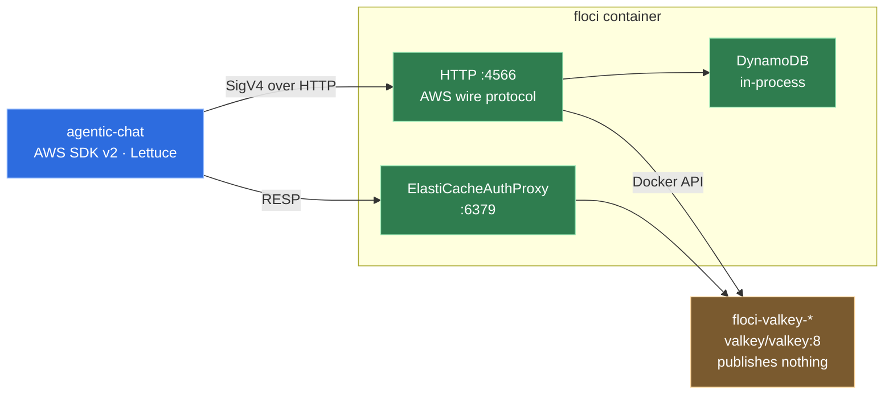

# 0004 — floci provides both DynamoDB and Valkey

**Status:** Accepted · **[measured]**

## Context

The application needs a durable store for conversations and a fast cache in front
of it. In production those would be DynamoDB and ElastiCache. Locally they have
to be something that starts with `docker compose up`, on a machine with 7 GB of
RAM available to WSL2 ([0003](0003-no-local-model.md)).

LocalStack's community edition [sunset in March 2026](https://blog.localstack.cloud/the-road-ahead-for-localstack/),
now requiring an auth token and no longer receiving security updates. floci is
the MIT-licensed replacement and is what the brief specified.

## Decision

**One floci container provides both backends.** DynamoDB runs in-process inside
it; ElastiCache starts a real `valkey/valkey:8` container through the mounted
Docker socket and proxies it.



Verified against `floci/floci:1.6.0` on this machine. The image starts in
**0.098 s**, reports healthy within about six seconds, and defaults to region
`us-east-1`, account `000000000000`, HTTP only.

DynamoDB accepted a **dummy** SigV4 header — `Signature=deadbeef` — and
round-tripped a table:

```
CreateTable (PAY_PER_REQUEST, pk HASH + sk RANGE) -> TableStatus: ACTIVE
PutItem  -> {}
Query    -> {"Items":[{"pk":{"S":"s#1"},"sk":{"S":"m#1"},"body":{"S":"ola"}}],"Count":1}
```

## The two traps

Both cost real time to find, and neither is guessable from the AWS API.

**1. `CreateCacheCluster` is memcached-only.** Asking for a Valkey engine there
fails:

```
InvalidParameterValue: Engine must be 'memcached'. For Redis/Valkey use CreateReplicationGroup.
```

Valkey and Redis engines must be created with **`CreateReplicationGroup`**. That
is what `LocalAwsBootstrap` does, and the class exists mostly to absorb this.

**2. The RESP endpoint is on the *floci* container, not on the Valkey container.**
floci's log says it plainly:

```
ElastiCacheContainerManager: ElastiCache backend for group chat-cache: 172.17.0.3:6379
ElastiCacheAuthProxy:       ElastiCache proxy started for group chat-cache on port 6379 → 172.17.0.3:6379
ElastiCacheService:         Replication group chat-cache created, endpoint=localhost:6379
```

The spawned `floci-valkey-chat-cache` container exposes 6379 but **publishes
nothing**, and the endpoint floci reports (`localhost:6379`) is only meaningful
inside floci's own network namespace. So `compose.yaml` must publish `6379:6379`
**from the floci service**, and clients connect to `floci:6379` on the compose
network. Getting this wrong produces a connection-refused that looks like the
Valkey container failing to start, which it is not.

With the port published, a raw socket round trip through the proxy works, with no
auth token:

```
PING                       -> +PONG
SET chat:session:1 "ola…"  -> +OK
GET chat:session:1         -> $9 ola mundo
INFO server                -> valkey_version:8.1.9  release_stage:ga
```

## Consequences

**Gained.** One dependency for two AWS services. The application code is the same
against floci and against real AWS — only the endpoint differs, which is the
entire point of using an emulator instead of mocks. Storage mode `hybrid` keeps
DynamoDB state across `docker compose restart` at an async flush every 5 s.
Integration tests get `io.floci:testcontainers-floci`, whose version is already
managed by the Micronaut 5.1.0 platform BOM (2.8.0) and which mounts the Docker
socket and exposes proxy ports 6379-6388 without any configuration.

Cost is negligible:

```
floci-valkey-chat-cache   3.805 MiB / 7.756 GiB
floci                    26.99  MiB / 7.756 GiB
```

**Given up.** floci needs the Docker socket, and it must run as root to use it —
acceptable for a local emulator, never for anything else. An integration test
pays about 35 s of container startup, which is why those tests are tagged and
excluded from the default build. And an emulator is an emulator: it can accept a
call real AWS would reject, so nothing here proves production behaviour.

## Revisit if

The project ever needs a service floci models only as a stub (its Bedrock Runtime
is a dummy, for instance), or a fidelity difference produces a bug that only
appears against real AWS.
