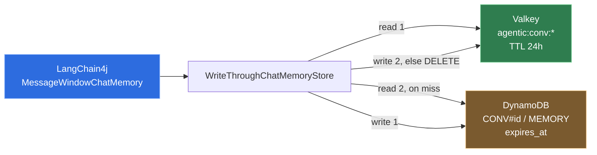

# 0007 — Valkey in front of DynamoDB for conversation memory

**Status:** Accepted · **[measured]**

## Context

`ChatMemoryStore` is three methods and is called on every turn, twice — once to
read the history, once to write it back. It needs to be fast enough not to matter
and durable enough that a restart does not erase a conversation.

The brief asked for a memory provider system using DynamoDB and Redis/Valkey,
both through floci.

## Decision

**DynamoDB is the source of truth; Valkey is a cache in front of it.**

**Ordering follows from which one is authoritative.** Writes go to DynamoDB
first, then Valkey. If the Valkey write fails the key is **deleted** rather than
left holding a previous value, so the next read falls through to the durable
store. A stale chat memory is worse than a slow one: the model then answers from
a history the user never had.

**Availability is asymmetric on purpose.** Valkey down degrades latency only;
DynamoDB down fails the request. Silently continuing without the durable store
would drop a user's conversation with no signal.

**One DynamoDB item per conversation, not one per message.**
`ChatMemoryStore.updateMessages` replaces the entire list on every turn, so a
per-message layout would force a read-diff-write on the hot path for no benefit.
A windowed memory is far below the 400 KB item cap.

**Serialization goes through LangChain4j's `ChatMessageSerializer`.** This is
load-bearing, not stylistic: skill activation state travels in
`ToolExecutionResultMessage.attributes()`, and a store that persisted only
`message.text()` would silently reset progressive tool disclosure on every turn
— see [0005](0005-progressive-tool-disclosure-through-skills.md). The integration
test asserts the attributes survive both stores.

**`ConversationId` is a validated value object.** It is used to build storage
keys in both stores, and an unvalidated id there is a key-injection hole: `a\nb`
in a RESP key, `conv:*` matching other conversations, a crafted DynamoDB
partition key. The regex is `[A-Za-z0-9_-]{1,64}` and the tests name each
rejected shape and why.

**A third backend exists and is never chosen automatically.**
`agentic.persistence.memory-backend: in-memory` runs the whole application with
no Docker and no network, which is what keeps the test suite fast. Falling back
to it automatically when Valkey is unreachable would lose every conversation on
restart while the health check stayed green, so the default is durable and the
choice is explicit.

## Consequences

**Gained.** Sub-millisecond reads on the common path, durability across restarts,
a natural TTL on both tiers, and a test suite that needs no infrastructure.

**Given up.** Two systems to keep consistent, and a window where DynamoDB has a
newer value than Valkey — bounded, because that window ends in a delete rather
than a stale read. LangChain4j's own `ChatMemoryService` also caches `ChatMemory`
objects per node in an unbounded map with no eviction, so a long-running node
grows with the number of distinct conversations it has served. That is a known
limitation of the library, not of this store, and is not yet addressed here.

Concurrent turns on the same conversation are a lost-update window: LangChain4j
states plainly that an AI service must not be called concurrently for the same
`@MemoryId`. There is no per-conversation lock yet.

## Revisit if

Concurrent turns per conversation become real, at which point a Valkey-based
per-conversation lock is the smallest fix; or conversation history needs to be
queryable, which would justify a per-message layout with a sort key.
