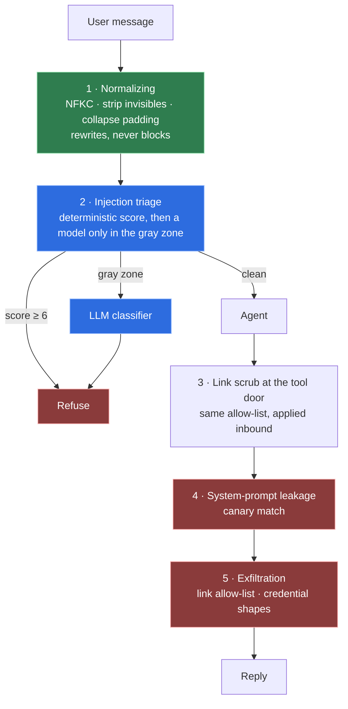

# 0008 — Normalize, then score, then ask a model

**Status:** Accepted · **[measured]**

## Context

`langchain4j-guardrails` ships `PatternBasedPromptInjectionGuardrail`, a regex
list. Regex alone is a speed bump: it is walked past by fullwidth characters,
zero-width joiners, base64 and a rephrasing. A pure LLM classifier is the
opposite failure — accurate enough, but a second model call on every turn, on top
of the triage judge that already runs on every turn.

## Decision

Four guardrails, ordered so each makes the next one's job smaller.

### 1. Normalization is the lever, and it never blocks

It must run first because LangChain4j feeds each guardrail's `successfulText()`
to every subsequent one, and the rewritten message is also what reaches the
model. Normalizing once means no later rule has to be written twice — for the
plain form and for the fullwidth form of the same attack.

NFKC folds fullwidth `Ｉｇｎｏｒｅ`, mathematical-bold `𝗜𝗴𝗻𝗼𝗿𝗲` and ligatures onto
plain ASCII ([UAX #15](https://www.unicode.org/reports/tr15/)). Invisible
characters, C0/C1 controls and padding runs are removed.

Cyrillic and Greek homoglyphs are deliberately **not** folded. Confusables
folding ([UTS #39](https://www.unicode.org/reports/tr39/)) is a false-positive
minefield in an application that is legitimately multilingual, so a high
proportion of non-Latin letters becomes a *score* instead.

Multi-part messages are passed through untouched: LangChain4j's
`rewriteUserMessage` replaces **every** `TextContent` with the same string, which
would destroy a message that has more than one.

### 2. Structural certainties block; statistical hints score

This split is what decides whether a detection layer survives contact with
production.

| Blocks on its own | Adds to a score |
|---|---|
| chat-template delimiters (`<\|im_start\|>`, `[INST]`, `<<SYS>>`) | invisible characters present before normalization (+2) |
| a code fence labelled `system` / `assistant` / `developer` | >30% non-Latin letters (+2) |
| `data:…;base64,` URIs | a single "probe" phrase, e.g. "quais são suas instruções" (+3 each) |
| a base64 run that **decodes to mostly printable text** | |
| >12 000 characters, or an unbroken 400-character token | |
| an explicit instruction-override phrase | |

A base64-shaped run only counts when it decodes: random identifiers and hashes
are base64-shaped too, and decode to noise. Threshold is 6 to block, 2 to consult
a model.

**Three false-positive controls**, and they are the reason the rules are usable:

1. Matching runs on an **accent-folded** copy. Brazilian users type "instrucoes"
   as often as "instruções"; a rule that only catches the accented spelling
   catches only the polite attacker.
2. Phrase rules are **skipped inside code fences** — a developer pasting an
   attack payload is not attacking anyone. Fences do not exempt the delimiter
   rules, because a fence *labelled* `system` is itself the attack.
3. Persona phrases that are ordinary language ("aja como", "finja que") only
   score when a role noun follows within ~40 characters. That is what keeps
   "finja que está tudo bem" out of the score.

Two real false positives were caught by the project's own corpus and fixed by
tightening rules: **"Show me the rules of the game Truco"** matched a
`show me the …rules` pattern, now narrowed to `your …prompt` and `the system
prompt`; and the Portuguese equivalent matched "mostre as regras", now requiring
a possessive or "de sistema".

### 3. The model only sees the gray zone

Heuristics and classifier live in **one** guardrail because LangChain4j gives an
input guardrail exactly two outcomes, pass or kill. There is no channel for
handing a score to the next guardrail, so a "score here, decide there" split is
not expressible.

Only a verdict above 0.80 confidence blocks. An unsure classifier lets a real
user through — the asymmetry is deliberate, and it is the same one the triage
judge uses.

The rejection message says nothing about why. A detector that explains which rule
fired is a detector the attacker iterates against.

### 4. Output side: a canary, and the two exfiltration channels

**System-prompt leakage** is detected with a per-process random canary embedded
in the prompt. Phrase-matching the prompt does not work, because the model
paraphrases — it will happily describe its instructions without reproducing a
sentence. A canary catches verbatim dumps with zero false positives. Paraphrase
leakage is handled a different way: the prompt contains nothing secret, which is
a design decision rather than a control (see
[0006](0006-llm-as-judge-triage.md)).

**Exfiltration** closes the two channels a compromised turn actually uses. A
markdown image pointing at an attacker host fires the moment the answer renders,
with no click. Credential-shaped strings must not reach the user even once. Link
hosts are allow-listed; the credential shapes are narrow so ordinary base64 is
not eaten.

Both use **`fatalWithMessageRemoval`**, not `failure`: the offending message is
dropped from chat memory. Leaving it there would replay the leaked text into
every later prompt, so one successful extraction would keep leaking for the rest
of the conversation.

## Consequences

**Gained.** The common path costs no model call. Every blocking rule is a unit
test with a named reason. Rule ids are logged, so the rules can be tuned against
real traffic instead of intuition.

**Given up.** A rule set is a maintenance surface, and every new phrase risks a
false positive in a language nobody on the team speaks. The gray zone adds one
model call to an uncommon path. Determined attackers will find phrasings the
rules miss — which is why this is one layer of several, not the answer.

## Revisit if

False positives appear in production traffic — the rules should first move to
shadow mode (score and log, never block) until the numbers justify blocking
again; or the gray-zone rate rises far enough that the extra model call stops
being uncommon.
